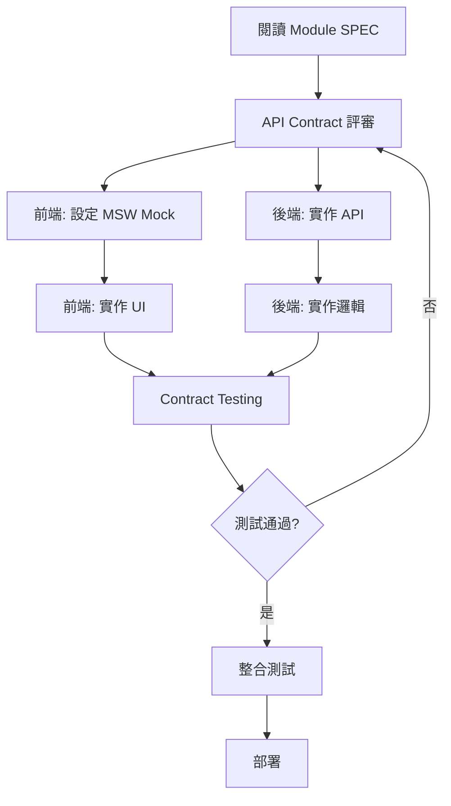

# 快速開始指南 (Quick Start Guide)

**目標讀者**: 前端工程師、後端工程師、新加入團隊成員
**預計時間**: 30 分鐘
**先決條件**: 基本 React 與 Node.js 知識

---

## 📚 五分鐘了解規格系統

### 你將獲得什麼?

✅ **52 份完整規格文件** - 涵蓋所有功能模組、UI 元件、技術規範
✅ **前後端分離開發** - 使用 Mock Server,前端不依賴後端進度
✅ **統一 API 規範** - RESTful API + 統一錯誤處理
✅ **可觀測性內建** - OpenTelemetry 自動追蹤
✅ **完整開發指引** - 從規格閱讀到實作測試的完整流程

### 核心文件導覽

```
.specify/specs/
├── 📖 README.md                 ← 從這裡開始!
├── 📋 _index.md                 ← 完整文件索引
├── 🎯 _completion-report.md     ← 專案完成報告
├── 📝 QUICKSTART.md             ← 你正在閱讀
│
├── 🔧 API 與整合規範/
│   ├── _api-contract-spec.md           ← API 設計總規範
│   ├── _backend-parameters-spec.md     ← 32 個參數 API
│   ├── _collaboration-spec.md          ← 10 個協作 API
│   └── _mock-server-setup.md           ← Mock Server 設定 ⭐
│
├── 📦 modules/                  ← 30 個功能模組規格
├── 🧩 components/               ← 10 個 UI 元件規格
└── 📐 common/                   ← 7 個通用規範
```

---

## 🚀 前端工程師 - 30 分鐘快速開始

### Step 1: 閱讀核心規範 (5 分鐘)

```bash
# 必讀文件
1. README.md                      # 規格系統總覽
2. _api-contract-spec.md          # API 呼叫規範
3. common/table-design-system.md  # UI 設計規範
```

**重點摘要**:
- API 統一使用 `{ data, meta, error }` 格式
- 權限格式為 `resource:action` (例: `incidents:read`)
- 表格統一使用虛擬滾動 (> 100 筆資料)
- Modal/Drawer 遵循 Z-index 優先級規則

---

### Step 2: 設定 Mock Server (10 分鐘)

#### 2.1 安裝依賴

```bash
cd your-frontend-project

# 安裝 MSW (Mock Service Worker)
npm install msw --save-dev

# 安裝 OpenTelemetry (可觀測性)
npm install @opentelemetry/sdk-trace-web \
            @opentelemetry/instrumentation-fetch \
            @opentelemetry/exporter-trace-otlp-http

# 初始化 MSW
npx msw init public/
```

#### 2.2 建立 Mock Handlers

參考 `_mock-server-setup.md` § 3,建立你的第一個 Mock Handler:

```typescript
// src/mocks/handlers/incidents.ts
import { http, HttpResponse } from 'msw';

export const incidentsHandlers = [
  // 獲取事件列表
  http.get('/api/v1/incidents', ({ request }) => {
    const url = new URL(request.url);
    const page = parseInt(url.searchParams.get('page') || '1');
    const pageSize = parseInt(url.searchParams.get('page_size') || '20');

    return HttpResponse.json({
      data: [
        {
          id: 'inc-001',
          title: 'Database connection timeout',
          status: 'open',
          severity: 'critical',
          createdAt: '2025-10-07T10:00:00Z',
        },
        // ... 更多 Mock 資料
      ],
      meta: {
        total: 100,
        page,
        pageSize,
      },
    });
  }),

  // 建立事件
  http.post('/api/v1/incidents', async ({ request }) => {
    const body = await request.json();

    return HttpResponse.json({
      data: {
        id: 'inc-new',
        ...body,
        createdAt: new Date().toISOString(),
      },
    }, { status: 201 });
  }),
];
```

#### 2.3 啟動 Mock Server

```typescript
// src/mocks/browser.ts
import { setupWorker } from 'msw/browser';
import { incidentsHandlers } from './handlers/incidents';

export const worker = setupWorker(...incidentsHandlers);

// src/index.tsx
if (process.env.REACT_APP_MOCK_ENABLED === 'true') {
  import('./mocks/browser').then(({ worker }) => {
    worker.start({
      onUnhandledRequest: 'warn',
    });
  });
}
```

#### 2.4 啟動開發環境

```bash
# 啟用 Mock Server
REACT_APP_MOCK_ENABLED=true npm start

# 瀏覽器 Console 應顯示:
# [MSW] Mocking enabled.
```

---

### Step 3: 實作第一個頁面 (15 分鐘)

#### 3.1 選擇模組規格

假設你要實作「事件列表」頁面:

```bash
# 閱讀模組規格
cat modules/incidents-list-spec.md

# 關鍵資訊:
# - API 端點: GET /api/v1/incidents
# - 欄位定義: id, title, status, severity, createdAt
# - 互動行為: 支援排序、篩選、批次操作
```

#### 3.2 使用 React Query 呼叫 API

```typescript
// src/hooks/useIncidents.ts
import { useQuery } from '@tanstack/react-query';

export const useIncidents = (params: IncidentListParams) => {
  return useQuery({
    queryKey: ['incidents', params],
    queryFn: async () => {
      const url = new URL('/api/v1/incidents', window.location.origin);
      url.search = new URLSearchParams(params as any).toString();

      const response = await fetch(url);
      if (!response.ok) throw new Error('Failed to fetch incidents');

      return response.json();
    },
    staleTime: 5 * 60 * 1000, // 5 分鐘
  });
};
```

#### 3.3 實作表格元件

```typescript
// src/pages/IncidentsListPage.tsx
import { useIncidents } from '../hooks/useIncidents';
import { Table } from 'antd';

export const IncidentsListPage = () => {
  const [params, setParams] = useState({ page: 1, pageSize: 20 });
  const { data, isLoading } = useIncidents(params);

  const columns = [
    { title: 'ID', dataIndex: 'id', key: 'id' },
    { title: '標題', dataIndex: 'title', key: 'title' },
    {
      title: '狀態',
      dataIndex: 'status',
      key: 'status',
      render: (status) => <StatusTag status={status} />
    },
    { title: '嚴重性', dataIndex: 'severity', key: 'severity' },
    { title: '建立時間', dataIndex: 'createdAt', key: 'createdAt' },
  ];

  return (
    <div>
      <h1>事件列表</h1>
      <Table
        columns={columns}
        dataSource={data?.data}
        loading={isLoading}
        pagination={{
          current: params.page,
          pageSize: params.pageSize,
          total: data?.meta.total,
          onChange: (page, pageSize) => setParams({ page, pageSize }),
        }}
      />
    </div>
  );
};
```

✅ **完成!** 你已經實作第一個頁面,完全使用 Mock 資料,不依賴後端!

---

## 🔧 後端工程師 - 30 分鐘快速開始

### Step 1: 閱讀 API 規範 (10 分鐘)

```bash
# 必讀文件
1. _api-contract-spec.md           # API 設計總規範
2. _backend-parameters-spec.md     # 32 個參數 API 定義
3. _collaboration-spec.md          # 10 個協作 API 定義
4. common/rbac.md                  # 權限系統規範
5. common/auditing.md              # 審計日誌規範
```

**重點摘要**:
- 所有 API 回傳格式: `{ data, meta }` (成功) 或 `{ error }` (失敗)
- 權限格式: `resource:action` (例: `incidents:create`)
- 所有 CUD 操作自動記錄審計日誌
- 支援 ETag 條件請求,實作 HTTP 快取

---

### Step 2: 實作第一個 API 端點 (15 分鐘)

#### 2.1 定義 API 路由

以 Node.js + Express 為例:

```typescript
// src/routes/incidents.ts
import express from 'express';
import { authenticate, authorize, audit } from '../middlewares';

const router = express.Router();

// 獲取事件列表
router.get('/incidents',
  authenticate,                         // JWT 驗證
  authorize('incidents:read'),          // RBAC 權限檢查
  async (req, res) => {
    try {
      const { page = 1, page_size = 20, filters } = req.query;

      // 查詢資料庫
      const incidents = await db.incidents.findMany({
        where: parseFilters(filters),
        skip: (page - 1) * page_size,
        take: page_size,
      });

      const total = await db.incidents.count({
        where: parseFilters(filters),
      });

      // 統一回應格式
      res.json({
        data: incidents,
        meta: {
          total,
          page: parseInt(page),
          pageSize: parseInt(page_size),
        },
      });
    } catch (error) {
      // 統一錯誤處理
      res.status(500).json({
        error: {
          code: 'INTERNAL_ERROR',
          message: '獲取事件列表失敗',
          details: error.message,
          requestId: req.id,
          timestamp: new Date().toISOString(),
        },
      });
    }
  }
);

// 建立事件
router.post('/incidents',
  authenticate,
  authorize('incidents:create'),
  audit('incidents', 'create'),         // 自動審計日誌
  async (req, res) => {
    try {
      const incident = await db.incidents.create({
        data: {
          ...req.body,
          createdBy: req.user.id,
        },
      });

      res.status(201).json({ data: incident });
    } catch (error) {
      res.status(400).json({
        error: {
          code: 'VALIDATION_ERROR',
          message: '建立事件失敗',
          details: error.message,
          requestId: req.id,
          timestamp: new Date().toISOString(),
        },
      });
    }
  }
);

export default router;
```

#### 2.2 實作 RBAC 中間件

```typescript
// src/middlewares/authorize.ts
export const authorize = (permission: string) => {
  return async (req, res, next) => {
    const [resource, action] = permission.split(':');

    // 檢查使用者權限
    const hasPermission = await checkUserPermission(
      req.user.id,
      resource,
      action
    );

    if (!hasPermission) {
      return res.status(403).json({
        error: {
          code: 'FORBIDDEN',
          message: `您沒有權限執行此操作 (${permission})`,
          requestId: req.id,
          timestamp: new Date().toISOString(),
        },
      });
    }

    next();
  };
};
```

#### 2.3 實作審計日誌中間件

```typescript
// src/middlewares/audit.ts
export const audit = (resource: string, action: string) => {
  return async (req, res, next) => {
    // 記錄操作前狀態
    const before = req.method !== 'POST'
      ? await getResourceState(resource, req.params.id)
      : null;

    // 執行原始操作
    res.on('finish', async () => {
      if (res.statusCode >= 200 && res.statusCode < 300) {
        await db.auditLogs.create({
          data: {
            userId: req.user.id,
            resource,
            action,
            resourceId: req.params.id || res.locals.createdId,
            before,
            after: res.locals.updatedState,
            ip: req.ip,
            userAgent: req.get('user-agent'),
            timestamp: new Date(),
          },
        });
      }
    });

    next();
  };
};
```

✅ **完成!** 你已經實作符合規範的 API 端點,包含權限驗證與審計日誌!

---

### Step 3: Contract Testing (5 分鐘)

#### 3.1 安裝 Pact

```bash
npm install --save-dev @pact-foundation/pact
```

#### 3.2 執行 Provider 驗證

```typescript
// tests/pact/incidents.provider.spec.ts
import { Verifier } from '@pact-foundation/pact';

describe('Incidents API Pact Verification', () => {
  it('should validate the incidents contract', async () => {
    const verifier = new Verifier({
      provider: 'IncidentsAPI',
      providerBaseUrl: 'http://localhost:3000',
      pactUrls: [
        './pacts/frontend-incidentsapi.json',
      ],
    });

    await verifier.verifyProvider();
  });
});
```

---

## 🎯 完整開發流程

### 前端 + 後端協作流程



### 時間規劃範例

**Week 1-2: API 設計與 Mock**
- 前端 + 後端: API Contract 設計評審
- 前端: 設定 MSW Mock Handlers
- 後端: 定義 API 路由與資料模型

**Week 3-6: 並行開發**
- 前端: 使用 Mock 獨立開發 UI
- 後端: 實作 API 端點與業務邏輯

**Week 7-8: 整合測試**
- Contract Testing 驗證
- 整合測試
- E2E 測試
- 效能測試

---

## 📖 進階學習路徑

### Level 1: 基礎 (已完成)
✅ 閱讀核心規範
✅ 設定 Mock Server
✅ 實作第一個頁面/API

### Level 2: 進階

**前端**:
- [ ] 閱讀 `common/modal-interaction-pattern.md` 學習 Modal/Drawer 設計
- [ ] 閱讀 `_resolution-plan-phase2.md` 了解 21 項 UI/UX 決策
- [ ] 實作虛擬滾動 (參考 `table-design-system.md` § 11)
- [ ] 整合 OpenTelemetry 監控 (參考 `_mock-server-setup.md` § 2)

**後端**:
- [ ] 實作 32 個參數 API (參考 `_backend-parameters-spec.md`)
- [ ] 實作 10 個協作 API (參考 `_collaboration-spec.md`)
- [ ] 設定 HTTP 快取策略 (參考 `_api-contract-spec.md` § 4)
- [ ] 實作 Contract Testing Provider

### Level 3: 專家

- [ ] 貢獻改進建議至規格文件
- [ ] 參與 API Contract 設計評審
- [ ] 建立新的 Mock Handlers
- [ ] 優化可觀測性監控
- [ ] 撰寫最佳實踐文件

---

## 🆘 常見問題 (FAQ)

### Q1: Mock Server 無法啟動?

**A**: 確認以下事項:
1. MSW 已正確安裝: `npm list msw`
2. Service Worker 已初始化: `npx msw init public/`
3. 環境變數已設定: `REACT_APP_MOCK_ENABLED=true`
4. 瀏覽器 Console 檢查錯誤訊息

### Q2: API 回應格式不符合規範?

**A**: 檢查是否遵循統一格式:
```typescript
// 成功回應
{ data: T, meta?: { ... } }

// 錯誤回應
{ error: { code, message, details, requestId, timestamp } }
```

參考: `_api-contract-spec.md` § 2

### Q3: 找不到對應的 SPEC 文件?

**A**: 使用文件索引快速查找:
1. 查看 `_index.md` 完整索引
2. 使用 `grep` 搜尋關鍵字:
   ```bash
   grep -r "incidents" modules/
   ```
3. 參考 `README.md` 文件架構圖

### Q4: 權限檢查應該在前端還是後端?

**A**: 兩者都要!
- **前端**: UI 層級權限檢查 (隱藏/禁用按鈕)
- **後端**: API 層級權限驗證 (必須,安全性)

參考: `common/rbac.md` § 5

### Q5: 如何實作審計日誌?

**A**: 使用中間件自動記錄:
```typescript
router.post('/incidents',
  authenticate,
  authorize('incidents:create'),
  audit('incidents', 'create'),  // 自動審計
  handler
);
```

參考: `common/auditing.md` § 3

---

## 📞 獲取幫助

**文件相關**:
- 📖 閱讀 `_completion-report.md` 了解完整專案狀態
- 📋 查看 `_index.md` 找到對應的規格文件
- 📝 參考 `CHANGELOG.md` 了解最新變更

**技術問題**:
- 前端: 聯繫前端架構師
- 後端: 聯繫後端架構師
- API 設計: 發起 API Contract 評審會議

**Bug 回報**:
- 建立 Issue 於專案 Repository
- 標記 `spec` 標籤
- 提供詳細錯誤訊息與重現步驟

---

## ✅ 檢查清單

完成快速開始後,確認以下事項:

**前端工程師**:
- [ ] 已閱讀 `README.md` 與 `_api-contract-spec.md`
- [ ] MSW Mock Server 已成功啟動
- [ ] 已實作第一個頁面並呼叫 Mock API
- [ ] 理解統一 API 格式與錯誤處理
- [ ] 知道如何查找對應的 Module/Component SPEC

**後端工程師**:
- [ ] 已閱讀 API Contract 與後端參數規範
- [ ] 已實作第一個符合規範的 API 端點
- [ ] 已實作 RBAC 權限驗證中間件
- [ ] 已實作審計日誌中間件
- [ ] 理解 HTTP 快取策略與 ETag 使用

**所有人**:
- [ ] 已加入專案溝通頻道
- [ ] 知道如何提出問題與回報 Bug
- [ ] 理解前後端協作流程

---

**文件版本**: v1.0
**最後更新**: 2025-10-07
**下一步**: 閱讀 `_completion-report.md` 了解完整專案狀態

🎉 **歡迎加入 SRE Platform 開發!**
