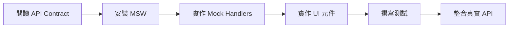
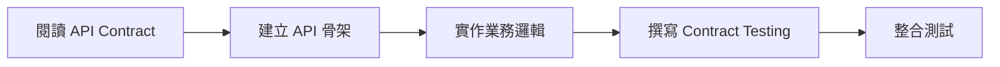

# SRE 平台規格文件體系 (Specification System)

**最後更新**: 2025-10-07
**狀態**: Production Ready ✅
**總文件數**: 52 份
**NEEDS CLARIFICATION 解決進度**: 78 / 78 項 (100%) 🎉

---

## 🎯 快速開始

### 我是前端開發者
1. 📖 閱讀 [API Contract 總規範](./_api-contract-spec.md) - 了解 API 設計標準
2. 🛠️ 閱讀 [Mock Server 設定指南](./_mock-server-setup.md) - 建置 MSW + OpenTelemetry
3. 📋 參考對應模組 SPEC (如 `modules/incidents-list-spec.md`) - 實作 UI

### 我是後端開發者
1. 📖 閱讀 [API Contract 總規範](./_api-contract-spec.md) - 了解統一格式與規範
2. 🔧 閱讀 [後端參數 API 規範](./_backend-parameters-spec.md) - 實作 32 個配置 API
3. 🤝 閱讀 [跨域協作 API 規範](./_collaboration-spec.md) - 實作 10 個協作功能

### 我是架構師/PM
1. 📊 閱讀 [第三階段執行報告](./_update-report-phase3.md) - 了解完成狀況
2. 🗺️ 閱讀 [第三階段解決方案](./_resolution-plan-phase3.md) - 了解整體策略
3. 📁 瀏覽 [文件索引](./_index.md) - 查看所有規格文件

---

## 📚 文件體系結構

```
.specify/specs/
├── README.md                              ← 本文件 (總覽)
├── _index.md                              ← 完整索引
│
├── 📋 階段報告 (3 份)
│   ├── _update-report.md                  Phase 1: 15 項前端 UI/UX
│   ├── _update-report-phase2.md           Phase 2: 21 項前端 UI/UX
│   └── _update-report-phase3.md           Phase 3: 32 項後端 + 10 項跨域協作
│
├── 🔧 API 與整合規範 (5 份)
│   ├── _api-contract-spec.md              API Contract 總規範
│   ├── _backend-parameters-spec.md        後端參數 API (32 項)
│   ├── _collaboration-spec.md             跨域協作 API (10 項)
│   ├── _mock-server-setup.md              Mock Server + OpenTelemetry 指南
│   └── _resolution-plan-phase3.md         第三階段解決方案
│
├── 📦 模組級規格 (33 份)
│   └── modules/
│       ├── incidents-*.md                 事件管理 (3 份)
│       ├── resources-*.md                 資源管理 (6 份)
│       ├── dashboards-*.md                儀表板 (2 份)
│       ├── insights-*.md                  洞察分析 (3 份)
│       ├── automation-*.md                自動化 (3 份)
│       ├── identity-*.md                  身份存取 (4 份)
│       ├── notification-*.md              通知管理 (3 份)
│       ├── platform-*.md                  平台設定 (6 份)
│       └── profile-*.md                   個人設定 (3 份)
│
├── 🧩 元件級規格 (8 份)
│   └── components/
│       ├── modal-spec.md                  模態框
│       ├── drawer-spec.md                 抽屜
│       ├── toolbar-spec.md                工具列
│       ├── table-container-spec.md        表格容器
│       ├── pagination-spec.md             分頁
│       ├── unified-search-modal-spec.md   統一搜尋
│       ├── column-settings-modal-spec.md  欄位設定
│       └── quick-filter-bar-spec.md       快速篩選
│
└── 📐 通用規範 (3 份)
    └── common/
        ├── crud-base-requirements.md      CRUD 基礎需求
        ├── table-design-system.md         表格設計系統
        └── modal-interaction-pattern.md   Modal 互動模式
```

---

## 🎉 重大里程碑

### 2025-10-07: 第三階段完成 ✅

**完成項目**:
- ✅ 新增 5 份 API 與整合規範
- ✅ 解決 42 項 NEEDS CLARIFICATION (32 後端 + 10 跨域)
- ✅ 定義 42+ 個 API 端點
- ✅ 建立 Mock Server 基礎設施 (MSW)
- ✅ 整合 OpenTelemetry 前端可觀測性

**累計成果**:
- ✅ 所有 78 項 NEEDS CLARIFICATION 解決完成
- ✅ 52 份完整規格文件
- ✅ API Contract First 開發策略確立
- ✅ 前後端並行開發基礎就緒

---

## 📊 進度總覽

### 階段性進度

| 階段 | 範圍 | 完成數量 | 完成日期 |
|------|------|---------|---------|
| **Phase 1** | 前端 UI/UX | 15 項 | 2025-10-06 |
| **Phase 2** | 前端 UI/UX | 21 項 | 2025-10-06 |
| **Phase 3** | 後端參數 + 跨域協作 | 42 項 | 2025-10-07 |
| **總計** | 全部 NEEDS CLARIFICATION | **78 項** ✅ | - |

### 文件狀態統計

| 類別 | 總數 | Production Ready |
|------|------|-----------------|
| 模組規格 | 33 | 0 (Draft) |
| 元件規格 | 8 | 0 (Draft) |
| 通用規範 | 3 | 0 (Draft) |
| API 與整合規範 | 5 | 5 ✅ |
| 階段性報告 | 3 | 3 ✅ |
| **合計** | **52** | **8** |

---

## 🔑 核心 API 規範

### 1. API Contract 總規範 (`_api-contract-spec.md`)

**涵蓋內容**:
- ✅ RESTful API 設計原則
- ✅ 統一錯誤回應格式 (含 HTTP 狀態碼規範)
- ✅ RBAC 認證與授權機制 (權限格式 `resource:action`)
- ✅ 分頁/篩選/排序統一格式
- ✅ 快取策略 (HTTP Cache + ETag)
- ✅ 審計日誌 (Auditing) 自動記錄
- ✅ 批次操作 API 設計
- ✅ WebSocket 即時通訊
- ✅ Contract Testing (Pact) 指南

**關鍵整合**:
- 參照 `specs/RBAC.md` 定義權限格式
- 參照 `specs/Auditing.md` 定義審計日誌
- 參照 `specs/Observability.md` 定義可觀測性

---

### 2. 後端參數 API 規範 (`_backend-parameters-spec.md`)

**32 項後端參數 API**:

#### § 1 認證與金鑰管理 (4 項)
- SMTP 認證資訊加密
- 渠道認證資訊管理
- 授權檔案簽章驗證
- MFA 恢復碼生成

#### § 2 資料保留與歸檔 (7 項)
- 統一保留策略 API (`GET /api/v1/config/retention/:type`)
- 審計日誌 (最低 30 天)
- 靜音規則過期清理
- 資源指標多級聚合 (raw/5m/1h/1d)

#### § 3 並行與限流 (6 項)
- 統一並行限制 API (`GET /api/v1/config/concurrency/:type`)
- 統一速率限制 API (`GET /api/v1/config/rate-limit/:type`)
- 任務狀態查詢

#### § 4 權限與隔離 (6 項)
- 敏感資訊脫敏規則
- 敏感操作告警機制
- 團隊資源隔離
- SSO 身份同步

#### § 5 業務規則 (9 項)
- 通知偏好繼承
- 靜音規則優先級
- 群組成員上限
- 動態群組支援
- 授權限制強制執行
- 標籤策略驗證
- 資源狀態判定邏輯
- 告警規則冷卻時間

---

### 3. 跨域協作 API 規範 (`_collaboration-spec.md`)

**10 項前後端協作功能**:

| 項目 | 前端職責 | 後端職責 |
|------|---------|---------|
| Drawer 預載入 | 觸發時機、快取策略 | API、ETag、TTL |
| Modal 動畫控制 | 狀態管理、防抖 | 無需介入 (純前端) |
| KPI 更新頻率 | 顯示更新時間、手動刷新 | 計算頻率、快取 TTL |
| 趨勢圖粒度 | 時間範圍選擇、圖表渲染 | 粒度計算、聚合邏輯 |
| 儀表板權限 | 權限選擇器、分享對話框 | 權限計算、繼承邏輯 |
| 儀表板版本 | 版本列表、比較 UI | 版本儲存、復原邏輯 |
| 團隊權限繼承 | 權限樹視覺化、覆寫標記 | 繼承計算、有效權限 |
| 批次操作限制 | 禁用超限按鈕、提示 | 限制參數、API 驗證 |
| 通知重試 | 重試狀態顯示、手動重試 | 重試策略、指數退避 |
| 觸發器防抖 | 冷卻狀態顯示、設定 | 防抖邏輯、窗口計算 |

---

## 🛠️ Mock Server + OpenTelemetry

### Mock Server 設定指南 (`_mock-server-setup.md`)

**技術選型**: MSW (Mock Service Worker)

**涵蓋內容**:
- ✅ MSW 安裝與初始化
- ✅ Mock Handlers 實作範例 (認證/事件/配置)
- ✅ Mock 資料管理策略
- ✅ 進階功能 (狀態保持/錯誤模擬/速率限制)
- ✅ 環境配置 (開發/測試/正式)

**OpenTelemetry 整合**:
- ✅ 自動追蹤 Fetch/XHR
- ✅ Core Web Vitals 收集 (LCP/FID/CLS/FCP/TTFB)
- ✅ 自訂追蹤與 Span (複雜元件/使用者互動)
- ✅ 錯誤邊界 (Error Boundary) 整合
- ✅ OTLP Exporter + Collector 設定

**優勢**:
- 前端無需等待後端 API,即可獨立開發
- 支援完整測試場景 (正常/錯誤/延遲)
- 開發與測試環境共用

---

## 📖 使用指南

### 查找規格文件

**方法 1: 依功能模組**
```bash
# 事件管理
modules/incidents-list-spec.md
modules/incidents-alert-spec.md

# 資源管理
modules/resources-list-spec.md
modules/resources-group-spec.md

# 完整索引
_index.md
```

**方法 2: 依元件**
```bash
# 通用元件
components/modal-spec.md
components/table-container-spec.md

# 完整索引
_index.md § 三、元件級規格
```

**方法 3: 依 API**
```bash
# API 總規範
_api-contract-spec.md

# 後端參數 API
_backend-parameters-spec.md

# 跨域協作 API
_collaboration-spec.md
```

---

### 實作流程建議

#### 前端開發流程


**步驟**:
1. 閱讀 `_api-contract-spec.md` 了解 API 設計原則
2. 閱讀 `_mock-server-setup.md` 建置 Mock Server
3. 實作對應模組的 Mock Handlers
4. 參考模組 SPEC 實作 UI 元件
5. 撰寫單元測試與整合測試 (基於 MSW)
6. 關閉 Mock Server,連接真實 API
7. E2E 測試與調整

---

#### 後端開發流程


**步驟**:
1. 閱讀 `_api-contract-spec.md` 了解統一格式
2. 根據 OpenAPI Spec 生成 API 骨架 (可選)
3. 實作 32 項後端參數 API (`_backend-parameters-spec.md`)
4. 實作 10 項跨域協作 API (`_collaboration-spec.md`)
5. 設定 RBAC 中介層 (權限驗證)
6. 設定審計日誌中介層 (自動記錄)
7. 撰寫 Pact Provider 測試 (Contract Testing)
8. 整合測試與調整

---

## 🔗 相關文件

**核心參考**:
- [憲法 (Constitution)](../memory/constitution.md) - 平台設計原則
- [規格模板 (Spec Template)](../templates/spec-template.md) - SPEC 撰寫規範

**外部參考規範**:
- [RBAC 規範](../../specs/RBAC.md) - 權限控制標準
- [Observability 規範](../../specs/Observability.md) - 可觀測性標準
- [Auditing 規範](../../specs/Auditing.md) - 審計日誌標準
- [Clarifications 記錄](../../specs/Clarifications.md) - 問題澄清記錄

---

## 🤝 貢獻指南

### 新增規格文件
1. 遵循 `.specify/templates/spec-template.md` 格式
2. 符合 `.specify/memory/constitution.md` 原則
3. 標記不確定項目為 `[NEEDS CLARIFICATION]`
4. 更新 `_index.md` 索引

### 更新現有規格
1. 確保變更符合 Constitution 原則
2. 更新決策記錄 (Decision Records)
3. 標記已解決項目 (✅ ~~[NEEDS CLARIFICATION]~~)
4. 更新相關文件的變更記錄

### 前後端協作項目
1. 雙方共同討論 API 設計
2. 更新 `_collaboration-spec.md` 定義介面
3. 前端更新 Mock Handlers
4. 後端更新 API 實作
5. 雙方執行 Contract Testing

---

## 📞 聯絡與支援

**問題回報**:
- 規格文件缺失/不一致/需澄清: 提交 GitHub Issues
- 所有 NEEDS CLARIFICATION 已解決,新問題請開新 Issue

**文件維護**:
- 維護者: Claude Code (Spec Architect)
- 更新頻率: 按需更新
- 版本控制: Git

---

## 📈 未來規劃

### 短期目標 (1-2 週)
- [ ] 前端團隊審查所有 API 規範
- [ ] 後端團隊審查所有 API 規範
- [ ] 建立完整 Mock Handlers (42+ 個 API)
- [ ] 設定 OpenTelemetry Collector

### 中期目標 (1-2 個月)
- [ ] 前端基於 Mock 完成 UI 實作
- [ ] 後端完成 API 實作
- [ ] Contract Testing CI/CD 整合
- [ ] E2E 測試涵蓋率 > 80%

### 長期目標 (3-6 個月)
- [ ] 所有模組 SPEC 狀態更新為 Production Ready
- [ ] 建立 OpenAPI 3.0 完整文件
- [ ] API 文件自動生成 (Swagger/Redoc)
- [ ] 效能測試與優化

---

**README 完成日期**: 2025-10-07
**撰寫人員**: Claude Code (Spec Architect)
**狀態**: Production Ready ✅

**🎊 歡迎使用 SRE 平台規格文件體系!**
