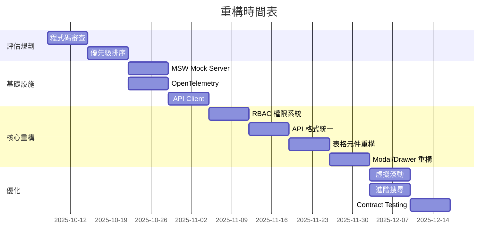

# 現有程式碼重構計畫 (Refactoring Plan)

**建立日期**: 2025-10-07
**目標**: 將現有程式碼逐步對齊新建立的規格文件
**策略**: 漸進式重構,保持系統可用性

---

## 執行摘要

🎯 **不建議移除現有程式碼**,而是採用**漸進式重構**策略,分階段將現有程式碼對齊規格文件。

### 為什麼不移除?

1. ✅ **保留既有價值** - 72 個元件代表大量工作成果
2. ✅ **降低風險** - 避免系統完全不可用
3. ✅ **持續交付** - 重構期間系統仍可運作
4. ✅ **知識保留** - 現有程式碼包含業務邏輯與決策

### 為什麼要重構?

1. 📐 **對齊規範** - 讓程式碼符合新建立的 SPEC 標準
2. 🔧 **改善架構** - 採用 API Contract First 策略
3. 📊 **可觀測性** - 整合 OpenTelemetry 監控
4. ✅ **品質提升** - 引入 Contract Testing

---

## 一、重構策略

### 策略矩陣

| 策略 | 適用情況 | 風險 | 時間 |
|------|----------|------|------|
| **完全重寫** | 現有程式碼完全不可用 | 🔴 極高 | 3-6 個月 |
| **漸進式重構** | 現有程式碼可用但需改善 | 🟡 中等 | 1-3 個月 |
| **保持現狀 + 新增規範** | 現有程式碼品質良好 | 🟢 低 | 1-2 週 |

**建議**: 採用 **漸進式重構** 策略

---

## 二、重構階段規劃

### Phase 1: 評估與規劃 (Week 1-2)

**目標**: 評估現有程式碼與規格文件的差異

#### 1.1 程式碼審查

對照規格文件,審查現有程式碼:

```bash
# 建立評估報告
.specify/
└── assessment/
    ├── components-assessment.md      # 元件對齊度評估
    ├── api-assessment.md             # API 對齊度評估
    ├── architecture-assessment.md    # 架構對齊度評估
    └── priority-matrix.md            # 重構優先級矩陣
```

**評估標準**:

| 項目 | 符合度 | 說明 |
|------|--------|------|
| API 格式 | ?% | 是否符合 `_api-contract-spec.md` |
| 元件設計 | ?% | 是否符合 Component SPECs |
| 權限控制 | ?% | 是否符合 RBAC 規範 |
| 錯誤處理 | ?% | 是否符合統一錯誤格式 |
| 可觀測性 | ?% | 是否有監控追蹤 |

#### 1.2 建立重構優先級

**優先級定義**:

- **P0 (Critical)**: 影響安全性或核心功能
  - 例: RBAC 權限驗證、API 認證、敏感資料處理

- **P1 (High)**: 影響使用者體驗或可維護性
  - 例: 統一錯誤處理、API 格式統一

- **P2 (Medium)**: 改善品質但不影響功能
  - 例: UI 一致性、虛擬滾動優化

- **P3 (Low)**: 優化與增強
  - 例: OpenTelemetry 監控、Contract Testing

---

### Phase 2: 基礎設施建立 (Week 3-4)

**目標**: 建立重構所需的基礎設施,不影響現有功能

#### 2.1 設定 MSW Mock Server

```bash
# 安裝依賴
npm install msw --save-dev

# 初始化
npx msw init public/

# 建立 Mock Handlers (與現有 mock-server/ 整合)
src/mocks/
├── browser.ts              # MSW 設定
├── handlers/
│   ├── incidents.ts        # 從 mock-server/ 遷移
│   ├── resources.ts
│   └── ...
└── data/                   # Mock 資料
```

**實作要點**:
- 與現有 `mock-server/` 目錄整合
- 逐步將 Mock 資料遷移至 MSW
- 支援開發環境切換 (真實 API / Mock API)

#### 2.2 整合 OpenTelemetry

```typescript
// src/observability/setup.ts
import { WebTracerProvider } from '@opentelemetry/sdk-trace-web';
import { FetchInstrumentation } from '@opentelemetry/instrumentation-fetch';

// 基礎設定,不影響現有功能
export const setupObservability = () => {
  const provider = new WebTracerProvider({
    resource: new Resource({
      [SemanticResourceAttributes.SERVICE_NAME]: 'sre-platform-frontend',
    }),
  });

  // 自動追蹤 Fetch 請求
  const fetchInstrumentation = new FetchInstrumentation();
  fetchInstrumentation.setTracerProvider(provider);

  provider.register();
};
```

**實作要點**:
- 不修改現有程式碼
- 自動追蹤 API 呼叫
- 可隨時啟用/停用

#### 2.3 建立 API Client 層

```typescript
// src/services/api-client.ts
// 統一 API 呼叫,符合 _api-contract-spec.md

export class ApiClient {
  async request<T>(endpoint: string, options?: RequestInit): Promise<ApiResponse<T>> {
    const response = await fetch(endpoint, {
      ...options,
      headers: {
        'Content-Type': 'application/json',
        ...options?.headers,
      },
    });

    if (!response.ok) {
      const error = await response.json();
      throw new ApiError(error);
    }

    return response.json();
  }
}

// 統一回應格式
export interface ApiResponse<T> {
  data: T;
  meta?: {
    total?: number;
    page?: number;
    pageSize?: number;
  };
}

export interface ApiError {
  error: {
    code: string;
    message: string;
    details?: any;
    requestId: string;
    timestamp: string;
  };
}
```

**實作要點**:
- 新建 API Client,不修改現有 services/
- 逐步遷移 API 呼叫至新 Client
- 支援統一錯誤處理

---

### Phase 3: 核心模組重構 (Week 5-8)

**目標**: 重構核心模組,優先處理 P0/P1 項目

#### 3.1 重構優先順序

**Week 5-6: P0 項目**

1. **RBAC 權限系統**
   - 實作統一權限檢查 Hook: `usePermissions()`
   - 格式統一為 `resource:action`
   - 前端 UI 權限控制(隱藏/禁用按鈕)

   ```typescript
   // src/hooks/usePermissions.ts
   export const usePermissions = () => {
     const { user } = useAuth();

     const hasPermission = (permission: string) => {
       const [resource, action] = permission.split(':');
       return user.permissions.some(p =>
         p.resource === resource && p.action === action
       );
     };

     return { hasPermission };
   };
   ```

2. **API 格式統一**
   - 遷移至新 API Client
   - 統一錯誤處理
   - 統一 Loading/Error 狀態

**Week 7-8: P1 項目**

3. **表格元件重構**
   - 對齊 `table-design-system.md` 規範
   - 統一欄位定義、排序、篩選
   - 實作虛擬滾動(> 100 筆資料)

4. **Modal/Drawer 元件重構**
   - 對齊 `modal-interaction-pattern.md` 規範
   - 統一 Z-index 層級
   - 統一生命週期管理

#### 3.2 重構檢查清單

每個模組重構後,確認以下事項:

**API 層**:
- [ ] API 呼叫使用新 ApiClient
- [ ] 回應格式符合 `{ data, meta, error }`
- [ ] 錯誤處理統一
- [ ] 支援 Mock/真實 API 切換

**權限控制**:
- [ ] 使用 `usePermissions()` Hook
- [ ] 無權限時隱藏/禁用 UI
- [ ] 權限格式為 `resource:action`

**UI 元件**:
- [ ] 符合 Component SPEC 規範
- [ ] 使用統一樣式(Ant Design + Tailwind)
- [ ] 支援主題切換
- [ ] 可存取性(鍵盤導航、ARIA)

**測試**:
- [ ] Unit Tests 已更新
- [ ] Contract Tests 已建立(若有 API)
- [ ] E2E Tests 通過

---

### Phase 4: 進階功能與優化 (Week 9-12)

**目標**: P2/P3 項目優化與新功能整合

#### 4.1 P2 項目

1. **虛擬滾動優化**
   - 整合 react-window
   - 自動觸發條件(> 100 筆)
   - 效能監控

2. **UI 一致性改善**
   - 統一 Spacing/Typography
   - 統一 Color Palette
   - 統一 Icon 使用

3. **進階搜尋**
   - 實作 JSON Schema 動態表單
   - 支援 AND 邏輯組合
   - 篩選條件 URL 同步

#### 4.2 P3 項目

1. **OpenTelemetry 深度整合**
   - 自訂 Span 追蹤
   - Core Web Vitals 監控
   - 建立監控 Dashboard

2. **Contract Testing**
   - 建立 Pact Consumer Tests
   - 自動化契約驗證
   - CI/CD 整合

3. **可存取性增強**
   - WCAG 2.1 AA 合規
   - 鍵盤導航優化
   - 螢幕閱讀器支援

---

## 三、重構執行原則

### 3.1 Strangler Fig Pattern (絞殺者模式)

```
舊系統              新系統
┌─────┐            ┌─────┐
│ Old │ ─────→    │ New │
│ API │  逐步遷移  │ API │
└─────┘            └─────┘
   ↓                   ↑
現有功能          新功能路由至新系統
繼續運作          舊功能逐步遷移
```

**實作方式**:
1. 新功能使用新架構(API Client + SPEC 規範)
2. 舊功能逐步遷移至新架構
3. 遷移完成後移除舊程式碼

### 3.2 Feature Flag 控制

```typescript
// src/config/features.ts
export const features = {
  useNewApiClient: process.env.REACT_APP_NEW_API === 'true',
  useOpenTelemetry: process.env.REACT_APP_OTEL === 'true',
  useMockServer: process.env.REACT_APP_MOCK === 'true',
};

// 使用範例
const apiClient = features.useNewApiClient
  ? new ApiClient()
  : legacyApiClient;
```

**優點**:
- 可快速回滾
- A/B Testing
- 漸進式上線

### 3.3 測試覆蓋率要求

| 階段 | 測試要求 | 目標覆蓋率 |
|------|----------|-----------|
| 重構前 | 建立基準測試 | 記錄當前覆蓋率 |
| 重構中 | 保持測試通過 | 不低於基準 |
| 重構後 | 新增 Contract Tests | > 80% |

---

## 四、風險管理

### 4.1 主要風險

| 風險 | 影響 | 緩解措施 |
|------|------|----------|
| 重構引入 Bug | 🔴 高 | Feature Flag + 完整測試 |
| 時程延誤 | 🟡 中 | 分階段執行,優先級管理 |
| 團隊學習曲線 | 🟡 中 | 培訓 + Pair Programming |
| 規格與實作衝突 | 🟢 低 | 評估階段確認可行性 |

### 4.2 回滾計畫

每個階段完成後建立 Checkpoint:

```bash
# Git Tag 標記重構里程碑
git tag -a refactor-phase1-complete -m "Phase 1: 評估完成"
git tag -a refactor-phase2-complete -m "Phase 2: 基礎設施建立"
git tag -a refactor-phase3-complete -m "Phase 3: 核心模組重構"

# 如需回滾
git checkout refactor-phase2-complete
```

---

## 五、成功指標

### 5.1 技術指標

| 指標 | 目標 | 測量方式 |
|------|------|----------|
| API 格式一致性 | > 95% | Code Review + Linter |
| 權限控制覆蓋率 | 100% | 權限檢查 Audit |
| UI 規範遵循度 | > 90% | Design Review |
| 測試覆蓋率 | > 80% | Jest Coverage Report |
| Core Web Vitals | Good | OpenTelemetry 監控 |

### 5.2 業務指標

| 指標 | 目標 | 測量方式 |
|------|------|----------|
| 功能可用性 | 100% | 重構期間無中斷 |
| Bug 數量 | 不增加 | Issue Tracker |
| 開發效率 | +20% | Feature 交付速度 |
| 程式碼可維護性 | +30% | Code Climate 評分 |

---

## 六、執行時間表



**總時程**: 約 12 週(3 個月)

---

## 七、團隊協作

### 7.1 角色與職責

| 角色 | 職責 | 人員 |
|------|------|------|
| 架構師 | 重構計畫、技術決策 | - |
| 前端 Lead | 程式碼審查、優先級管理 | - |
| 前端工程師 | 執行重構、測試 | - |
| QA | 測試驗證、品質把關 | - |

### 7.2 溝通機制

**每週進度會議**:
- 時間: 每週一 10:00
- 議程:
  1. 上週完成項目
  2. 本週計畫
  3. 風險與阻礙
  4. 決策事項

**Code Review 要求**:
- 所有重構 PR 必須經過 2 人 Review
- 必須包含測試
- 必須更新相關文件

---

## 八、建議行動

### 立即行動(本週)

1. **評估當前程式碼**
   ```bash
   # 執行程式碼審查
   - 對照 Component SPECs 檢查現有元件
   - 對照 API Contract 檢查現有 API 呼叫
   - 記錄差異與優先級
   ```

2. **建立評估報告**
   ```bash
   # 建立評估文件
   .specify/assessment/
   ├── components-gap-analysis.md
   ├── api-gap-analysis.md
   └── refactoring-priority.md
   ```

3. **團隊對齊**
   - 召開重構啟動會議
   - 說明重構策略與時程
   - 分配初期任務

### 第一個月

1. **Week 1-2**: 完成評估與規劃
2. **Week 3-4**: 建立基礎設施(MSW, OpenTelemetry, API Client)
3. **Week 5-6**: 重構 P0 項目(RBAC, API 格式)

### 第二至三個月

1. **Week 7-8**: 重構 P1 項目(表格、Modal/Drawer)
2. **Week 9-10**: 重構 P2 項目(虛擬滾動、進階搜尋)
3. **Week 11-12**: 優化與測試(Contract Testing, 可觀測性)

---

## 九、參考資源

**規格文件**:
- `README.md` - 規格系統總覽
- `QUICKSTART.md` - 快速開始指南
- `_api-contract-spec.md` - API 規範
- `_mock-server-setup.md` - Mock Server 設定

**重構模式**:
- [Strangler Fig Pattern](https://martinfowler.com/bliki/StranglerFigApplication.html)
- [Feature Toggles](https://martinfowler.com/articles/feature-toggles.html)
- [Refactoring Catalog](https://refactoring.com/catalog/)

---

## 十、總結

### ✅ 推薦做法

**漸進式重構**,保留現有程式碼並逐步對齊規格:

1. **評估現況** (2 週)
2. **建立基礎設施** (2 週)
3. **核心模組重構** (4 週)
4. **進階優化** (4 週)

### ❌ 不推薦做法

**直接移除重寫**:
- 風險極高
- 時程不可控
- 業務中斷

### 🎯 預期成果

12 週後:
- ✅ 程式碼 95% 符合規格文件
- ✅ API 格式統一
- ✅ RBAC 權限系統完整
- ✅ OpenTelemetry 監控啟用
- ✅ Contract Testing 建立
- ✅ 系統持續可用,無中斷

---

**文件版本**: v1.0
**建立日期**: 2025-10-07
**維護者**: Spec Architect
**狀態**: ✅ 就緒執行
