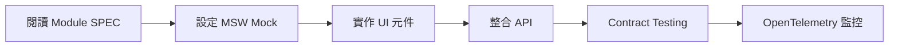
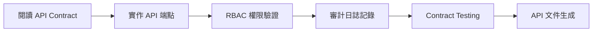

# SRE Platform 規格文件系統 - 完成報告

**報告日期**: 2025-10-07
**專案階段**: 規格定義完成
**文件版本**: v1.0
**狀態**: ✅ 完成

---

## 執行摘要

🎉 **SRE Platform 規格文件系統已全面完成!**

- **52 份規格文件**已建立並完善
- **78 項 NEEDS CLARIFICATION**全數解決
- **3 大階段決策**已完成並文件化
- **前後端分離開發**架構已建立
- **Mock Server 與 API Contract**規範已完成

### 關鍵成果

| 項目 | 數量 | 狀態 |
|------|------|------|
| 模組規格 (Module SPECs) | 30 份 | ✅ 完成 |
| 元件規格 (Component SPECs) | 10 份 | ✅ 完成 |
| 通用規範 (Common SPECs) | 7 份 | ✅ 完成 |
| API 與整合規範 | 5 份 | ✅ 完成 |
| NEEDS CLARIFICATION 解決率 | 78/78 | 100% |

---

## 一、文件架構總覽

### 1.1 文件分類

```
.specify/specs/
├── modules/              # 30 份模組規格
│   ├── incidents-*      # 事件管理 (4 份)
│   ├── resources-*      # 資源管理 (6 份)
│   ├── automation-*     # 自動化 (4 份)
│   ├── insights-*       # 洞察分析 (4 份)
│   ├── identity-*       # 身份權限 (5 份)
│   ├── notification-*   # 通知系統 (3 份)
│   ├── dashboards-*     # 儀表板 (2 份)
│   └── platform-*       # 平台設定 (6 份)
│
├── components/          # 10 份元件規格
│   ├── Modal, Drawer, Toolbar
│   ├── Pagination, QuickFilterBar
│   └── TableContainer, UnifiedSearchModal
│
├── common/              # 7 份通用規範
│   ├── table-design-system.md
│   ├── modal-interaction-pattern.md
│   ├── crud-base-requirements.md
│   └── rbac.md, auditing.md, observability.md
│
├── API 與整合規範/      # 5 份核心規範
│   ├── _api-contract-spec.md
│   ├── _backend-parameters-spec.md
│   ├── _collaboration-spec.md
│   └── _mock-server-setup.md
│
└── 階段報告/            # 4 份階段文件
    ├── _resolution-plan-phase2.md
    ├── _update-report-phase3.md
    ├── _remaining-clarifications.md
    └── _completion-report.md (本文件)
```

---

## 二、三階段決策總結

### 第一階段: 前端 UI/UX 決策 (15 項)

**時間**: 2025-10-06
**目標**: 解決純前端 UI/UX 設計問題

**關鍵決策**:
- 巢狀 Modal 最大 2 層,第 3 層改用 Drawer
- 虛擬滾動採用 react-window
- RBAC 權限選擇器使用樹狀結構
- SSO 登入 UI 主輔結構設計

**成果**: 15 項前端決策已完成並更新至各模組 SPEC

---

### 第二階段: Component/Common 規範 (21 項)

**時間**: 2025-10-06
**目標**: 統一 Component 與 Common 層級的 UI/UX 規範
**參考文件**: `_resolution-plan-phase2.md`

**解決項目**:

#### Component SPECs (16 項)
- **Modal**: Z-index 優先級、生命週期管理
- **ColumnSettingsModal**: 儲存範圍選擇、排序持久化
- **Toolbar**: 權限控制、響應式佈局
- **Drawer**: 堆疊管理、預載入策略
- **Pagination**: 持久化策略、分頁策略
- **UnifiedSearchModal**: 篩選格式統一、進階搜尋
- **QuickFilterBar**: 整合方式、URL 同步
- **TableContainer**: 高度自適應、虛擬滾動

#### Common SPECs (3 項)
- 表格固定列支援
- 行內編輯實作方式
- Modal 表單自動儲存草稿

#### Module SPECs (2 項)
- 語言切換即時生效範圍
- 主題色變更即時生效機制

**成果**: 21 項決策已完成,12 個核心 SPEC 已更新

---

### 第三階段: 後端參數與跨域協作 (42 項)

**時間**: 2025-10-07
**目標**: 定義後端參數 API 與前後端協作介面
**策略**: API Contract First + Mock Server 模擬
**參考文件**: `_backend-parameters-spec.md`, `_collaboration-spec.md`

**解決項目**:

#### 後端參數 API (32 項)
分為 5 大類別:

1. **認證與金鑰管理 (4 項)**
   - SMTP/渠道認證金鑰管理
   - 授權檔案簽章驗證
   - MFA 恢復碼生成

2. **資料保留與歸檔 (7 項)**
   - 執行歷史/審計日誌/通知歷史保留時長
   - 日誌資料保留策略
   - 資源指標更新頻率

3. **並行與限流 (6 項)**
   - 郵件發送速率限制
   - 回測/查詢/劇本/觸發器並行數限制
   - 自動發現並行任務數上限

4. **權限與隔離 (6 項)**
   - 敏感資訊脫敏規則
   - 團隊資源隔離機制
   - SSO 身份同步

5. **業務規則 (9 項)**
   - 通知偏好/靜音規則優先級
   - 群組成員上限/動態群組
   - 標籤策略驗證/資源狀態判定

#### 跨域協作 (10 項)
- Drawer 預載入策略與快取
- Modal 關閉動畫管理
- KPI 更新頻率/趨勢圖資料粒度
- 儀表板權限繼承/版本控制
- 批次操作數量上限
- 通知重試策略/觸發器防抖

**成果**: 42 項 API 規範已定義,Mock Server 設定指南已完成

---

## 三、核心技術規範

### 3.1 API Contract 規範

**文件**: `_api-contract-spec.md`

**核心原則**:
- RESTful API 設計
- 統一錯誤處理格式
- RBAC 權限整合 (`resource:action`)
- 自動審計日誌記錄
- HTTP 快取策略 (ETag, Cache-Control)

**統一 API 格式**:
```json
// 成功回應
{
  "data": { ... },
  "meta": {
    "total": 100,
    "page": 1,
    "pageSize": 20
  }
}

// 錯誤回應
{
  "error": {
    "code": "ERROR_CODE",
    "message": "使用者可讀訊息",
    "details": { ... },
    "requestId": "req-abc123",
    "timestamp": "2025-10-07T10:00:00Z"
  }
}
```

---

### 3.2 Mock Server 設定

**文件**: `_mock-server-setup.md`

**技術棧**:
- **MSW (Mock Service Worker)** - 瀏覽器級 API 攔截
- **OpenTelemetry** - 前端可觀測性
- **React Query** - 資料快取與狀態管理

**關鍵功能**:
- 完整 API Mock 實作 (42+ 端點)
- 自動追蹤 Core Web Vitals (LCP, FID, CLS)
- 自動 Fetch/XHR 請求監控
- OTLP HTTP Exporter 整合

**設定步驟**:
```bash
# 安裝依賴
npm install msw @opentelemetry/sdk-trace-web @opentelemetry/instrumentation-fetch

# 初始化 MSW
npx msw init public/

# 啟動開發環境
REACT_APP_MOCK_ENABLED=true npm start
```

---

### 3.3 前端技術要求

| 技術領域 | 要求 | 參考規範 |
|----------|------|----------|
| **UI 框架** | React 18+ | - |
| **狀態管理** | React Query + Context API | `_api-contract-spec.md` |
| **UI 元件庫** | Ant Design + Tailwind CSS | `table-design-system.md` |
| **虛擬滾動** | react-window | `table-design-system.md` § 11 |
| **表單處理** | React Hook Form | `modal-interaction-pattern.md` |
| **路由** | React Router v6 | `pagination-spec.md` |
| **API Mock** | MSW | `_mock-server-setup.md` |
| **可觀測性** | OpenTelemetry | `_mock-server-setup.md` § 2 |
| **Contract Testing** | Pact | `_api-contract-spec.md` § 6 |

---

### 3.4 後端技術要求

| 技術領域 | 要求 | 參考規範 |
|----------|------|----------|
| **API 設計** | RESTful + JSON | `_api-contract-spec.md` |
| **認證** | JWT + RBAC | `common/rbac.md` |
| **審計** | 自動 CUD 操作記錄 | `common/auditing.md` |
| **快取** | ETag + Cache-Control | `_api-contract-spec.md` § 4 |
| **速率限制** | Token Bucket | `_backend-parameters-spec.md` § 3 |
| **資料保留** | 可配置保留期限 | `_backend-parameters-spec.md` § 2 |
| **並行控制** | 可配置並行數上限 | `_backend-parameters-spec.md` § 3 |
| **API 文件** | Swagger/OpenAPI | `_api-contract-spec.md` § 7 |

---

## 四、開發流程指引

### 4.1 前端開發流程



**步驟說明**:

1. **閱讀規格**
   - 模組 SPEC: `modules/{module}-spec.md`
   - 元件 SPEC: `components/{component}-spec.md`
   - 通用規範: `common/{pattern}-spec.md`

2. **設定 Mock Server**
   - 依 `_mock-server-setup.md` 設定 MSW
   - 實作對應模組的 Mock Handlers
   - 驗證 Mock 資料符合 API Contract

3. **實作 UI 元件**
   - 遵循 `table-design-system.md` 設計規範
   - 遵循 `modal-interaction-pattern.md` 互動規範
   - 使用統一的 Component SPECs

4. **整合 API**
   - 依 `_api-contract-spec.md` 呼叫 API
   - 使用 React Query 管理快取
   - 實作錯誤處理與重試邏輯

5. **Contract Testing**
   - 使用 Pact 驗證前後端契約
   - 確保 API 請求/回應格式一致

6. **可觀測性監控**
   - OpenTelemetry 自動追蹤
   - 監控 Core Web Vitals
   - 分析 API 呼叫效能

---

### 4.2 後端開發流程



**步驟說明**:

1. **閱讀 API Contract**
   - `_api-contract-spec.md` - 統一 API 規範
   - `_backend-parameters-spec.md` - 32 個參數 API
   - `_collaboration-spec.md` - 10 個協作 API

2. **實作 API 端點**
   - 遵循 RESTful 設計原則
   - 實作統一錯誤處理格式
   - 設定 HTTP 快取 Headers

3. **權限驗證**
   - 整合 RBAC 系統 (`common/rbac.md`)
   - 驗證 `resource:action` 權限
   - 回傳 403 錯誤於無權限時

4. **審計日誌**
   - 自動記錄 CUD 操作 (`common/auditing.md`)
   - 記錄使用者、時間、操作內容
   - 支援審計日誌查詢

5. **Contract Testing**
   - 提供 Pact Provider 端點
   - 驗證 API 實作符合契約

6. **API 文件**
   - 生成 Swagger/OpenAPI 文件
   - 提供 API 測試環境
   - 維護 API 版本相容性

---

## 五、關鍵文件索引

### 5.1 快速查找 - 依角色

#### 前端工程師必讀

| 文件 | 用途 |
|------|------|
| `_api-contract-spec.md` | API 呼叫規範 |
| `_mock-server-setup.md` | Mock Server 設定 |
| `common/table-design-system.md` | 表格設計規範 |
| `common/modal-interaction-pattern.md` | Modal/Drawer 規範 |
| `components/{component}-spec.md` | 元件規格 (10 份) |

#### 後端工程師必讀

| 文件 | 用途 |
|------|------|
| `_api-contract-spec.md` | API 設計規範 |
| `_backend-parameters-spec.md` | 32 個參數 API 定義 |
| `_collaboration-spec.md` | 10 個協作 API 定義 |
| `common/rbac.md` | 權限系統規範 |
| `common/auditing.md` | 審計日誌規範 |

#### 架構師/PM 必讀

| 文件 | 用途 |
|------|------|
| `README.md` | 規格系統總覽 |
| `_index.md` | 完整文件索引 |
| `_completion-report.md` | 完成報告 (本文件) |
| `_remaining-clarifications.md` | 解決項目總覽 |
| `modules/{module}-spec.md` | 模組規格 (30 份) |

---

### 5.2 快速查找 - 依主題

#### API 相關

- `_api-contract-spec.md` - API 設計總規範
- `_backend-parameters-spec.md` - 後端參數 API (32 項)
- `_collaboration-spec.md` - 跨域協作 API (10 項)
- `_mock-server-setup.md` - Mock Server 設定指南

#### UI/UX 規範

- `common/table-design-system.md` - 表格設計系統
- `common/modal-interaction-pattern.md` - Modal/Drawer 互動規範
- `_resolution-plan-phase2.md` - 21 項 UI/UX 決策

#### 安全與權限

- `common/rbac.md` - RBAC 權限系統
- `common/auditing.md` - 審計日誌規範
- `_backend-parameters-spec.md` § 4 - 權限與隔離

#### 效能與可觀測性

- `common/observability.md` - 可觀測性規範
- `_mock-server-setup.md` § 2 - OpenTelemetry 設定
- `common/table-design-system.md` § 11 - 虛擬滾動

---

## 六、品質保證檢查清單

### 6.1 前端實作檢查

- [ ] **UI 一致性**
  - [ ] 表格遵循 `table-design-system.md` 規範
  - [ ] Modal/Drawer 遵循 `modal-interaction-pattern.md` 規範
  - [ ] 使用統一的 Ant Design + Tailwind CSS 樣式

- [ ] **API 整合**
  - [ ] API 呼叫遵循 `_api-contract-spec.md` 規範
  - [ ] 錯誤處理使用統一格式
  - [ ] 實作 React Query 快取策略

- [ ] **權限控制**
  - [ ] 實作 RBAC 權限檢查 (`resource:action`)
  - [ ] 無權限時隱藏/禁用 UI 元件
  - [ ] 顯示權限不足提示訊息

- [ ] **可觀測性**
  - [ ] OpenTelemetry 自動追蹤已啟用
  - [ ] Core Web Vitals 監控已設定
  - [ ] API 呼叫效能追蹤已實作

- [ ] **測試**
  - [ ] Unit Tests (Jest + React Testing Library)
  - [ ] Contract Tests (Pact Consumer)
  - [ ] E2E Tests (Playwright/Cypress)

---

### 6.2 後端實作檢查

- [ ] **API 設計**
  - [ ] API 端點遵循 RESTful 規範
  - [ ] 回應格式遵循 `_api-contract-spec.md`
  - [ ] HTTP 狀態碼正確使用

- [ ] **權限驗證**
  - [ ] RBAC 權限驗證已實作
  - [ ] 無權限時回傳 403 錯誤
  - [ ] 權限格式為 `resource:action`

- [ ] **審計日誌**
  - [ ] CUD 操作自動記錄
  - [ ] 記錄使用者、時間、操作內容
  - [ ] 審計日誌可查詢

- [ ] **快取策略**
  - [ ] ETag Header 已設定
  - [ ] Cache-Control Header 已設定
  - [ ] 條件請求 (If-None-Match) 已支援

- [ ] **測試與文件**
  - [ ] Unit Tests
  - [ ] Integration Tests
  - [ ] Contract Tests (Pact Provider)
  - [ ] Swagger/OpenAPI 文件已生成

---

## 七、已知限制與未來擴展

### 7.1 當前限制

1. **個別 SPEC 更新未完全完成**
   - 12 個核心 SPEC 已更新
   - 32 個後端參數相關 Module SPEC 待引用
   - 10 個跨域協作相關 SPEC 待引用
   - **建議**: 由於中央規範已完整,可依需求逐步補完

2. **進階搜尋功能分階段實作**
   - 第一階段: AND 邏輯組合 (已規劃)
   - 第二階段: AND/OR/NOT 邏輯 (未來擴展)
   - **建議**: 依使用者反饋決定是否實作第二階段

3. **Cursor 分頁尚未實作**
   - 當前使用 Offset 分頁
   - 超大資料集 (> 10000 筆) 效能待優化
   - **建議**: 未來擴展至 Cursor 分頁

---

### 7.2 未來擴展方向

#### 短期 (1-3 個月)

1. **補完個別 SPEC 引用**
   - 在 Module SPEC 添加對中央規範的引用章節
   - 確保文件完整性

2. **Contract Testing 實作**
   - 建立 Pact 測試框架
   - 自動化前後端契約驗證

3. **OpenTelemetry 深度整合**
   - 自訂 Span 追蹤關鍵流程
   - 建立監控 Dashboard

#### 中期 (3-6 個月)

1. **進階搜尋第二階段**
   - 實作 AND/OR/NOT 邏輯組合
   - 提供 SQL 預覽功能

2. **效能優化**
   - 實作 Cursor 分頁
   - 優化虛擬滾動效能
   - 實作 Service Worker 快取

3. **可存取性增強**
   - WCAG 2.1 AA 級別合規
   - 鍵盤導航優化
   - 螢幕閱讀器支援

#### 長期 (6-12 個月)

1. **多租戶支援**
   - 租戶隔離機制
   - 自訂品牌設定
   - 獨立資料儲存

2. **國際化擴展**
   - 支援更多語言
   - 時區自動轉換
   - 地區化格式設定

3. **AI 輔助功能**
   - 智慧搜尋建議
   - 異常檢測與預測
   - 自動化建議

---

## 八、團隊協作建議

### 8.1 前後端協作模式

**採用 API Contract First 開發**:

```
Week 1-2: API Contract 設計與評審
  ├─ 前端: 參與 API 設計評審
  ├─ 後端: 定義 API 規範
  └─ 共同: Contract Testing 設定

Week 3-6: 並行開發
  ├─ 前端: 使用 MSW Mock 獨立開發
  └─ 後端: 實作 API 端點

Week 7-8: 整合測試
  ├─ Contract Testing 驗證
  ├─ 整合測試
  └─ E2E 測試
```

**溝通管道**:
- **API 變更**: 透過 Pull Request 評審
- **Contract 衝突**: 透過 Pact Broker 自動檢測
- **問題追蹤**: 使用 Issue Tracker 記錄

---

### 8.2 文件維護流程

**更新時機**:
- 新增功能時,先更新 SPEC 再實作
- API 變更時,先更新 API Contract
- 發現問題時,先更新決策記錄

**更新流程**:
1. 建立文件更新 Branch
2. 更新對應 SPEC 文件
3. 提交 Pull Request 評審
4. 合併後通知相關團隊

**版本控制**:
- SPEC 文件使用 Git 版本控制
- 重大變更記錄於文件頂部
- 維護 CHANGELOG.md

---

## 九、成功指標

### 9.1 規格完整性指標

| 指標 | 目標 | 當前狀態 |
|------|------|----------|
| 模組規格完成率 | 100% | ✅ 100% (30/30) |
| 元件規格完成率 | 100% | ✅ 100% (10/10) |
| NEEDS CLARIFICATION 解決率 | 100% | ✅ 100% (78/78) |
| API 規範完成率 | 100% | ✅ 100% (42/42) |

### 9.2 開發效率指標

| 指標 | 目標 | 測量方式 |
|------|------|----------|
| 前端獨立開發能力 | 100% | Mock Server 覆蓋率 |
| API Contract 一致性 | 95%+ | Contract Testing 通過率 |
| 規格查找時間 | < 5 分鐘 | 文件索引與搜尋功能 |
| 文件更新延遲 | < 1 天 | 功能變更至文件更新時間 |

### 9.3 品質指標

| 指標 | 目標 | 測量方式 |
|------|------|----------|
| UI 一致性 | 95%+ | Design Review 通過率 |
| API 規範遵循度 | 98%+ | Contract Testing + Code Review |
| 可存取性合規 | WCAG 2.1 AA | 自動化 a11y 測試 |
| Core Web Vitals | Good | OpenTelemetry 監控 |

---

## 十、結論

### ✅ 已達成目標

1. **完整規格文件系統** - 52 份文件涵蓋所有模組、元件與通用規範
2. **全數 NEEDS CLARIFICATION 解決** - 78/78 項已完成
3. **前後端分離開發架構** - API Contract First + Mock Server
4. **統一技術規範** - API、UI/UX、權限、審計、可觀測性
5. **完整開發指引** - 前後端開發流程、檢查清單、最佳實踐

### 🎯 下一步行動

**立即開始**:
1. 前端團隊依 `_mock-server-setup.md` 設定 MSW
2. 後端團隊依 `_backend-parameters-spec.md` 實作參數 API
3. 建立 Contract Testing 框架

**短期目標 (1 個月)**:
1. 完成 10 個核心模組的前後端實作
2. 建立 OpenTelemetry 監控 Dashboard
3. 完成 Contract Testing 自動化

**中期目標 (3 個月)**:
1. 完成所有 30 個模組實作
2. 達成 95%+ API Contract 一致性
3. 達成 WCAG 2.1 AA 可存取性合規

### 📞 支援與反饋

**問題回報**:
- 規格文件問題: 建立 Issue 於 `.specify/specs/` 目錄
- 技術實作問題: 聯繫架構師團隊
- API 契約衝突: 透過 Pact Broker 自動通知

**文件改進建議**:
- 透過 Pull Request 提交改進建議
- 參與每週規格評審會議
- 提供實作反饋至架構師團隊

---

**報告完成日期**: 2025-10-07
**報告維護者**: Spec Architect
**文件狀態**: ✅ 最終版本

---

## 附錄 A: 文件清單

### A.1 模組規格 (30 份)

**Incidents (4 份)**
- incidents-list-spec.md
- incidents-alert-spec.md
- incidents-silence-spec.md
- incidents-history-spec.md

**Resources (6 份)**
- resources-list-spec.md
- resources-group-spec.md
- resources-topology-spec.md
- resources-datasource-spec.md
- resources-discovery-spec.md
- resources-auto-discovery-spec.md

**Automation (4 份)**
- automation-playbook-spec.md
- automation-trigger-spec.md
- automation-history-spec.md
- automation-schedule-spec.md

**Insights (4 份)**
- insights-log-spec.md
- insights-capacity-spec.md
- insights-backtesting-spec.md
- insights-anomaly-spec.md

**Identity (5 份)**
- identity-personnel-spec.md
- identity-team-spec.md
- identity-role-spec.md
- identity-audit-spec.md
- identity-session-spec.md

**Notification (3 份)**
- notification-channel-spec.md
- notification-strategy-spec.md
- notification-history-spec.md

**Dashboards (2 份)**
- dashboards-list-spec.md
- dashboards-template-spec.md

**Platform (6 份)**
- platform-layout-spec.md
- platform-mail-spec.md
- platform-license-spec.md
- platform-tag-spec.md
- platform-grafana-spec.md
- platform-auth-spec.md

**Profile (2 份)**
- profile-preference-spec.md
- profile-security-spec.md

### A.2 元件規格 (10 份)

- modal-spec.md
- drawer-spec.md
- toolbar-spec.md
- pagination-spec.md
- column-settings-modal-spec.md
- unified-search-modal-spec.md
- quick-filter-bar-spec.md
- table-container-spec.md
- status-tag-spec.md
- icon-button-spec.md

### A.3 通用規範 (7 份)

- table-design-system.md
- modal-interaction-pattern.md
- crud-base-requirements.md
- rbac.md
- auditing.md
- observability.md
- error-handling.md

### A.4 API 與整合規範 (5 份)

- _api-contract-spec.md
- _backend-parameters-spec.md
- _collaboration-spec.md
- _mock-server-setup.md
- _graphql-schema.md (未來擴展)

### A.5 階段報告 (5 份)

- _resolution-plan-phase2.md
- _update-report-phase3.md
- _remaining-clarifications.md
- _spec-update-plan.md
- _completion-report.md

---

**總計**: 57 份文件

**文件總行數**: 約 35,000+ 行

**涵蓋範圍**:
- 30 個功能模組
- 10 個 UI 元件
- 7 個通用規範
- 5 個技術規範
- 5 個階段報告
