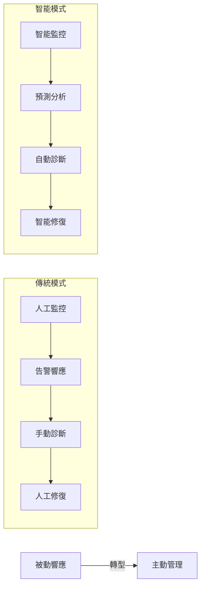
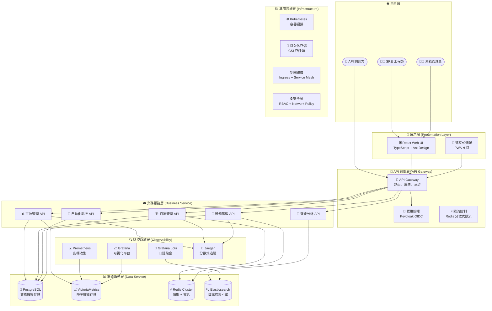

# SRE 平台系統架構設計書

## 📋 文檔概覽

**文檔版本**: 1.0  
**更新日期**: 2025-09-25  

本設計文檔旨在描述 SRE 平台的整體架構、核心設計理念及關鍵技術決策，支撐平台的長期發展與穩定運行。

---

## 📋 核心契約文件參考 (SSOT)

本架構設計基於以下唯一真實來源：

- **[openapi.yaml](openapi.yaml)** - API 規格契約  
- **[db_schema.sql](db_schema.sql)** - 數據庫架構契約  
- **[specs.md](specs.md)** - 功能規格和 UI 原型分析  

---

## 🎯 平台定位與架構哲學

SRE 平台定位為「統一管理平面」(Unified Management Plane)，專注於提供最佳的人員體驗，避免重複打造底層引擎。平台整合多個成熟開源工具（如 Grafana、Keycloak），通過 API 調用實現功能擴展和深度整合。

平台作為智能告警處理中樞，採用統一 Webhook 接收所有告警，經由 AI Agent 進行根因分析、關聯分析、自動化修復及告警風暴總結，實現告警的智能分發與管理。

---

## 💡 核心設計理念

- **智慧告警處理中樞**：Webhook → AI 分析 → 智能分發  
- **AI Agent 四大核心角色**：  
  1. 智慧關聯與根因分析  
  2. 動態產生處理預案  
  3. 自動化修復  
  4. 告警風暴總結  

---

## 🏗️ 資訊架構原則

### 操作視圖 vs 管理配置雙軌制

| 分類         | 職責             | 使用頻率 | 範例功能             |
|--------------|------------------|----------|----------------------|
| **操作視圖** | 日常監控巡檢     | 高頻使用 | 儀表板、資源、事件   |
| **管理配置** | 平台設定調整     | 低頻使用 | 管理選單各項功能     |

此雙軌制設計確保日常監控與平台管理配置分離，提升用戶操作效率與體驗。

---

## ⚡ 自動化引擎設計

平台支持四大自動化觸發機制，覆蓋多場景需求：

1. **事件驅動**：基於告警規則的自動化修復  
2. **排程觸發**：例行任務管理與執行  
3. **手動觸發**：日常操作中腳本或任務手動執行  
4. **Webhook 觸發**：系統整合與外部事件驅動  

> 💡 設計依據：參考 [Google SRE Book](google-sre-book/Chapter-07-The-Evolution-of-Automation-at-Google.md) 的自動化觸發理念。

---

## 📈 DataOps 與數據血緣

平台數據治理基於 DataOps 三大支柱：

1. **數據來源與資產目錄**：建立完整的數據資產註冊表，確保數據資產可追蹤與管理。  
2. **數據可觀測性**：監控數據管道健康，保障數據質量與穩定性。  
3. **數據血緣分析**：追溯 AI 決策的完整數據流，增強透明度與可審計性。  

此數據治理體系支持平台智能分析與自動化決策的數據基礎。

---

## 🏗️ 系統架構與組件分層

---

## 🧩 模組說明

- **事故管理 (IncidentAPI)**：管理事件生命週期，支持根因分析與狀態流轉。  
- **資源管理 (ResourceAPI)**：資源的多維度標籤管理與動態屬性支持。  
- **通知管理 (NotifyAPI)**：多渠道通知策略與條件觸發機制。  
- **智能分析 (AnalyzeAPI)**：基於 AI 的告警關聯與根因分析。  
- **自動化執行 (AutoAPI)**：支持多種觸發機制的自動化任務執行。  

---

## 🌟 核心價值與 USP

- **統一管理平面**：整合多個開源工具，提供一致且友善的用戶體驗。  
- **智慧告警處理中樞**：Webhook 統一入口，AI Agent 智能分析與分發，提升告警處理效率與準確度。  
- **操作視圖與管理配置雙軌制**：清晰分離日常監控與平台管理，提升用戶操作效率。  
- **多元自動化觸發機制**：支持事件驅動、排程、手動及 Webhook 觸發，靈活適配各種運維場景。  
- **DataOps 數據治理**：建立資產目錄、確保數據可觀測性與血緣追蹤，保障數據質量與決策透明。  

---

## 🔍 差異化與產品區隔

- **專注人員體驗，不重造底層引擎**：利用 Grafana、Keycloak 等成熟工具，專注於提供增值功能與優化操作流程。  
- **AI 驅動的智能告警**：原生 Grafana 缺乏 AI 分析能力，平台提供更深入的根因與關聯分析。  
- **雙軌資訊架構**：區分操作與管理，滿足不同用戶角色需求，提升平台易用性。  
- **多元化自動化策略**：支持多種觸發方式，覆蓋更廣泛的運維自動化場景。  
- **完善的數據治理體系**：從資產管理到數據血緣，支持平台智能化與合規性需求。  

---

## 🚀 設計脈絡與實施路線圖

1. **階段一：核心監控與洞察**  
   - 建立統一管理平面與基礎數據模型  
   - 實現智能告警處理中樞與 AI 分析能力  
   - 推出操作視圖與管理配置雙軌制  

2. **階段二：自動化與協作整合**  
   - 完善自動化引擎，支持多種觸發機制  
   - 擴展通知策略與多渠道支持  
   - 強化數據血緣與 DataOps 實踐  

3. **階段三：平台優化與擴展**  
   - 持續優化用戶體驗與性能  
   - 深化 AI 能力與智能決策支持  
   - 擴展第三方系統整合與生態建設  