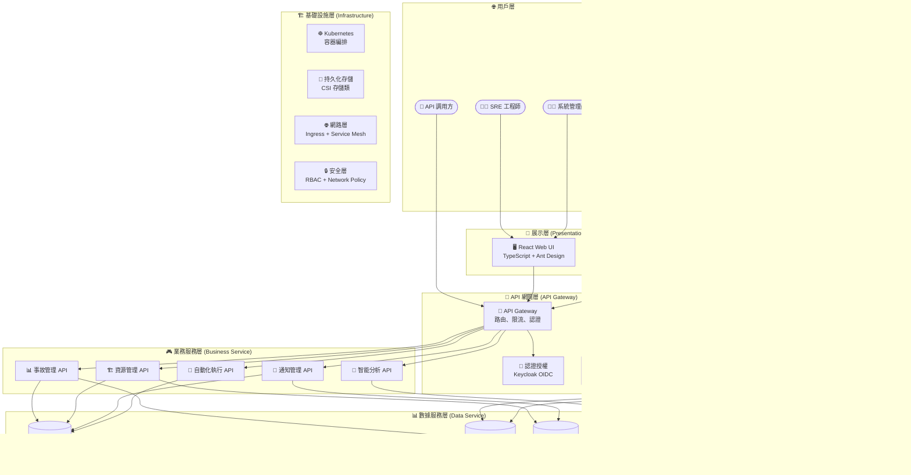

# SRE 平台系統架構設計書

## 📋 文檔概覽

**文檔版本**: 1.0
**更新日期**: 2025-09-25

## 📋 核心契約文件參考 (SSOT)
本架構設計基於以下唯一真實來源：
- **[openapi.yaml](openapi.yaml)** - API 規格契約
- **[db_schema.sql](db_schema.sql)** - 數據庫架構契約
- **[specs.md](specs.md)** - 功能規格和 UI 原型分析

## 🎯 系統概覽與核心架構哲學

SRE 平台是一個現代化的企業級維運平台，採用前後端分離架構，專為 SRE 團隊設計。平台作為「統一管理平面」(Unified Management Plane)，整合多個開源工具，實現從被動故障響應到主動系統管理的轉型。

### 統一管理層 + 開源執行引擎架構
- **平台定位**：作為「統一管理平面」(Unified Management Plane)
- **整合方式**：通过API調用Grafana Alerting和Grafana OnCall
- **核心價值**：提供最佳人員體驗，而非重建底層引擎

### 核心設計理念


### 智慧告警處理中樞
- **Webhook作為AI整合點**：Grafana 統一發送告警到平台，不直接通知用戶
- **平台作為智能處理中樞**：所有告警先經過平台 AI 分析再智能分發
- **AI Agent四大核心角色**：
  1. 智慧關聯與根因分析
  2. 動態產生處理預案
  3. 自動化修復
  4. 告警風暴總結

### 關鍵技術決策

1. **統一管理層策略**: 告警管理委託給 Grafana，人員**認證**狀態管理委託給 Keycloak，平台僅保留**業務**活動狀態。
2. **混合架構模式**: Go 後端處理高併發業務邏輯，React 前端提供現代化用戶體驗
3. **雲原生設計**: 完全容器化，支持 Kubernetes 部署
4. **可觀測性優先**: 內建分散式追蹤、指標收集、結構化日誌

## 📊 資訊架構原則

### 操作視圖 vs 管理配置雙軌制
| 分類 | 職責 | 使用頻率 | 範例功能 |
|------|------|----------|----------|
| **操作視圖** | 日常監控巡檢 | 高頻使用 | 儀表板、資源、事件 |
| **管理配置** | 平台設定調整 | 低頻使用 | 管理選單各項功能 |

## 🔧 核心設計邏輯

### 權責分離原則體系
1. **權限群組**：專注RBAC權限管理
2. **通知團隊**：專注通知設定與聯絡點
3. **資源群組**：擁有唯一負責團隊，確保責任歸屬

### 引導式配置策略
- 從範圍開始 → 系統自動建議 → 提供透明反饋 → 保留手動覆寫
- 降低人員操作門檿，提升配置準確性

## 🔐 身份認證整合

### Keycloak整合方案核心
- **委託專業IAM**：將帳號狀態管理交給Keycloak
- **平台專注點**：內部角色與權限映射
- **簡化管理頁面**：專注於權限群組分配

## ⚡ 自動化引擎設計

### 四大觸發機制
1. **事件驅動**：自動化修復 (設定於告警規則)
2. **排程觸發**：例行任務 (排程管理頁面)
3. **手動觸發**：日常操作 (腳本庫執行按鈕)
4. **Webhook觸發**：系統整合 (腳本詳情頁)

> 💡 **設計依據**: 參考 [Google SRE Book](google-sre-book/Chapter-07-The-Evolution-of-Automation-at-Google.md) 的自動化觸發機制設計理念

## 📈 監控策略體系

### DataOps實踐框架三支柱
1. **數據來源與資產目錄**：建立數據資產註冊表
2. **數據可觀測性**：監控數據管道健康狀態
3. **數據血緣分析**：追溯AI決策完整鏈路

### 飽和度監控指標體系
- **CPU**：平均負載 vs 核心數比率
- **記憶體**：交換空間使用情況
- **磁碟I/O**：等待時間佔比
- **網路**：頻寬使用率與封包丟失
- **應用層**：資源池使用率(連線池、線程池)

## 🏗️ 整體架構

### 系統分層架構



### 核心組件說明

#### 🎯 前端平台 (React + TypeScript)
- **技術棧**: React 18 + TypeScript 5 + Ant Design 5 + Vite
- **主要職責**:
  - 統一的管理界面和用戶體驗
  - 資源生命週期可視化管理
  - 任務編排和調度界面
  - 實時監控數據展示
  - 響應式設計支持多設備

#### 🔧 後端服務 (Go)
- **技術棧**: Go 1.21+ + Gin + GORM + Redis + PostgreSQL
- **主要職責**:
  - RESTful API 服務提供
  - 複雜業務邏輯處理
  - 數據持久化管理
  - 外部系統集成
  - AI Agent 驅動的智能分析
  - 自動化工作流執行

## ⭐ 平台核心功能架構

平台確立了以下三大核心附加價值功能，這些功能超越了原生 Grafana 的能力：

### 🔄 週期性靜音規則 (Recurring Silence Rules)
**問題解決**: Grafana 只支援一次性靜音，無法滿足例行維護需求。

**平台解決方案**:
- **自訂排程器服務**: 基於 CRON 表達式的週期性靜音規則
- **智慧型代理**: 動態呼叫 Grafana API 建立/刪除標準靜音
- **視覺化管理**: 提供比原生 Grafana 更友善的管理介面


### 🏷️ 標籤治理 (Tag Governance)
**問題解決**: 缺乏統一的元數據標準，導致標籤混亂。

**平台解決方案**:
- **標籤綱要管理**: 定義標籤鍵、允許值、驗證規則
- **合規性檢查**: 自動檢測不符合規範的資源標籤
- **智慧輸入**: 提供預設值下拉選單，防止標籤錯誤


### 📨 智能告警處理與通知歷史追蹤 (Intelligent Alert Processing & Notification History)
**問題解決**: Grafana 通知是無狀態的，且缺乏 AI 分析能力。

**平台解決方案**:
- **統一 Webhook 入口**: 平台作為 Grafana 告警的唯一接收點
- **AI 智能分析**: 對每個告警進行根因分析和關聯分析
- **智能通知分發**: 根據分析結果和業務策略智能決定通知方式
- **持久化記錄**: 儲存告警處理的完整生命週期
- **可審計性**: 提供完整的告警處理歷史和狀態追蹤


## 📐 詳細架構設計

### 1. API 設計架構

#### RESTful API 設計原則
```yaml
# 基於 OpenAPI 3.1.0 規範
基礎路徑: /api/v1
認證方式: Bearer Token (OIDC)
內容類型: application/json
響應格式: 統一的 ResponseWrapper<T>

# 核心 API 模組
/auth/*          # 認證授權
/incidents/*     # 事故管理
/resources/*     # 資源管理
/notifications/* # 通知管理
/analytics/*     # 分析報告
/automation/*    # 自動化執行
```

#### API 安全設計


### 2. 數據架構設計

#### 數據存儲策略


#### 數據模型設計要點
1. **用戶系統**: 委託 Keycloak 管理，本地僅存儲業務關聯數據
2. **事故模型**: 支持層級關聯、狀態流轉、AI 分析結果存儲
3. **資源模型**: 多維度標籤、動態屬性、批量操作支持
4. **通知模型**: 多渠道、模板化、條件觸發機制

## 🛠️ 技術實作細節

### 監控採集策略矩陣
| 資源類型 | 可安裝Agent | 推薦方案 | 理由 |
|----------|-------------|----------|------|
| Linux/Windows伺服器 | ✅ 是 | node_exporter | 黃金標準，指標最全面 |
| 網路設備 | ❌ 否 | snmp_exporter | 業界標準，專為網路設備設計 |
| 應用程式 | ✅ 是 | 專屬Exporter | 獲取應用內部性能指標 |
| 自訂應用 | ✅ 是 | Prometheus Client Library | 從源頭暴露指標 |

### 資源分類管理體系
| 資源類型 | 標籤 | 說明 |
|----------|------|------|
| Host | 基礎設施資源 | 物理/虛擬主機 |
| Service | 應用服務資源 | 微服務單元 |
| Database | 資料庫資源 | 託管資料庫實例 |
| Container | 容器資源 | Kubernetes容器實例 |
| Cloud Resource | 雲端資源 | AWS/GCP雲服務 |

## 🧰 技術棧

根據藍圖設計文件，SRE平台涉及以下技術棧：

### 前端技術
- **React 19**：用於構建互動原型
- **TypeScript**：提供類型安全
- **Tailwind CSS（CDN）+ 客製元件**：透過 CDN 載入 Tailwind 並配合自製元件建立 UI
- **ECharts 6**：以 `echarts@^6.0.0` 作為主要依賴，並在 `index.html` 保留 5.5.0 CDN 做為備援

### 前端觀測性
- **Sentry（規劃中）**：目前尚未導入 SDK，待後端統一權限審核與錯誤分類方案完成後再接入，用於前端錯誤追蹤與性能監控。
- **OpenTelemetry JavaScript（規劃中）**：尚未初始化追蹤程式，預計在導入後串接 Alloy 以獲取前端操作軌跡。
- **Web Vitals（規劃中）**：尚未啟用量測，待建立性能指標基準與告警門檻後再啟動收集。
- **Real User Monitoring／RUM（規劃中）**：目前僅為目標狀態，需確認法遵與隱私條款後才會部署。

### 後端與監控技術
- **Go 1.21+**：高性能後端語言
- **Gin**：HTTP Web 框架
- **GORM**：ORM 數據庫操作
- **Zap**：高性能結構化日誌記錄
- **OpenTelemetry**：分散式追蹤、指標和日誌收集
- **Grafana Alloy**：統一觀測性數據收集器
- **Grafana Alerting**：告警規則與路由引擎
- **VictoriaMetrics**：時序數據庫存儲
- **Prometheus node_exporter**：系統指標收集
- **snmp_exporter**：網路設備指標收集
- **Grafana OpenAPI SDK**：已有社群產生的 OpenAPI Go client：`github.com/grafana/grafana-openapi-client-go`，由 Swagger/OpenAPI 規範自動生成，支援全 API 覆蓋。
- **Keycloak OpenAPI**：
https://www.keycloak.org/docs-api/latest/rest-api/openapi.yaml
- **Grafana OpenAPI**：
https://github.com/grafana/grafana/blob/main/public/api-merged.json


### 觀測性架構 (Observability)
- **OpenTelemetry 統一匯出（規劃中）**：目前尚未部署 Collector，待後端完成 Tracing SDK 接入後再統一輸出 Logs/Traces/Metrics。
- **Grafana Alloy 作為收集器（規劃中）**：尚未建置 Alloy 節點，需完成部署資源評估後才會成為集中收集層。
- **多目標匯出（規劃中）**：目前僅以本地 Grafana 做手動匯入，尚未串接 Grafana Cloud，待 Alloy 上線後再進行多目標分流設定。
- **結構化日誌**：已使用 Zap（後端）輸出結構化日誌，後續會再補上集中式儲存與查詢流程。
- **分散式追蹤（規劃中）**：尚未串接 Tracing，需在服務完成 Trace Context 管理與抽樣策略後才會啟動。
- **業務指標（規劃中）**：尚未建立 Prometheus Exporter，自定義指標規格仍在彙整。
- **前端監控（規劃中）**：Sentry / Web Vitals / RUM 尚未導入，待完成前端 SDK 評估及隱私審核。
- **性能測試（規劃中）**：尚未將 K6 納入 CI/CD，後續待測試團隊提供場景腳本後才會加入觀測鏈路。

### 數據流架構
```
前端 (React) → OpenTelemetry JS → Grafana Alloy → Grafana/Loki
    ↓
後端 (Go) → OpenTelemetry Go → Grafana Alloy → VictoriaMetrics
    ↓
測試 (K6) → 性能指標 → Grafana Alloy → Grafana Dashboards
```

### 身份認證
- **Keycloak**：專業IAM系統，處理人員身份與權限

## ⚖️ 重要技術決策

### 1. 架構決策：統一管理層 + 開源執行引擎
**決策內容**：
- 平台作為「統一管理層」，專注於人員體驗
- 底層依賴Grafana等開源工具作為「執行引擎」
- 通過API調用整合Grafana功能

** rationale**：
- 避免重複造輪子
- 利用成熟開源工具的能力
- 專注於提供增值的人員體驗

### 2. 數據收集策略決策
**決策內容**：
- 優先使用`node_exporter`進行深度監控（侵入式）
- 無法安裝agent時使用`snmp_exporter`（非侵入式）

** rationale**：
- `node_exporter`提供更豐富的系統指標
- `snmp_exporter`適用於網路設備等無法安裝agent的場景
- 平衡監控深度與部署複雜度

### 3. 身份認證決策
**決策內容**：
- 整合Keycloak進行身份認證
- 平台不再自行管理帳號狀態

** rationale**：
- 專業事項委託專業系統處理
- 簡化平台複雜度
- 提高安全性

### 4. AI整合決策
**決策內容**：
- 所有告警先經平台Webhook服務再分發
- AI Agent在Webhook服務中進行分析處理

** rationale**：
- 實現AI分析的統一入口
- 提供上下文豐富的分析能力
- 支持自動化修復等功能

### 5. 功能分階段實施決策
**決策內容**：
- Phase 1：聚焦監控與洞察核心功能
- Phase 2：實現響應與協作整合功能

** rationale**：
- 確保核心監控能力穩定
- 降低外部系統依賴風險
- 通過人員反饋優化後續功能

### 6. 資源分類決策
**決策內容**：
- 將資源分為多個類型：Host、Service、Database、Container、Cloud Resource
- 在資源列表中明確標示資源類型

** rationale**：
- 統一管理不同層次的資源
- 提供清晰的資源視圖
- 支持針對性的監控策略

### 7. 飽和度監控決策
**決策內容**：
- 監控資源飽和度而非僅使用率
- 針對不同資源類型定義專門的飽和度指標

** rationale**：
- 更準確反映系統壓力狀況
- 提供預警性監控能力
- 支持更精細的容量規劃

### 8. **告警執行委託給 Grafana，處理交由平台智能中樞**
**決策內容**：
- Grafana 負責告警規則評估和觸發，平台負責智能處理和分發
- 平台提供友善的規則配置界面，同步到 Grafana 執行
- Grafana 統一發送 Webhook 到平台，不直接通知用戶
- 平台作為智能告警處理中樞，提供 AI 分析和複雜通知策略

** rationale**：
- 專注於人員體驗而非重複造輪子
- 利用 Grafana 成熟的告警執行引擎
- 通過統一 Webhook 實現 AI 智能分析
- 提供比原生 Grafana 更強大的處理能力

### 9. **內部人員狀態管理 (Internal User Status)**
**決策內容**：
- 在 `users` 表中保留一個 `is_active` 欄位
- 此欄位用於控制平台內部的業務邏輯，如任務指派、通知等

** rationale**：
- 避免因 SSO 系統中的人員狀態變更，導致平台內部數據關聯中斷
- 提供平台管理員一個獨立的人員啟用/停用控制開關
- 實現平台內部業務邏輯與外部認證系統的解耦

### 10. **軟刪除策略 (Soft Delete Strategy)**
**決策內容**：
- 核心資源表（如 `users`, `teams`, `resources`）採用軟刪除機制
- 透過 `deleted_at` 時間戳欄位來標記刪除狀態

** rationale**：
- **數據完整性**: 確保與已刪除資源相關的歷史記錄（如審計日誌、事件記錄）不會因級聯刪除而丟失，這對於一個需要嚴格審計的 SRE 平台至關重要。
- **可恢復性**: 提供一個快速恢復被誤刪除數據的機制，增加系統的容錯能力。
- **歷史追溯**: 即使資源被刪除，其歷史操作和關聯依然可以被追溯，滿足合規性與故障分析的需求。

### 11. **數據庫架構一致性原則 (Database Architecture Consistency)**
**決策內容**：
- 數據庫表設計必須嚴格符合「統一管理層」架構理念
- 禁止創建與外部系統功能重複的表格
- 所有新增表格必須支持平台核心增值功能

** rationale**：
- **避免功能重複**: 防止與 Grafana、Keycloak 等外部系統產生功能衝突
- **維護一致性**: 確保數據架構與系統架構決策保持同步
- **降低複雜度**: 減少不必要的數據同步和維護負擔

### 12. **數據模型設計規範 (Data Model Design Standards)**
**決策內容**：
- 所有表格必須包含完整的約束檢查（CHECK constraints）
- 時序數據表必須有合理的索引策略
- 大數據量表必須考慮分區策略

** rationale**：
- **數據品質**: 通過約束確保數據一致性和完整性
- **查詢性能**: 通過合理索引提升查詢效率
- **擴展性**: 通過分區策略支持大規模數據存儲

**設計模板**：
```sql
-- 標準表格設計模板
CREATE TABLE example_table (
    id UUID PRIMARY KEY DEFAULT gen_random_uuid(),
    name VARCHAR(128) NOT NULL,
    status VARCHAR(32) NOT NULL DEFAULT 'active',
    created_at TIMESTAMPTZ NOT NULL DEFAULT NOW(),
    updated_at TIMESTAMPTZ NOT NULL DEFAULT NOW(),
    deleted_at TIMESTAMPTZ, -- 軟刪除支持
    CONSTRAINT chk_example_status CHECK (status IN ('active','inactive'))
);

-- 必要索引
CREATE INDEX idx_example_status ON example_table (status);
CREATE INDEX idx_example_created_at ON example_table (created_at DESC);
```

---

### 13. **審計日誌保留策略 (Audit Log Retention)**
**決策內容**：
- 透過資料庫函式 `cleanup_old_audit_logs(retention_interval INTERVAL)` 週期性清理超過保留期間的審計資料，預設保留兩年。

** rationale**：
- **合規與成本平衡**：確保審計資料滿足稽核需求的同時控制儲存成本，避免日誌無限制成長。
- **自動化治理**：搭配排程服務即可週期觸發清理函式，減少人工維運成本。
- **彈性保留**：函式保留參數化的保留期間，未來可依合規需求調整。

## 📊 數據架構邊界說明 (Data Model Boundary Overview)

### 事件與告警分工 (Event Processing vs Alerting)
- **Grafana 告警規則**：負責告警條件評估、觸發判斷與基礎通知派送。
- **SRE 平台事件**：聚焦於 AI 根因分析、跨事件關聯、值班處理追蹤與歷史報表。
- **資料模型落實**：`incidents` 表新增 `source` 枚舉欄位與註解，強調僅承載增值處理，所有告警規則仍交由 Grafana 管理。
- **快取支援**：新增 `alert_rule_snapshots` 表記錄 Grafana 規則快取與同步狀態，提供精靈編輯時的離線回填資料，同時維持 Grafana 作為唯一真實來源。

### 通知策略範圍 (Notification Strategy Scope)
- **Grafana 通知**：專注於告警觸發後的標準聯絡點與 On-Call 流程。
- **平台通知策略**：透過 `notification_strategies` 與 `notification_channels` 管理複雜業務規則、跨系統事件與多渠道路由。
- **整體體驗**：統一管理層負責彙整狀態、追蹤歷史與提供精細化的接收條件，補足 Grafana 在商業流程上的不足。

## 📋 架構總結

SRE 平台的核心價值，在於提供了一個**統一、易用的管理介面 (Unified Management Plane)**，將 Grafana Alerting、Grafana OnCall 這些強大但可能分散的工具整合在一起。

專注於打造最好的上層體驗，而不是重建底層已經非常成熟的引擎。

**最終的架構如下：**

### 🎯 核心架構組件

1. **SRE 平台 (UI + Backend)**：作為**「統一管理層」**
   - 提供統一的用戶界面和業務邏輯
   - 實現三大核心增值功能
   - 管理平台特有的數據和流程

2. **外部系統整合**：通過 API 調用管理外部資源
   - **Grafana**: 告警規則、通知策略、儀表板渲染
   - **Keycloak**: 用戶認證、會話管理、身份提供商整合
   - 其他監控工具: Prometheus、VictoriaMetrics 等

3. **明確的系統邊界**：避免功能重複和架構衝突

### ⚖️ 系統邊界原則總結

#### Grafana 邊界 🚨
```
平台職責: 週期性靜音、通知歷史、告警關聯分析、自動化響應
Grafana 職責: 告警規則引擎、告警評估、通知路由、儀表板渲染
```

#### Keycloak 邊界 🔐
```
平台職責: 用戶偏好、團隊管理、業務權限、平台通知
Keycloak 職責: 用戶認證、密碼管理、SSO整合、身份協議
```

### 🎖️ 架構優勢

這個架構設計實現了：
- **避免重複造輪子**: 專注於平台增值功能
- **清晰的職責分離**: 每個系統負責自己的專業領域
- **統一的管理體驗**: 用戶通過單一界面管理所有資源
- **高度可擴展性**: 通過 API 整合更多外部系統
- **架構一致性**: 數據庫設計與系統架構決策保持同步

**最終效果**: 在享受 Grafana、Keycloak 強大能力的同時，提供給使用者一個完全客製化、無縫整合的平台體驗，並通過三大增值功能提供超越原生工具的價值。