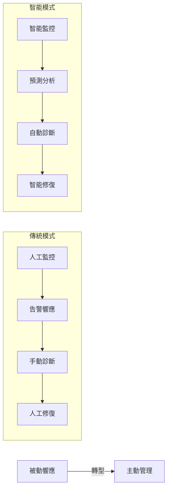
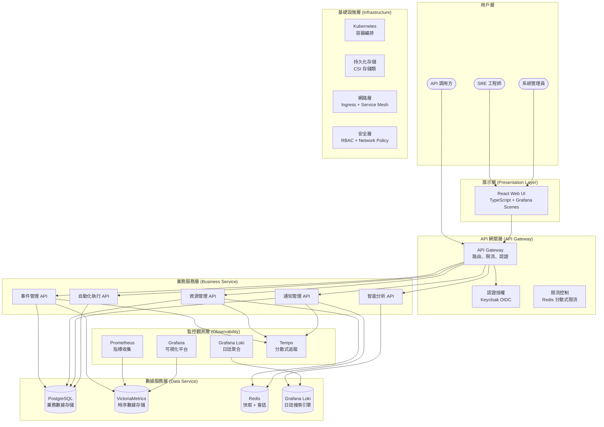
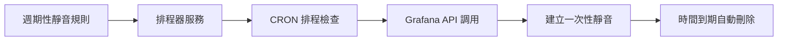
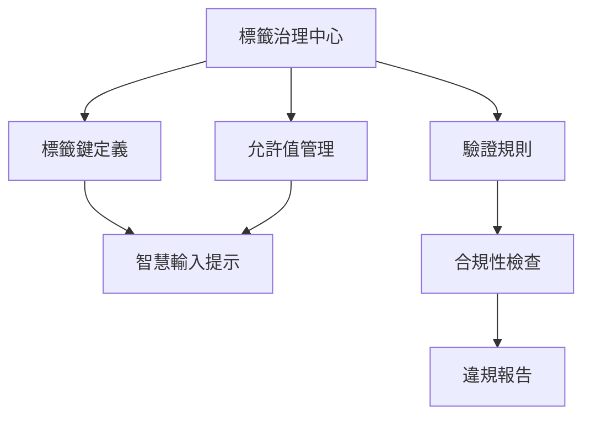
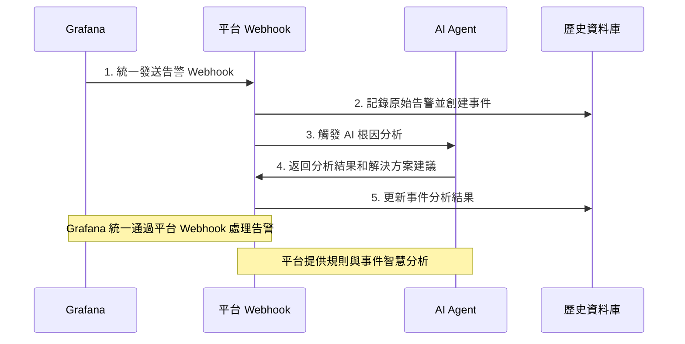
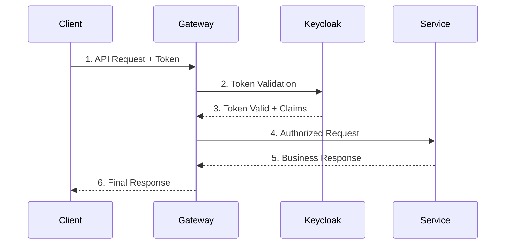
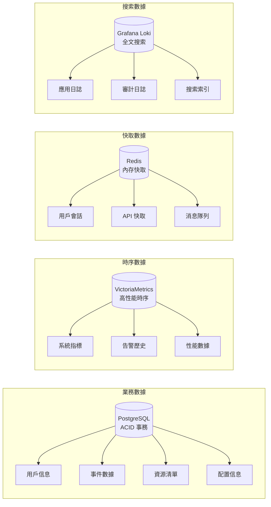

# SRE 平台系統架構設計書

## 文檔概覽

**文檔版本**: 3.0
**更新日期**: 2025-10-11
**目標讀者**: 技術架構師、開發團隊、系統運維人員

**開發策略參考**:
- [.specify/memory/constitution.md](../.specify/memory/constitution.md)
- [.specify/memory/development-guideline.md](../.specify/memory/development-guideline.md)

## 系統概覽與核心架構哲學
SRE 平台是一個現代化的企業級維運平台，採用前後端分離架構，專為 SRE 團隊設計。平台作為「統一管理平面」(Unified Management Plane)，整合多個開源工具，實現從被動故障響應到主動系統管理的轉型。

### 統一管理層 + 開源執行引擎架構
- **平台定位**：作為「統一管理平面」(Unified Management Plane)
- **整合方式**：通過 API 調用 Grafana Alerting
- **核心價值**：提供最佳人員體驗，而非重建底層引擎

### 核心設計理念



### 規則與事件智慧分析
- **規則效能智慧評估**：平台提供 AI 分析能力，評估告警規則的效能並提供優化建議
- **事件根因智慧分析**：整合統計分析、機器學習和專家知識庫，為事件提供多層次的根因推測
- **AI Agent 支援功能**：
  1. 告警規則效能分析與優化建議
  2. 事件根因推測與解決方案建議
  3. 自動化修復建議生成

### 關鍵技術決策
1. **統一管理層策略**: 告警管理委託給 Grafana，人員**認證**狀態管理委託給 Keycloak，平台僅保留**業務**活動狀態。
2. **混合架構模式**: Go 後端處理高併發業務邏輯，React 前端提供現代化用戶體驗
3. **雲原生設計**: 完全容器化，支持 Kubernetes 部署
4. **可觀測性優先**: 內建分散式追蹤、指標收集、結構化日誌

## 資訊架構原則

### 操作視圖 vs 管理配置雙軌制
| 分類 | 職責 | 使用頻率 | 範例功能 |
|------|------|----------|----------|
| **操作視圖** | 日常監控巡檢 | 高頻使用 | 儀表板、資源、事件 |
| **管理配置** | 平台設定調整 | 低頻使用 | 管理選單各項功能 |

## 核心設計邏輯

### 權責分離原則體系
1. **權限群組**：專注 RBAC 權限管理
2. **通知團隊**：專注通知設定與聯絡點
3. **資源群組**：擁有唯一負責團隊，確保責任歸屬

### 引導式配置策略
- 從範圍開始 → 系統自動建議 → 提供透明反饋 → 保留手動覆寫
- 降低人員操作門檻，提升配置準確性

## 身份認證整合

#### 多身份提供商 (IdP) 支援策略
- **架構設計**：平台採用統一的多 IdP 支援架構，支援配置多個身份提供商 (Identity Provider)，實現企業級身份認證整合。
- **整合方式**：透過標準協議 (OIDC / SAML 2.0) 實現統一的身份登入與權限管理。
- **平台責任**：
  - 提供統一的多 IdP 管理介面和配置策略
  - 實作 IdP 至平台內部角色的映射層 (Mapping Layer)
  - 管理平台特有的業務權限和使用者偏好設定
  - 確保身份認證的高可用性和故障轉移機制
- **主要優勢**：
  - 支援企業依據環境和需求選擇最適合的 IdP
  - 實現混合式登入（企業 SSO + 本地帳號）
  - 提升系統的彈性和可移植性，減少供應商鎖定風險

#### IdP 管理功能實作

##### 前端功能模組
- **IdP 配置管理**：
  - 支援 Keycloak、Auth0、Azure AD、自訂 IdP
  - 動態配置表單根據 IdP 類型調整欄位
  - 敏感資訊的安全顯示和複製功能
  - 即時連線測試和狀態監控

- **安全憑證處理**：
  - Client Secret 等敏感資訊的遮蔽顯示
  - 基於權限的查看/複製控制
  - 安全的剪貼簿操作和權限驗證
  - 秘密驗證和輪換機制

- **狀態監控與錯誤處理**：
  - 即時連線狀態和響應時間監控
  - 結構化錯誤顯示和重試機制
  - Session 管理和自動 token 刷新
  - 完整的審計日誌和操作追蹤

##### 後端整合架構
- **API 設計**：
  - RESTful IdP 配置管理端點
  - 安全的敏感資訊處理 API
  - 即時連線測試和健康檢查
  - 審計日誌和操作記錄

- **安全考量**：
  - 敏感資料加密儲存
  - 權限-based 訪問控制
  - 審計追蹤所有操作
  - GDPR 合規的資料處理

##### 故障轉移機制
- **自動故障轉移**：當主要 IdP 失敗時自動切換到備用 IdP
- **優先順序管理**：支援多個 IdP 的優先順序配置
- **健康檢查**：定期檢查 IdP 可用性和響應時間
- **降級策略**：在所有 IdP 都不可用時的備用方案

## 自動化引擎設計

### 四大觸發機制
1. **事件驅動**：自動化修復 (設定於告警規則)
2. **排程觸發**：例行任務 (排程管理頁面)
3. **手動觸發**：日常操作 (腳本庫執行按鈕)
4. **Webhook觸發**：系統整合 (腳本詳情頁)

> 💡 **設計依據**: 參考 [Google SRE Book](google-sre-book/Chapter-07-The-Evolution-of-Automation-at-Google.md) 的自動化觸發機制設計理念

## 監控策略體系

### DataOps 實踐框架三支柱
1. **數據來源與資產目錄**：建立數據資產註冊表
2. **數據可觀測性**：監控數據管道健康狀態
3. **數據血緣分析**：追溯 AI 決策完整鏈路

### 飽和度監控指標體系
- **CPU**：平均負載 vs 核心數比率
- **記憶體**：交換空間使用情況
- **磁碟I/O**：等待時間佔比
- **網路**：頻寬使用率與封包丟失
- **應用層**：資源池使用率(連線池、線程池)

## 整體架構

### 系統分層架構



### 核心組件說明

#### 前端平台 (React + TypeScript)
- **技術棧**: React 18 + TypeScript 5 + Grafana Scenes SDK + Frontend-First + Mock 驅動策略
- **主要職責**:
  - 統一的管理界面和用戶體驗
  - 資源生命週期可視化管理
  - 任務編排和調度界面
  - 實時監控數據展示

#### 🔧 後端服務 (Go) [FUTURE]
- **技術棧**: Go 1.21+ + Gin + GORM + Redis + PostgreSQL
- **主要職責**:
  - RESTful API 服務提供
  - 複雜業務邏輯處理
  - 數據持久化管理
  - 外部系統集成
  - AI Agent 驅動的智能分析
  - 自動化工作流執行
- 目前階段以 Mock Server 提供 API 響應，後端開發暫緩

## 平台核心功能架構

平台確立了以下三大核心附加價值功能，這些功能超越了原生 Grafana 的能力：

### 週期性靜音規則 (Recurring Silence Rules)
**問題解決**: Grafana 只支援一次性靜音，無法滿足例行維護需求。

**平台解決方案**:
- **自訂排程器服務**: 基於 CRON 表達式的週期性靜音規則
- **智慧型代理**: 動態呼叫 Grafana API 建立/刪除標準靜音
- **視覺化管理**: 提供比原生 Grafana 更友善的管理介面



### 標籤治理 (Tag Governance)
**問題解決**: 缺乏統一的元數據標準，導致標籤混亂。

**平台解決方案**:
- **標籤綱要管理**: 定義標籤鍵、允許值、驗證規則
- **合規性檢查**: 自動檢測不符合規範的資源標籤
- **智慧輸入**: 提供預設值下拉選單，防止標籤錯誤



### 規則與事件智慧分析 (Intelligent Rules & Event Analysis)
**問題解決**: 傳統告警規則管理和事件處理缺乏智慧分析能力。

**平台解決方案**:
- **統一 Webhook 入口**: 平台作為 Grafana 告警的唯一接收點，提供 `/api/v1/webhooks/alerts` 端點
- **規則效能 AI 分析**: 評估告警規則的效能並提供優化建議
- **事件根因智慧分析**: 整合多種分析方法為事件提供根因推測
- **解決方案建議生成**: 基於分析結果提供處理建議
- **歷史趨勢分析**: 記錄規則觸發和事件處理的歷史數據
- **持續優化**: 通過 AI 分析不斷提升規則和處理效能



## 詳細架構設計

### 1. API 設計架構

#### RESTful API 設計原則（比照 Grafana 與 Kubernetes）

本平台所有 API 設計採用 **Resource-Oriented Architecture (ROA)**，並遵循 **Grafana** 與 **Kubernetes** 的命名與資源分層規範。

### 最高原則

1. **資源導向 (Resource-Oriented)**  
   每個 API 對應單一資源（如 `users`, `tags`, `dashboards`），並遵循 CRUD 操作語意。  
   路徑應採用 **小寫複數名詞**，例如：  
   `/api/v1/resources`, `/api/v1/notifications/strategies`

2. **分層式命名空間 (Hierarchical Namespace)**  
   模組化分組，例如：
   ```
   /api/v1/platform/tags
   /api/v1/identity/users
   /api/v1/insights/logs
   /api/v1/automation/playbooks
   ```
   對應 `/specs/00X-*` 模組規格，形成一致的層級結構。

3. **語意一致的 HTTP 動詞**  
   | 動詞 | 用途 | 範例 |
   |------|------|------|
   | `GET` | 取得資源 | `/resources` |
   | `POST` | 新增資源 | `/resources` |
   | `PUT` / `PATCH` | 更新資源 | `/resources/{id}` |
   | `DELETE` | 刪除資源 | `/resources/{id}` |

4. **子資源與動作 (Subresource & Action)**  
   - 狀態與擴展操作應透過子路徑提供，類似 Kubernetes Subresource：  
     `/resources/{id}/status`, `/incidents/{id}/resolve`, `/notifications/history/export`

5. **統一回應結構 (Unified Response Schema)**  
   所有 API 響應必須封裝為標準結構：
   ```json
   {
     "data": { },
     "error": null,
     "meta": {
       "timestamp": "2025-10-12T00:00:00Z",
       "requestId": "uuid"
     }
   }
   ```

6. **查詢參數與分頁 (Query Parameters)**  
   所有列表型 API 應支援：
   ```
   ?limit=50&offset=0&sort=name:asc&filter=status:active
   ```

7. **版本化 (Versioning)**  
   所有路徑統一以 `/api/v1/` 開頭，未來支援版本升級（v2, v3）。

8. **錯誤與狀態碼規範**  
   - `200 OK` 成功  
   - `201 Created` 資源建立  
   - `400 Bad Request` 驗證錯誤  
   - `401 Unauthorized` 未登入  
   - `403 Forbidden` 權限不足  
   - `404 Not Found` 資源不存在  
   - `500 Internal Server Error` 系統錯誤  

9. **OpenAPI 規格與自動化契約測試**  
   所有模組的 API 必須以 OpenAPI 3.1 定義 (`contracts/openapi.yaml`)，並透過 Mock Server 驗證資料一致性。  

10. **遵循 Spec-driven 原則**  
   API 設計、資料模型與互動行為皆以 `/specs` 為唯一事實來源 (Single Source of Truth)，任何改動需同步更新對應規格文件。

---

此原則作為全平台 API 設計與實作的最高準則，後續每個模組的 `spec.md` 應延伸本規範，並具體化各自的資源結構與路徑命名。

#### API 安全設計


### 2. 數據架構設計

#### 數據存儲策略


#### 數據模型設計要點
1. **用戶系統**: 委託 Keycloak 管理，本地僅存儲業務關聯數據
2. **事件模型**: 支持層級關聯、狀態流轉、AI 分析結果存儲
3. **資源模型**: 多維度標籤、動態屬性、批量操作支持
4. **通知模型**: 多渠道、模板化、條件觸發機制

## 技術實作細節

### 監控採集策略矩陣
| 資源類型 | 可安裝Agent | 推薦方案 | 理由 |
|----------|-------------|----------|------|
| Linux/Windows伺服器 | ✅ 是 | node_exporter | 黃金標準，指標最全面 |
| 網路設備 | ❌ 否 | snmp_exporter | 業界標準，專為網路設備設計 |
| 應用程式 | ✅ 是 | 專屬 Exporter | 獲取應用內部性能指標 |
| 自訂應用 | ✅ 是 | Prometheus Client Library | 從源頭暴露指標 |

### 資源分類管理體系
| 資源類型 | 標籤 | 說明 |
|----------|------|------|
| Host | 基礎設施資源 | 物理/虛擬主機 |
| Service | 應用服務資源 | 微服務單元 |
| Database | 資料庫資源 | 託管資料庫實例 |
| Container | 容器資源 | Kubernetes容器實例 |
| Cloud Resource | 雲端資源 | AWS/GCP雲服務 |

## 技術棧

根據藍圖設計文件，SRE 平台涉及以下技術棧：

### 前端技術
- **React 18**：用於構建互動原型
- **TypeScript**：提供類型安全
- **Grafana UI / Scenes SDK**
- **Grafana Visualization Components**
- **Grafana REST API (內部與外部整合)**

### 前端觀測性
- **Sentry**：前端錯誤追蹤和性能監控
- **OpenTelemetry JavaScript**：前端人員行為追蹤
- **Web Vitals**：核心 Web 性能指標監控
- **Real User Monitoring (RUM)**：真實人員監控

### 後端與監控技術
- **Go 1.21+**：高性能後端語言
- **Gin**：HTTP Web 框架
- **GORM**：ORM 數據庫操作
- **Zap**：高性能結構化日誌記錄
- **OpenTelemetry**：分散式追蹤、指標和日誌收集
- **Grafana Alloy**：統一觀測性數據收集器
- **Grafana Alerting**：告警規則與路由引擎
- **VictoriaMetrics**：時序數據庫存儲
- **Prometheus node_exporter**：系統指標收集
- **snmp_exporter**：網路設備指標收集
- **Grafana OpenAPI SDK**：已有社群產生的 OpenAPI Go client：`github.com/grafana/grafana-openapi-client-go`，由 Swagger/OpenAPI 規範自動生成，支援全 API 覆蓋。

### 觀測性架構 (Observability)
- **OpenTelemetry 統一匯出**：Logs/Traces/Metrics 三合一觀測性數據
- **Grafana Alloy 作為收集器**：統一接收和轉發觀測性數據
- **多目標匯出**：支援本地 Grafana 或 Grafana Cloud
- **結構化日誌**：使用 Zap (後端) 提供高性能結構化日誌記錄
- **分散式追蹤**：端到端請求追蹤和性能監控
- **業務指標**：自定義業務指標收集和分析
- **前端監控**：Sentry + Web Vitals + RUM 真實人員監控
- **性能測試**：K6 負載測試和性能監控

**MVP 階段**: 前端 Scenes 以模擬資料來源（Mock Data Source）呈現觀測數據，確保介面與資料模型一致，待後端接入 Grafana Alloy。

### 數據流架構
```
前端 (React) → OpenTelemetry JS → Grafana Alloy → Grafana/Loki
    ↓
後端 (Go) → OpenTelemetry Go → Grafana Alloy → VictoriaMetrics
    ↓
測試 (K6) → 性能指標 → Grafana Alloy → Grafana Dashboards
```

### 身份認證
- **Keycloak**：專業 IAM 系統，處理人員身份與權限

## 重要技術決策

### 1. 架構決策：統一管理層 + 開源執行引擎
**決策內容**：
- 平台作為「統一管理層」，專注於人員體驗
- 底層依賴 Grafana 等開源工具作為「執行引擎」
- 通過 API 調用整合 Grafana 功能

**決策理由**：
- 避免重複造輪子
- 利用成熟開源工具的能力
- 專注於提供增值的人員體驗

### 2. 數據收集策略決策
**決策內容**：
- 優先使用 `node_exporter` 進行深度監控（侵入式）
- 無法安裝 agent 時使用 `snmp_exporter`（非侵入式）

**決策理由**：
- `node_exporter` 提供更豐富的系統指標
- `snmp_exporter` 適用於網路設備等無法安裝agent的場景
- 平衡監控深度與部署複雜度

### 3. 身份認證決策
**決策內容**：
- 整合 Keycloak 進行身份認證
- 平台不再自行管理帳號狀態

**決策理由**：
- 專業事項委託專業系統處理
- 簡化平台複雜度
- 提高安全性

### 4. AI 整合決策
**決策內容**：
- 所有告警先經平台 Webhook 服務再分發
- AI Agent 在 Webhook 服務中進行分析處理

**決策理由**：
- 實現 AI 分析的統一入口
- 提供上下文豐富的分析能力
- 支持自動化修復等功能

### 5. 功能分階段實施決策
**決策內容**：
- Phase 1：聚焦監控與洞察核心功能
- Phase 2：實現響應與協作整合功能

**決策理由**：
- 確保核心監控能力穩定
- 降低外部系統依賴風險
- 通過人員反饋優化後續功能

### 6. 資源分類決策
**決策內容**：
- 將資源分為多個類型：Host、Service、Database、Container、Cloud Resource
- 在資源列表中明確標示資源類型

**決策理由**：
- 統一管理不同層次的資源
- 提供清晰的資源視圖
- 支持針對性的監控策略

### 7. 飽和度監控決策
**決策內容**：
- 監控資源飽和度而非僅使用率
- 針對不同資源類型定義專門的飽和度指標

**決策理由**：
- 更準確反映系統壓力狀況
- 提供預警性監控能力
- 支持更精細的容量規劃

### 8. **告警規則管理委託給平台，AI 分析增強處理能力**
**決策內容**：
- 平台提供統一的告警規則配置和管理介面
- 整合 Grafana 作為告警執行引擎，實現規則的實際評估和觸發
- 提供統一 Webhook 入口接收 Grafana 告警並自動創建事件
- 平台提供 AI 分析能力，協助規則優化和事件根因分析
- 通過 Webhook 接收和智慧處理提升告警管理的效率

**決策理由**：
- 專注於提供優質的規則管理和智慧分析體驗
- 利用 Grafana 成熟的告警執行引擎作為後端支援
- 通過 AI 增強功能提供比原生 Grafana 更強大的分析能力
- 實現規則管理與事件處理的統一平台體驗

### 9. **內部人員狀態管理 (Internal User Status)**
**決策內容**：
- 在 `users` 表中保留一個 `is_active` 欄位
- 此欄位用於控制平台內部的業務邏輯，如任務指派、通知等

**決策理由**：
- 避免因 SSO 系統中的人員狀態變更，導致平台內部數據關聯中斷
- 提供平台管理員一個獨立的人員啟用/停用控制開關
- 實現平台內部業務邏輯與外部認證系統的解耦

### 10. **軟刪除策略 (Soft Delete Strategy)**
**決策內容**：
- 核心資源表（如 `users`, `teams`, `resources`）採用軟刪除機制
- 透過 `deleted_at` 時間戳欄位來標記刪除狀態

**決策理由**：
- **數據完整性**: 確保與已刪除資源相關的歷史記錄（如審計日誌、事件記錄）不會因級聯刪除而丟失，這對於一個需要嚴格審計的 SRE 平台至關重要。
- **可恢復性**: 提供一個快速恢復被誤刪除數據的機制，增加系統的容錯能力。
- **歷史追溯**: 即使資源被刪除，其歷史操作和關聯依然可以被追溯，滿足合規性與故障分析的需求。

### 11. **數據庫架構一致性原則 (Database Architecture Consistency)**
**決策內容**：
- 數據庫表設計必須嚴格符合「統一管理層」架構理念
- 禁止創建與外部系統功能重複的表格
- 所有新增表格必須支持平台核心增值功能

**決策理由**：
- **避免功能重複**: 防止與 Grafana、Keycloak 等外部系統產生功能衝突
- **維護一致性**: 確保數據架構與系統架構決策保持同步
- **降低複雜度**: 減少不必要的數據同步和維護負擔

## 數據架構邊界說明 (Data Model Boundary Overview)

### 事件與告警分工 (Event Processing vs Alerting)
- **Grafana 告警規則**：負責告警條件評估、觸發判斷與基礎通知派送。
- **SRE 平台事件**：聚焦於 AI 根因分析、跨事件關聯、值班處理追蹤與歷史報表。

### 通知策略範圍 (Notification Strategy Scope)
- **Grafana 通知**：專注於告警觸發後的標準聯絡點與 On-Call 流程。
- **平台通知策略**：透過 `notification_strategies` 與 `notification_channels` 管理複雜業務規則、跨系統事件與多渠道路由。
- **整體體驗**：統一管理層負責彙整狀態、追蹤歷史與提供精細化的接收條件，補足 Grafana 在商業流程上的不足。

## 架構總結
SRE 平台的核心價值，在於提供了一個**統一、易用的管理介面 (Unified Management Plane)**，將 Grafana Alerting、Grafana OnCall 這些強大但可能分散的工具整合在一起。
專注於打造最好的上層體驗，而不是重建底層已經非常成熟的引擎。

**最終的架構如下：**

### 核心架構組件

1. **SRE 平台 (UI + Backend)**：作為**「統一管理層」**
   - 提供統一的用戶界面和業務邏輯
   - 實現三大核心增值功能
   - 管理平台特有的數據和流程

2. **外部系統整合**：通過 API 調用管理外部資源
   - **Grafana**: 告警規則、通知策略、儀表板渲染
   - **Keycloak**: 用戶認證、會話管理、身份提供商整合
   - 其他監控工具: Prometheus、VictoriaMetrics 等

3. **明確的系統邊界**：避免功能重複和架構衝突

### 系統邊界原則總結

#### Grafana 邊界
```
平台職責: 週期性靜音、通知歷史、告警關聯分析、自動化響應
Grafana 職責: 告警規則引擎、告警評估、通知路由、儀表板渲染
```

#### Keycloak 邊界
```
平台職責: 用戶偏好、團隊管理、業務權限、平台通知
Keycloak 職責: 用戶認證、密碼管理、SSO整合、身份協議
```

### 架構優勢

這個架構設計實現了：
- **避免重複造輪子**: 專注於平台增值功能
- **清晰的職責分離**: 每個系統負責自己的專業領域
- **統一的管理體驗**: 用戶通過單一界面管理所有資源
- **高度可擴展性**: 通過 API 整合更多外部系統
- **架構一致性**: 數據庫設計與系統架構決策保持同步

**最終效果**: 在享受 Grafana、Keycloak 強大能力的同時，提供給使用者一個完全客製化、無縫整合的平台體驗，並通過三大增值功能提供超越原生工具的價值。

## 架構演進階段
1. **Phase 1**：Frontend-First + Mock Server，建立完整互動體驗與規格驗證。
2. **Phase 2**：[FUTURE] 後端實作，整合 Grafana API 與資料庫。
3. **Phase 3**：AI Agent 與 Observability 全面接入。
