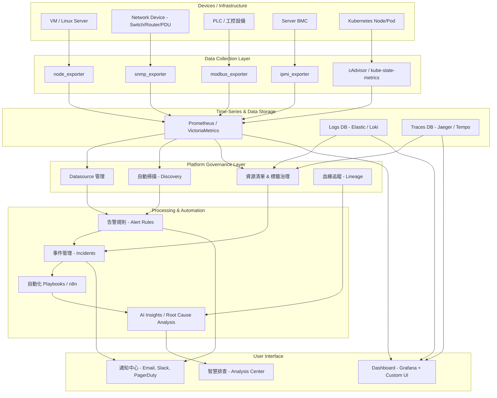

# Data Flow (From Collection to User)

```mermaid
flowchart TD

    subgraph Devices["Devices / Infrastructure"]
        Z1[VM / Linux Server]
        Z2[Network Device - Switch/Router/PDU]
        Z3[PLC / 工控設備]
        Z4[Server BMC]
        Z5[Kubernetes Node/Pod]
    end

    subgraph Collectors["Data Collection Layer"]
        A1[node_exporter]
        A2[snmp_exporter]
        A3[modbus_exporter]
        A4[ipmi_exporter]
        A5[cAdvisor / kube-state-metrics]
    end

    subgraph Storage["Time-Series & Data Storage"]
        B1[Prometheus / VictoriaMetrics]
        B2[Logs DB - Elastic / Loki]
        B3[Traces DB - Jaeger / Tempo]
    end

    subgraph Governance["Platform Governance Layer"]
        C1[Datasource 管理]
        C2[自動掃描 - Discovery]
        C3[資源清單 & 標籤治理]
        C4[血緣追蹤 - Lineage]
    end

    subgraph Processing["Processing & Automation"]
        D1[告警規則 - Alert Rules]
        D2[事件管理 - Incidents]
        D3[自動化 Playbooks / n8n]
        D4[AI Insights / Root Cause Analysis]
    end

    subgraph Presentation["User Interface"]
        E1[Dashboard - Grafana + Custom UI]
        E2[通知中心 - Email, Slack, PagerDuty]
        E3[智慧排查 - Analysis Center]
    end

    %% Data Flow: Devices -> Collectors
    Z1 --> A1
    Z2 --> A2
    Z3 --> A3
    Z4 --> A4
    Z5 --> A5

    %% Collectors -> Storage
    A1 --> B1
    A2 --> B1
    A3 --> B1
    A4 --> B1
    A5 --> B1

    %% Storage -> Governance
    B1 --> C1
    B1 --> C2
    B1 --> C3
    B2 --> C3
    B3 --> C3

    %% Governance -> Processing
    C1 --> D1
    C2 --> D1
    C3 --> D2
    C4 --> D4

    %% Processing links
    D1 --> D2
    D2 --> D3
    D3 --> D4

    %% To Presentation
    D1 --> E2
    D2 --> E2
    D4 --> E3

    B1 --> E1
    B2 --> E1
    B3 --> E1
```