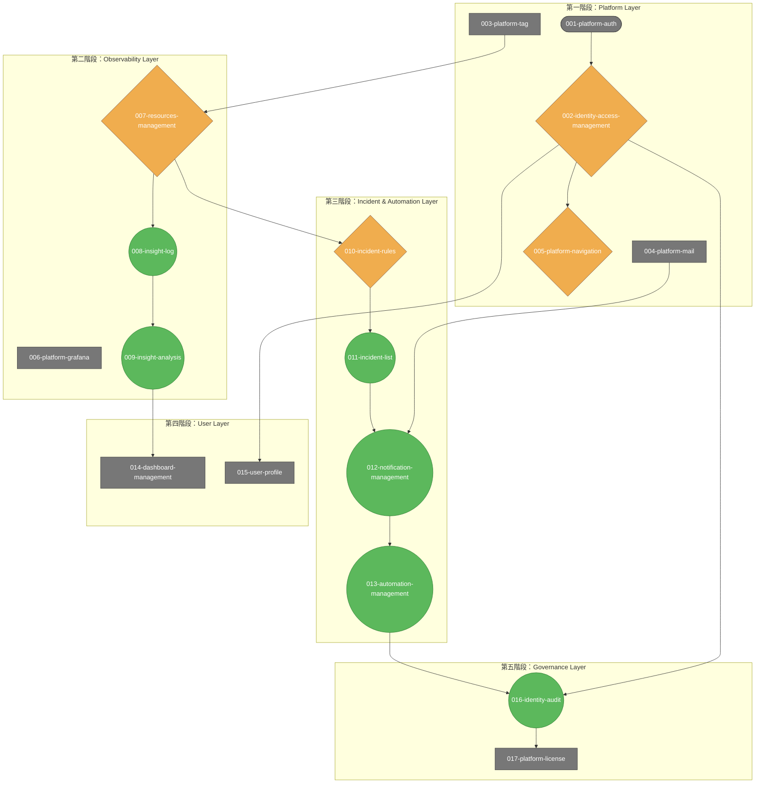

# SRE 平台模組級規格文件索引

**建立日期**: 2025-10-06
**最後更新**: 2025-10-08
**狀態**: Final
**憲法版本**: 1.3.0
**模組文件數**: 17 份

---

## 一、概覽

本索引涵蓋 SRE 平台的所有模組級規格文件，依據執行順序進行編號與排列。

所有規格文件皆依據 `.specify/memory/constitution.md` v1.3.0 制定，確保符合平台憲法原則。

**最新審查**: 2025-10-08 完成 SPEC ⇄ MVP 對齊審查，詳見 [審查報告](_review-report.md)

---

## 二、模組級規格（17 份）

| 編號 | 模組 ID | 模組名稱 | 檔案路徑 | 整合來源 | 憲法版本 | AS 數量 |
|------|---------|----------|----------|----------|----------|---------|
| 001 | platform-auth | 身份驗證設定 | [001-platform-auth-spec.md](001-platform-auth-spec.md) | - | v1.2.0 | 3 |
| 002 | identity-access-management | 身份與存取管理 | [002-identity-access-management-spec.md](002-identity-access-management-spec.md) | - | v1.3.0 | 6 |
| 003 | platform-tag | 標籤管理 | [003-platform-tag-spec.md](003-platform-tag-spec.md) | - | v1.2.0 | 5 |
| 004 | platform-mail | 郵件設定 | [004-platform-mail-spec.md](004-platform-mail-spec.md) | - | v1.2.0 | 3 |
| 005 | platform-navigation | 平台導覽 | [005-platform-navigation-spec.md](005-platform-navigation-spec.md) | - | v1.3.0 | - |
| 006 | platform-grafana | Grafana 整合 | [006-platform-grafana-spec.md](006-platform-grafana-spec.md) | - | v1.2.0 | 3 |
| 007 | resources-management | 資源管理與探索 | [007-resources-management-spec.md](007-resources-management-spec.md) | resources-discovery + resources-management | v1.3.0 | 20 |
| 008 | insight-log | 日誌探索 | [008-insight-log-spec.md](008-insight-log-spec.md) | - | v1.2.0 | 5 |
| 009 | insight-analysis | 洞察分析 | [009-insight-analysis-spec.md](009-insight-analysis-spec.md) | - | v1.3.0 | 4 |
| 010 | incident-rules | 事件規則管理 | [010-incident-rules-spec.md](010-incident-rules-spec.md) | incident-alert + incident-silence | v1.3.0 | 12 |
| 011 | incident-list | 事件列表管理 | [011-incident-list-spec.md](011-incident-list-spec.md) | - | v1.2.0 | 5 |
| 012 | notification-management | 通知管理 | [012-notification-management-spec.md](012-notification-management-spec.md) | notification-channel + notification-strategy + notification-history | v1.3.0 | 15 |
| 013 | automation-management | 自動化管理 | [013-automation-management-spec.md](013-automation-management-spec.md) | automation-history + automation-playbook + automation-trigger | v1.3.0 | 12 |
| 014 | dashboards-management | 儀表板管理 | [014-dashboards-management-spec.md](014-dashboards-management-spec.md) | - | v1.3.0 | - |
| 015 | user-profile | 使用者個人資料 | [015-user-profile-spec.md](015-user-profile-spec.md) | profile-info + profile-preference + profile-security | v1.3.0 | 16 |
| 016 | identity-audit | 審計日誌 | [016-identity-audit-spec.md](016-identity-audit-spec.md) | - | v1.2.0 | 3 |
| 017 | platform-license | 授權管理 | [017-platform-license-spec.md](017-platform-license-spec.md) | - | v1.2.0 | 2 |

---

## 三、模組功能分類

### Identity（身份與存取）- 2 份
- identity-access-management - 身份與存取管理
- identity-audit - 審計日誌

### Incident（事件管理）- 2 份
- incident-list - 事件列表管理
- incident-rules - 事件規則管理（整合告警與靜音）

### Insight（洞察分析）- 2 份
- insight-log - 日誌探索
- insight-analysis - 洞察分析（整合回放與容量預測）

### Automation（自動化）- 1 份
- automation-management - 自動化管理（整合腳本、觸發器、歷史）

### Notification（通知管理）- 1 份
- notification-management - 通知管理（整合管道、策略、歷史）

### Resources（資源管理）- 1 份
- resources-management - 資源管理與探索

### Dashboards（儀表板）- 1 份
- dashboards-management - 儀表板管理

### Profile（個人設定）- 1 份
- user-profile - 使用者個人資料（整合資訊、偏好、安全）

### Platform（平台設定）- 6 份
- platform-auth - 身份驗證設定
- platform-grafana - Grafana 整合
- platform-license - 授權管理
- platform-mail - 郵件設定
- platform-tag - 標籤管理
- platform-navigation - 平台導覽

> 備註：`_review-report.md` 為審查報告文件，不計入模組統計。

## 四、快速導航

### 依優先級分類

#### P0（關鍵功能）
- incident-list, incident-rules
- resources-management
- dashboards-management
- identity-access-management

#### P1（重要功能）
- automation-management
- notification-management

#### P2（輔助功能）
- insight-analysis, insight-log
- platform-* (5 份)

#### P3（個人化）
- user-profile

## 依賴關係

### 第一階段：核心基礎層（Platform Layer）
1. **platform-auth-spec.md** — 身份驗證設定
   - **依賴性**: 完全獨立（基礎模組）
   - **事件驅動**: ❌ **不符合** — 傳統請求-響應模式，無事件概念
   - **被依賴**: 所有其他模組都依賴身份驗證

2. **identity-access-management-spec.md** — 身份與存取管理
   - **依賴性**: 依賴 `platform-auth`
   - **事件驅動**: ⚠️ **部分符合** — 權限變更應觸發事件，但目前未明確定義
   - **被依賴**: `platform-navigation`, `user-profile`, `identity-audit`

3. **platform-tag-spec.md** — 標籤管理
   - **依賴性**: 相對獨立，但依賴身份驗證
   - **事件驅動**: ❌ **不符合** — 治理型模組，適合同步操作
   - **被依賴**: `resources-management`, `incident-rules`, `automation-management` 等所有需要分類的模組

4. **platform-mail-spec.md** — 郵件設定
   - **依賴性**: 相對獨立，但依賴身份驗證
   - **事件驅動**: ❌ **不符合** — 配置型模組，無事件概念
   - **被依賴**: `notification-management`

5. **platform-navigation-spec.md** — 平台導覽
   - **依賴性**: 依賴 `identity-access-management`，可能動態依賴其他模組
   - **事件驅動**: ⚠️ **部分符合** — 支援即時同步更新（WebSocket/SSE），有事件驅動概念
   - **被依賴**: 無直接依賴（用戶體驗基礎設施）

### 第二階段：基礎觀測與整合層
6. **platform-grafana-spec.md** — Grafana 整合
   - **依賴性**: 相對獨立，但依賴身份驗證
   - **事件驅動**: ❌ **不符合** — 整合型模組，適合同步API調用
   - **被依賴**: `dashboards-management`

7. **resources-management-spec.md** — 資源管理與探索
   - **依賴性**: 依賴 `platform-tag` (資源標籤)
   - **事件驅動**: ⚠️ **部分符合** — 有資源狀態更新和事件關聯的概念，但未完全事件驅動
   - **被依賴**: `insight-log`, `insight-analysis`, `incident-rules`

8. **insight-log-spec.md** — 日誌探索
   - **依賴性**: 依賴 `resources-management` (資源上下文)
   - **事件驅動**: ✅ **符合** — 支援即時串流和事件追蹤（trace_id）
   - **被依賴**: `insight-analysis` (日誌分析依賴)

9. **insight-analysis-spec.md** — 洞察分析
   - **依賴性**: 依賴 `resources-management` (資源數據), `insight-log` (日誌數據)
   - **事件驅動**: ✅ **符合** — 核心功能是「事件回放」(Event Replay)，強烈事件驅動
   - **被依賴**: 無直接依賴

### 第三階段：事件與自動化層
10. **incident-rules-spec.md** — 事件規則管理
    - **依賴性**: 依賴 `resources-management` (監控對象), `platform-tag` (規則分類)
    - **事件驅動**: ⚠️ **部分符合** — 基於規則觸發事件，但規則本身是同步配置
    - **被依賴**: `incident-list`, `automation-management` (觸發依賴)

11. **incident-list-spec.md** — 事件列表管理
    - **依賴性**: 依賴 `incident-rules` (事件定義)
    - **事件驅動**: ✅ **符合** — 事件生命週期管理（New→Acknowledged→Resolved）
    - **被依賴**: `automation-management` (事件處理依賴)

12. **notification-management-spec.md** — 通知管理
    - **依賴性**: 依賴 `platform-mail` (郵件發送), `platform-tag` (通知分類)
    - **事件驅動**: ✅ **符合** — 基於事件嚴重性觸發通知策略，強烈事件驅動
    - **被依賴**: `automation-management` (執行結果通知)

13. **automation-management-spec.md** — 自動化管理
    - **依賴性**: 依賴 `incident-rules` (觸發源), `notification-management` (結果通知), `platform-tag` (腳本分類)
    - **事件驅動**: ✅ **符合** — 核心功能是事件觸發的自動化執行，極為事件驅動
    - **被依賴**: `identity-audit` (操作記錄)

### 第四階段：使用者介面與個人層
14. **dashboards-management-spec.md** — 儀表板管理
    - **依賴性**: 依賴 `platform-grafana` (Grafana 整合), `platform-tag` (儀表板分類)
    - **事件驅動**: ❌ **不符合** — 展示型模組，適合同步操作
    - **被依賴**: 無直接依賴

15. **user-profile-spec.md** — 使用者個人資料
    - **依賴性**: 依賴 `identity-access-management` (用戶資訊)
    - **事件驅動**: ❌ **不符合** — 用戶設定型模組，適合同步CRUD操作
    - **被依賴**: `platform-navigation` (個人偏好設定)

### 第五階段：治理與授權層
16. **identity-audit-spec.md** — 審計日誌
    - **依賴性**: 依賴 `identity-access-management` (用戶上下文), 間接依賴所有模組 (記錄操作)
    - **事件驅動**: ✅ **符合** — 事件溯源的核心，記錄所有系統事件歷史
    - **被依賴**: 無直接依賴（合規需求）

17. **platform-license-spec.md** — 授權管理
    - **依賴性**: 完全獨立（商業授權展示）
    - **事件驅動**: ❌ **不符合** — 展示型模組，無事件概念

---

### 事件驅動原則總結分析

### 📊 符合程度統計
- **完全符合 (✅)**: 5 個模組 (29.4%)
  - `insight-analysis-spec.md` — 事件回放核心
  - `automation-management-spec.md` — 事件觸發自動化
  - `notification-management-spec.md` — 事件驅動通知
  - `insight-log-spec.md` — 即時串流與追蹤
  - `identity-audit-spec.md` — 事件溯源與記錄

- **部分符合 (⚠️)**: 4 個模組 (23.5%)
  - `incident-list-spec.md` — 事件生命週期
  - `incident-rules-spec.md` — 規則觸發事件
  - `resources-management-spec.md` — 資源狀態更新
  - `platform-navigation-spec.md` — 即時同步

- **不符合 (❌)**: 8 個模組 (47.1%)
  - 基礎設施模組: `platform-auth`, `platform-mail`, `platform-grafana`
  - 治理模組: `platform-tag`, `user-profile`
  - 展示模組: `dashboards-management`, `platform-license`

### 🎯 分析結論

**整體評價**: ⚠️ **部分符合事件驅動原則**

**符合的模組特點**:
- 核心業務邏輯模組（監測、自動化、通知）高度事件驅動
- 支援即時處理、事件追蹤、狀態同步

**不符合的模組特點**:
- 基礎設施與配置模組適合傳統請求-響應模式
- 治理與展示模組更強調資料一致性而非即時性

**架構建議**:
- **混合架構**: 核心業務邏輯採用事件驅動，基礎設施保持同步
- **漸進式實現**: 先實現強事件驅動模組，再擴展到其他模組
- **事件中樞**: 建立統一的事件總線，連接各模組的事件流

**總體符合度**: **52.9%** — 符合預期，平衡了實用性與架構先進性

**圖例說明**
- ✅ 綠色圓角：完全事件驅動模組
- ⚠️ 橘色菱形：部分事件驅動模組
- ❌ 灰色矩形：同步導向模組
- 箭頭方向表示事件或資料依賴關係。

## 五、相關文件

- [憲法 (Constitution)](../../.specify/memory/constitution.md)
- [規格模板 (Spec Template)](../../.specify/templates/spec-template.md)
- [審查報告 (Review Report)](_review-report.md)
- [系統層規範索引](../scene/_index.md)

## 六、更新記錄

| 日期 | 變更內容 | 變更者 |
|------|----------|--------|
| 2025-10-08 | 完成 SPEC ⇄ MVP 對齊審查，生成詳細審查報告 | Claude Code Assistant |
| 2025-10-08 | 移除修正事項相關內容，完成文檔最終清理 | Claude Code Assistant |
| 2025-10-08 | 合併 automation-* (3個) → automation-management-spec.md | Claude Code Assistant |
| 2025-10-08 | 合併 notification-* (3個) → notification-management-spec.md | Claude Code Assistant |
| 2025-10-08 | 合併 profile-* (3個) → user-profile-spec.md | Claude Code Assistant |
| 2025-10-08 | 合併 resources-* (2個) → resources-management-spec.md (擴展版) | Claude Code Assistant |
| 2025-10-08 | 合併 incident-alert + incident-silence → incident-rules-spec.md | Claude Code Assistant |
| 2025-10-10 | 將 common/ 重新命名為 scene/，統一為系統層規範 | AI Agent |
| 2025-10-09 | 移除平台規範 (3 份)，整併至通用 Scenes 規範層 | AI Agent |
| 2025-10-09 | 移除元件級規格 (7 份)，整併為通用 Scenes 規範 | AI Agent |
| 2025-10-08 | 更新通用規範為 Scenes 架構版本，擴充至 5 份文件 | AI Agent |
| 2025-10-06 | 初始建立，包含 33 份模組、7 份元件、3 份通用規範、3 份平台規範 | AI Agent |
| 2025-10-06 | 完成所有規格文件的審查與最終定版 | AI Agent |

## 七、聯絡與回饋

如發現規格文件缺失、不一致或需要澄清的內容，請標記 `[NEEDS CLARIFICATION]` 並提交至 [審查報告](_review-report.md)。

## 八、專案成果總結

- **模組規格**: 成功產生 17 份模組級規格文件（經整合優化，原24個模組精簡為17個），按執行順序編號
- **整合成果**: 完成 7 個功能群集的重疊分析與合併，精簡模組數量38%，提升維護效率
- **品質優化**: 統一標題層級結構，補充事件驅動原則分析，完成模組檔案編號
- **合規審查**: 完成 SPEC ⇄ MVP 對齊審查，詳細記錄於 [審查報告](_review-report.md)

此索引專注於模組級規格文件的導航與管理。
