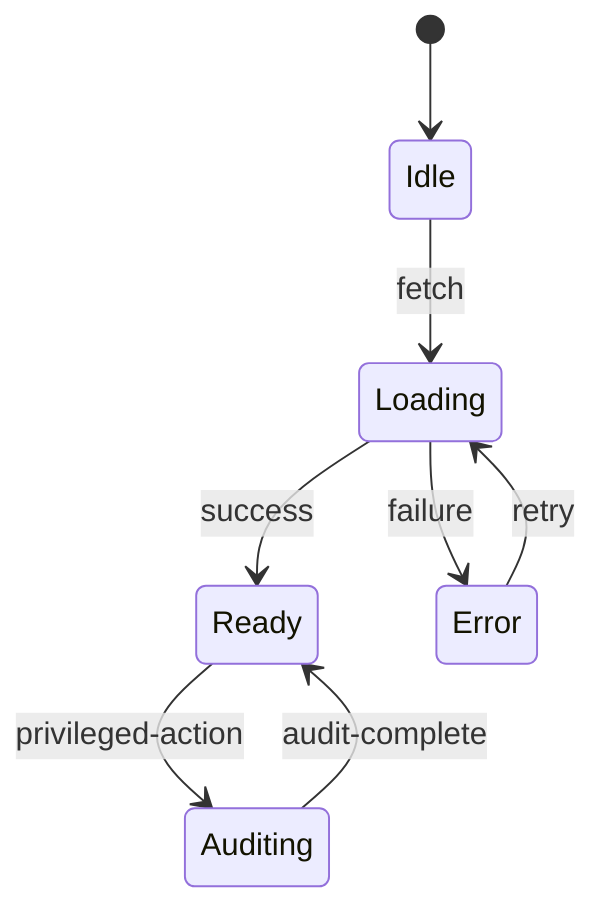

# 事件規則配置

- **Spec**: `specs/010-incident-rules`
- **Grafana 對照**: `grafana/public/app/features/alerting`

## Data Closed Loop
- **Input**: 依據 事件規則配置 規格從 API 取得資料並載入至 React Query。
- **Process**: Page 元件透過服務層套用 RBAC、記錄指標並更新 Scenes 狀態。
- **Output**: 以 @grafana/ui 元件呈現資料，並透過 notify 服務顯示結果。
- **Feedback & Audit**: 所有敏感操作寫入 audit trail，並回饋至 rbac.matrix.json。

## State Diagram

## Observability Hooks
- **Logging**: 使用 `logging` 服務記錄 page_view、action_click 與錯誤。
- **Metrics**: 以 `metrics` 服務上報 page_view / action_click / api_latency。
- **Alerts**: 異常操作透過 `notify` 流程顯示，必要時串接告警。
- **Scenes Events**: 每個場景以 scene:* 事件記錄互動，用於行為分析。
