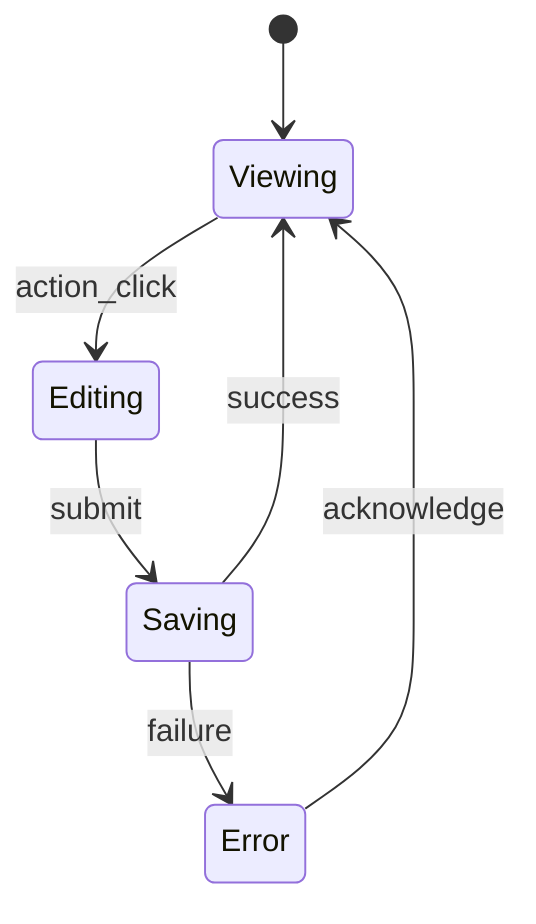

# 通知管理

- **Spec**: `specs/012-notification-management`
- **Responsibility**: 配置通知策略、管道與歷程審計
- **Architecture reference**: `grafana/public/app/features/alerting/notifications`

## Data Closed-Loop

1. **Input**: 前端透過表單與設定面板輸入，或由 API 回傳原始資料。
2. **Processing**: `apiClient` 將請求送往 `/api/v1/notification-management`，回應透過模組內的 hooks 與表格元件進行呈現。
3. **Output**: Page 與元件發送通知、指標紀錄與 audit log，更新使用者或系統狀態。
4. **Feedback & Audit**: `auditService` 與 `metricsService` 於動作觸發時記錄審計與指標，配合 `notifyService` 通知使用者。

## State Diagram (Conceptual)

