# 頁面一致性審查與優化建議

### 1.dashboard-overview-ai-summary.png
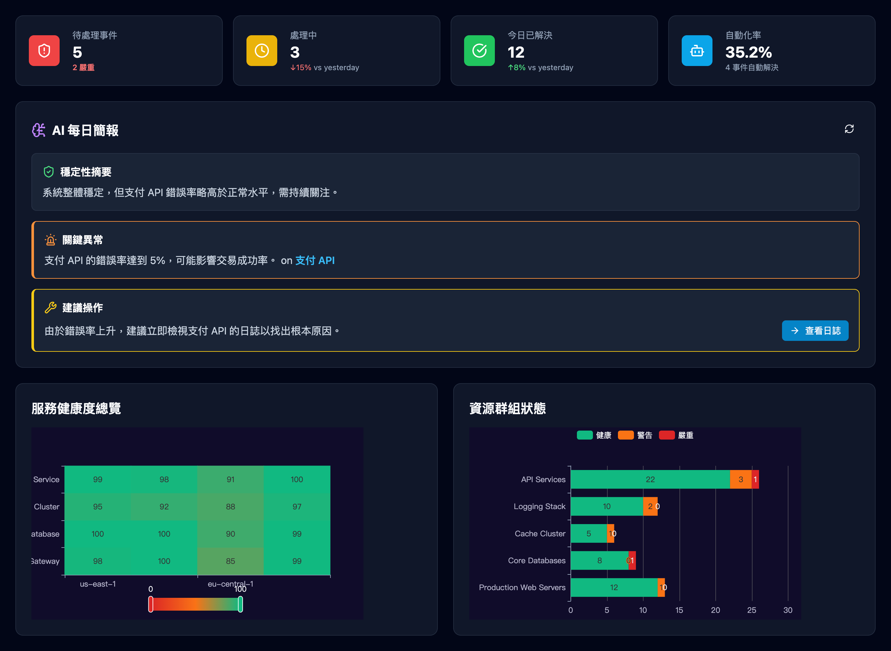
總覽卡片僅部分顯示「事件數＋變化百分比」，AI 每日簡報卡片卻只顯示文字，呈現資訊密度落差；建議將 AI 條目改為標題＋副標＋百分比的共用模板。下方「建議操作」按鈕與文案區塊的邊距不一致，右側按鈕略貼齊框線，建議提升間距並統一按鈕尺寸與左側章節內距。

### 2.incidents-list-overview.png
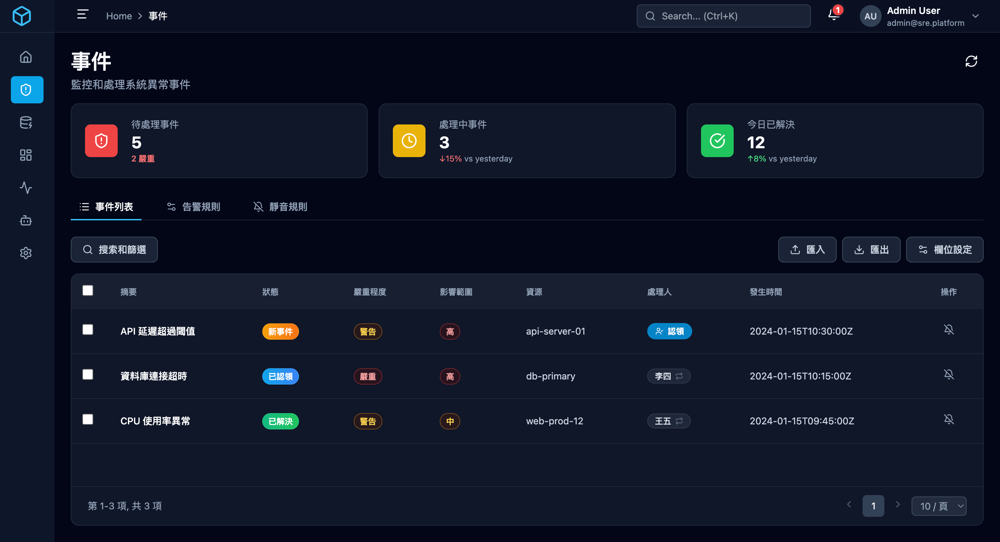
事故統計卡片的紅色卡片帶有「2 嚴重」文字，但其他卡片只保留百分比，建議統一顯示欄位組合以維持閱讀節奏。表格中的狀態膠囊高度與行距不一致，使得複選框與文字未能垂直置中；可調整行高並對齊圖示，使行為操作欄更易讀。

### 3.incidents-detail-ai-analysis.png

詳細側欄的標籤（New、Warning、High）使用英文，而主列表為中文狀態，語言混用；建議統一翻譯或提供多語切換。AI 自動分析區塊的分隔線與標題間距不足，建議加入更明顯的區塊背景或分隔，避免內容看起來擁擠。

### 4.incidents-detail-timeline.png
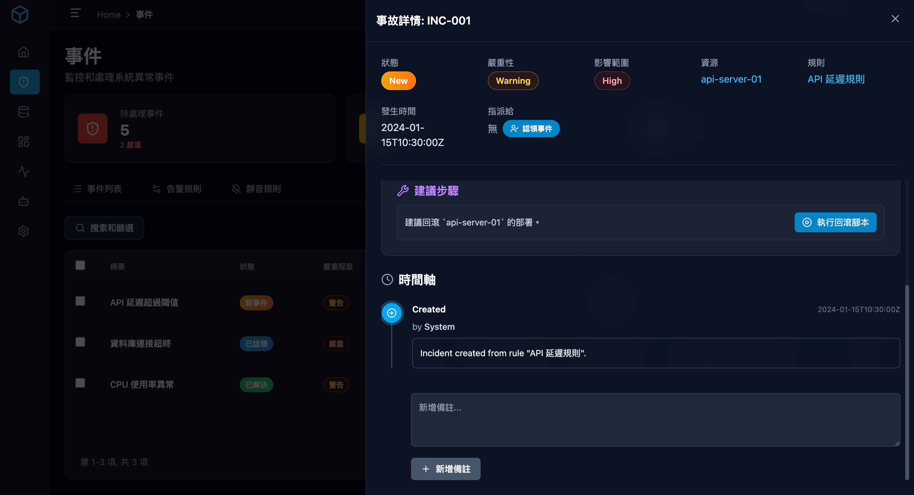
「建議步驟」區塊比上方卡片窄，導致右側執行按鈕懸浮在外；建議維持與 AI 區塊同寬並拉齊按鈕位置。時間軸文字全部使用英文事件描述，與其他中文敘述不符，可補充中文翻譯與明確的使用者名稱顯示方式。

### 5.incidents-assign-modal.png
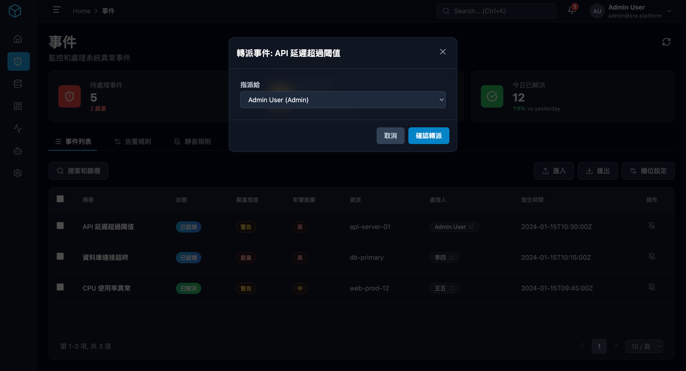
彈窗標題與背景列表字體大小差異大，且下方按鈕排列採左右對齊，與其他模態窗的右對齊不一致；建議統一採右側主次按鈕。使用者下拉選單未顯示角色或群組資訊，可在選項後方補充標籤減少指派錯誤。

### 6.incidents-silence-modal.png
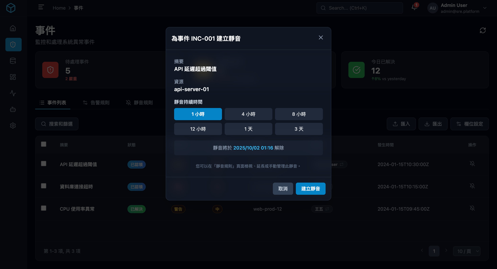
靜音時長按鈕使用不同高度的 pill 元件，文字左右 padding 不一；建議改用固定寬高與等距排列。提醒文字「您可以在靜音規則頁面檢視…」顏色過淺，與背景對比不足，應調整為次要文字色或加入提示圖示。

### 7.incidents-alert-rules-list.png
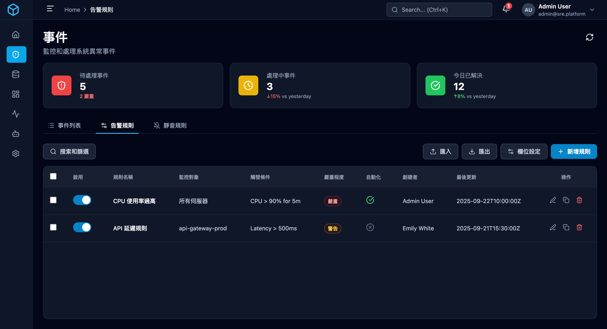
切換分頁標籤的底線顏色與狀態條件顏色不一致，容易誤判狀態；建議以品牌色統一分頁底線。表格內的「自動化」欄位使用勾叉圖示但缺少文字說明，建議加入 Tooltip 或直接顯示「已啟用／未啟用」。

### 8.incidents-alert-rules-column-settings.png
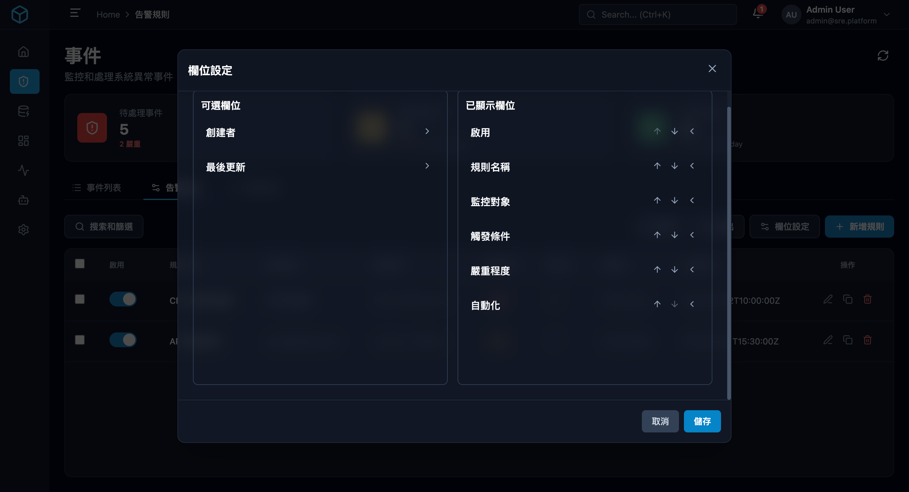
欄位設定彈窗左右欄標題缺乏視覺階層，使用者難以辨別拖曳方向；建議為可選欄位區塊加上背景或邊框。已顯示欄位的上下箭頭與拖曳手柄間距太近，容易誤點，應增加間距或改用統一的排序圖示。

### 9.incidents-alert-rule-wizard-step1.png
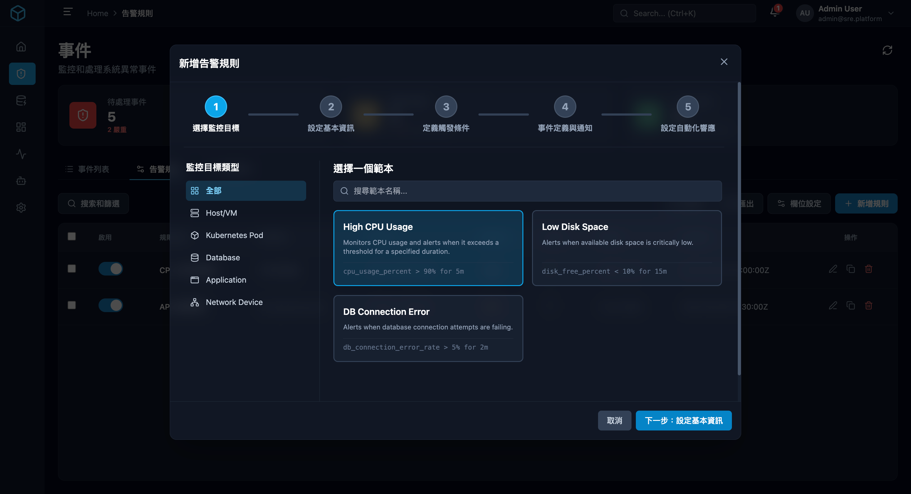
步驟導覽使用數字徽章，但完成與未完成的顏色差異不明顯；可加入勾勾圖示強調完成狀態。範本卡片內英文描述未對齊卡片寬度，行距較緊湊，建議增大行距並加上繁體中文簡述，減少語言切換負擔。

### 10.incidents-alert-rule-wizard-step2-basic.png
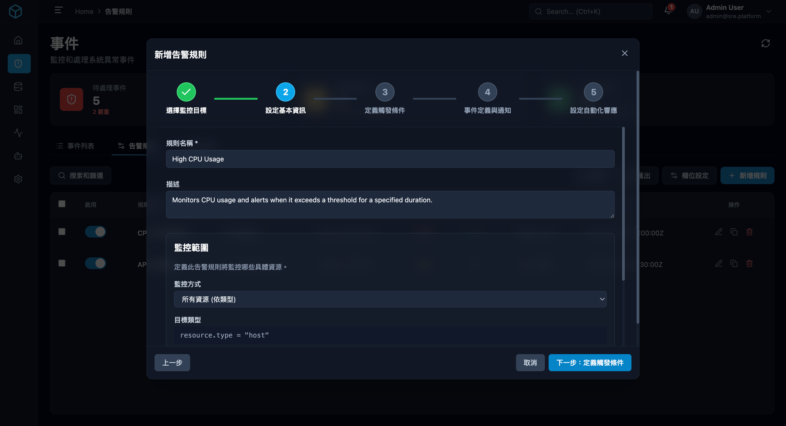
表單欄位沒有欄位說明文字，部分使用者可能不清楚輸入格式；建議在輸入框下方加上輔助說明。下方監控範圍區塊的背景與主卡同色，容易與其他欄位混淆，可加入淡色分隔或卡片邊框。

### 11.incidents-alert-rule-wizard-step2-scope.png

「附加篩選條件」說明文字過長且缺乏段落分隔，閱讀負擔重；建議使用列表或換行顯示。匹配資源預覽的數字沒有視覺重點，可加入徽章或顏色提示目前符合的資源數。

### 12.incidents-alert-rule-wizard-step3.png
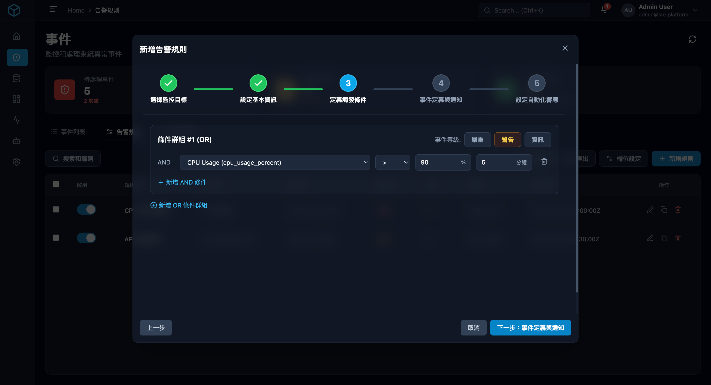
條件群組標題顯示為「條件群組 #1 (OR)」但下方按鈕顯示「新增 AND 條件」，語意較繞；可改為「條件群組 #1（以 OR 串接）」並將新增按鈕排成同一行。事件等級按鈕採用文字背景高亮但缺乏邊框，與其他 pill 元件風格不同，建議統一使用膠囊按鈕樣式。

### 13.incidents-alert-rule-wizard-step4.png
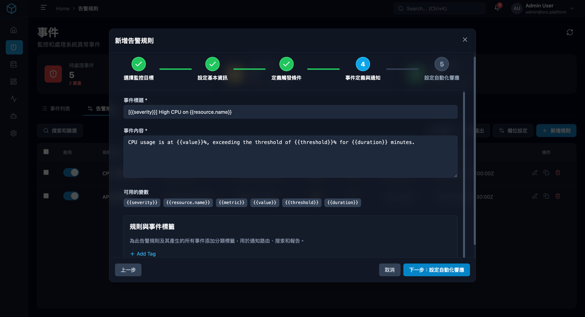
事件標題、內容的模板變數說明只以灰色小字列在下方，易被忽略；建議改為列表加上程式碼背景。Tag 新增連結使用藍色文字但缺少 icon，和其它可操作元素不一致，建議加入「＋」圖示。

### 14.incidents-alert-rule-wizard-step5.png
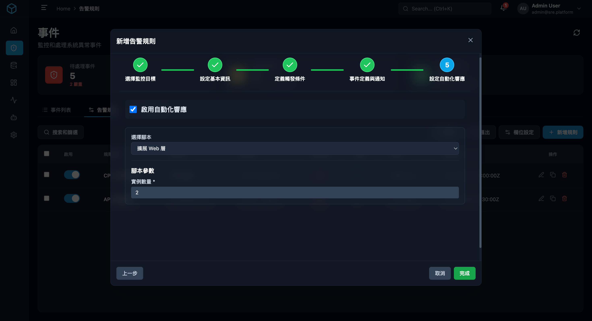
「啟用自動化響應」勾選框位置偏左，與上方卡片內距不同，視覺上不齊；建議調整左右留白。腳本參數欄位僅顯示「實例數量 *」缺乏單位說明，建議補上輸入範例或限制值。

### 15.incidents-silence-rules-list.png
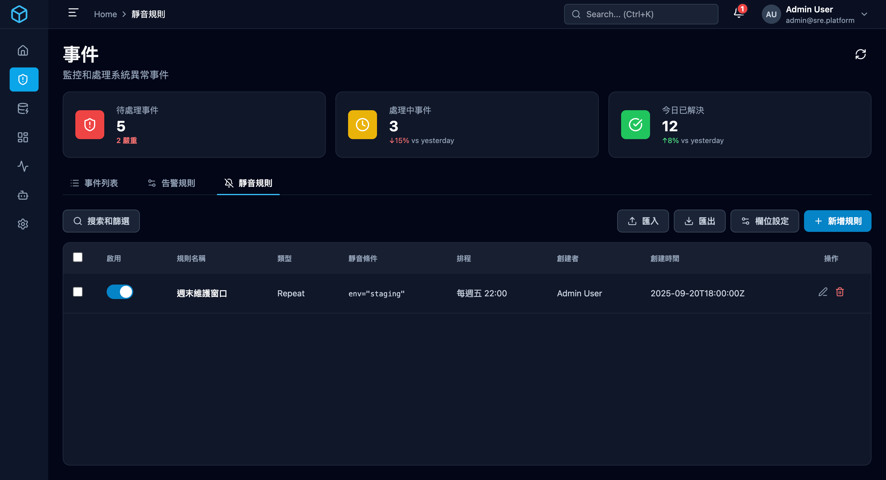
單一資料列的文字與狀態膠囊之間距離過大，看起來像兩行內容；可縮短欄位間距。操作欄僅提供編輯與刪除圖示，建議與事故列表一樣加上靜音延長或停用操作，維持功能一致性。

### 16.incidents-silence-rule-wizard-step1.png
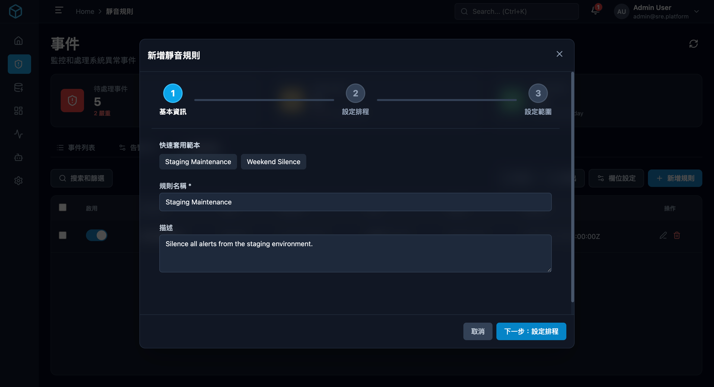
快速套用範本按鈕樣式與按鈕列不同，使用灰色背景卻沒有 hover 狀態；建議採用按鈕元件統一互動。表單欄位英文字母大小寫混用，建議加上中文標籤與輸入提示。

### 17.incidents-silence-rule-wizard-step2-once.png
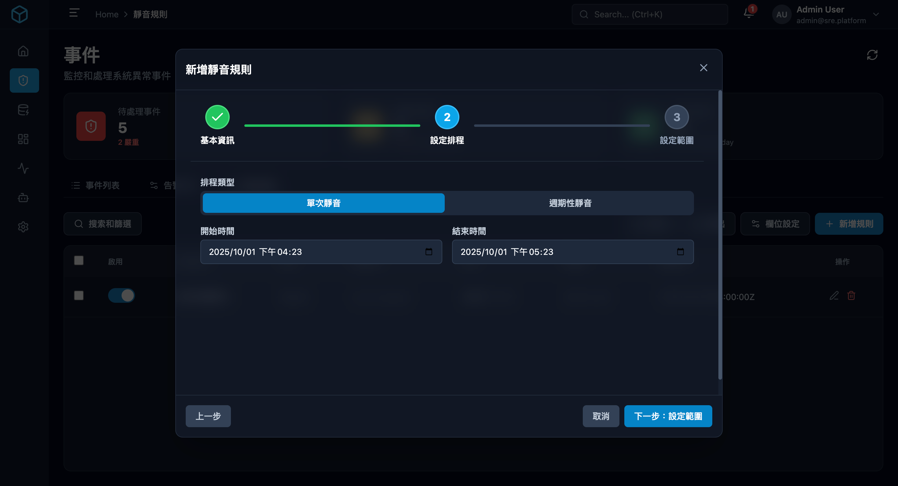
時間輸入框只顯示預設日期但無時區資訊，與其他頁面使用 UTC 後綴不一致；建議補上時區或格式提示。分頁切換（單次靜音／週期性靜音）沒有顯示目前選中狀態顏色，需提高對比。

### 18.incidents-silence-rule-wizard-step2-recurring.png
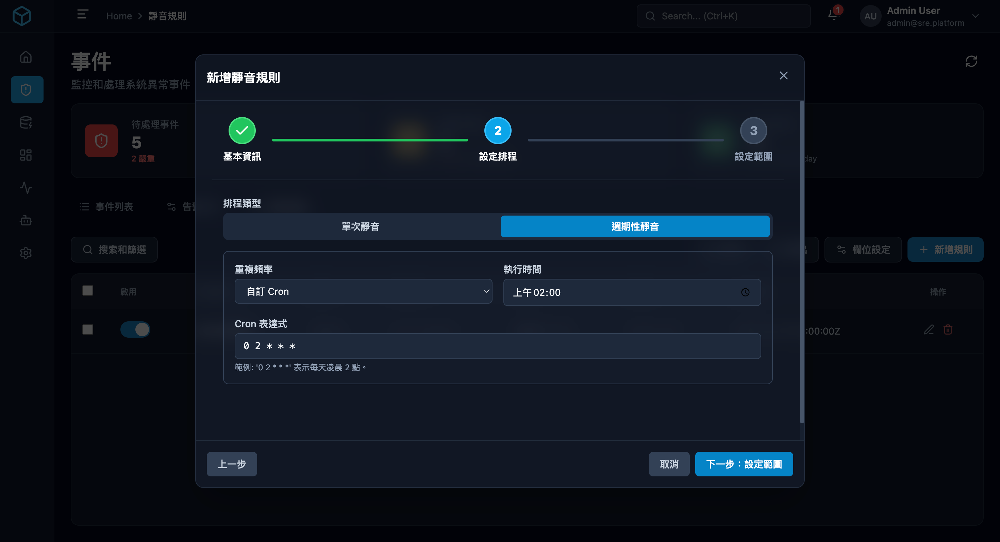
自訂 Cron 選項缺乏說明文字，新手難以理解；建議提供常見範例或使用者可切換的選擇器。執行時間欄位採用下拉但仍顯示文字輸入樣式，可改為時間選擇器提高一致性。

### 19.incidents-silence-rule-wizard-step3.png
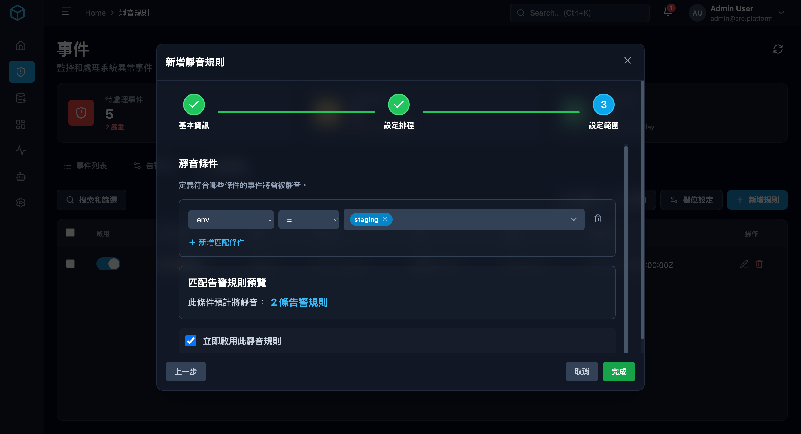
靜音條件區塊上下邊距過窄，導致欄位看起來擁擠；建議增加內距並使用卡片背景區隔。預覽區僅顯示「2 條告警規則」文字，建議提供可展開的詳細列表或 Tooltip 強化透明度。

### 20.resources-inventory-list.png
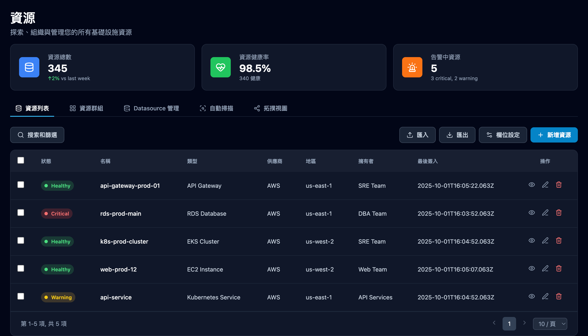
統計卡片顯示英文指標（Healthy、Critical），表格則使用英文狀態徽章，語言一致但標題仍為中文，建議提供雙語或統一中文。表格操作欄僅有「眼睛」與「鉛筆」圖示，建議補充文字 Tooltip 並保持與其他模組相同的圖示排列順序。

### 21.resources-edit-modal.png
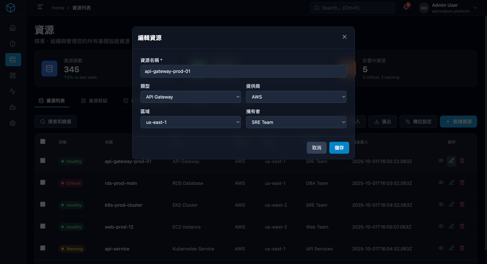
表單欄位間距過大，尤其是左右兩欄落差，建議改為單欄排列或縮小水平間距。下拉選單缺少搜尋功能，在選項多時不易使用，建議導入可搜尋的選擇器。

### 22.resources-groups-list.png
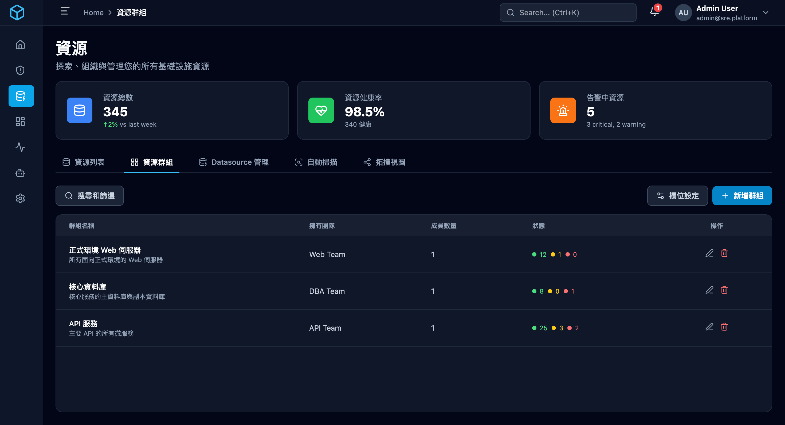
卡片統計（狀態燈號）與列表顏色不一致，容易讓使用者誤判健康指標；建議沿用綠橙紅三色。操作欄只有編輯與刪除，缺少快速查看群組成員的入口，建議增加「檢視」行為以與資源列表一致。

### 23.resources-edit-group-modal.png
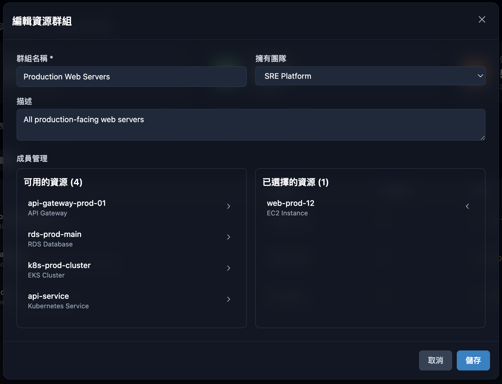
可用資源與已選資源欄位沒有明顯的拖放提示，建議加上「拖曳以加入」文字或箭頭。搜尋框缺乏邊框高亮，與背景混在一起，可增加邊框與聚焦樣式。

### 24.resources-datasources-list.png
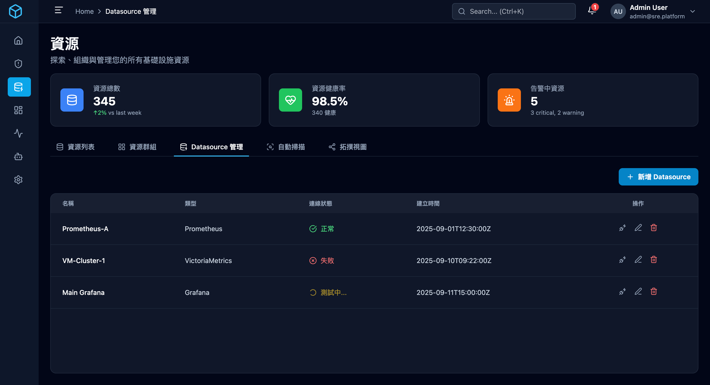
表格顯示的連線狀態圖示（正常、失敗、測試中）與資源列表用色不同，容易混淆；建議共用狀態色票。操作欄缺少「測試連線」的快速按鈕，只能在編輯彈窗中操作，建議加上快捷操作。

### 25.resources-edit-datasource-modal.png
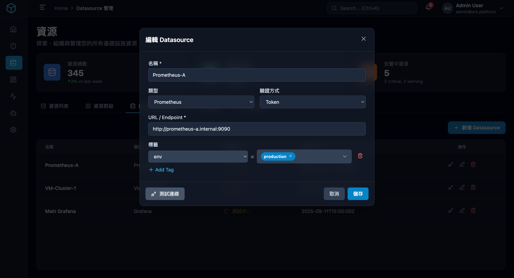
標籤區塊使用 Tag 組件但刪除 icon 與上方表單對齊不佳，可調整為單列顯示。下方操作按鈕與測試連線按鈕混在一起，建議改為左側「測試」右側「取消／儲存」的主次按鈕排列。

### 26.resources-auto-discovery-list.png
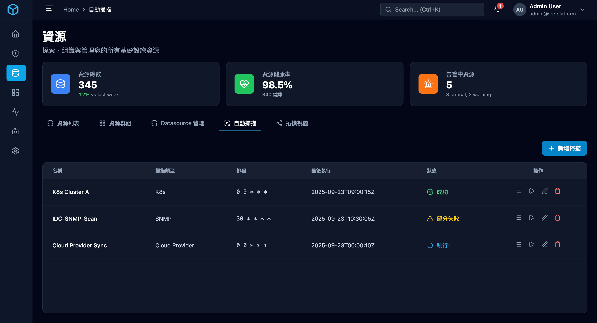
排程欄位顯示 Cron 但無翻譯說明，建議加上工具提示協助理解。狀態欄位使用字串「成功／部分失敗／執行中」，建議搭配圖示提升識別度。

### 27.resources-discovery-results-modal.png
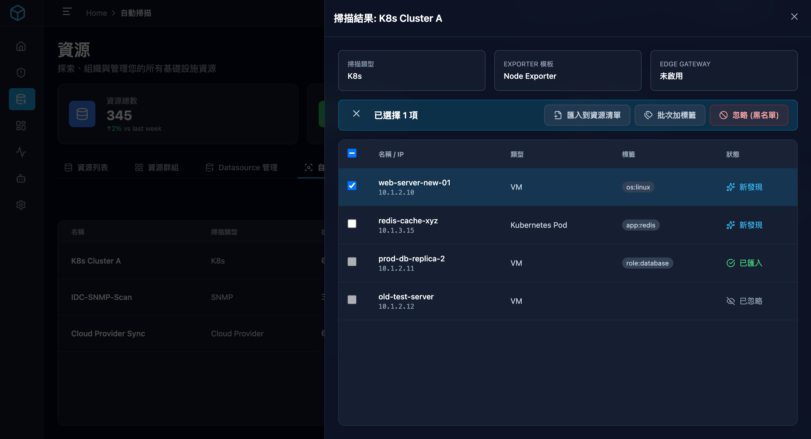
模態窗標題顯示「已選擇 1 項」但列表仍可多選，使用者難以理解；建議顯示已勾選數量並鎖定多選或單選行為。列表右側的狀態圖示與文字顏色對比不足，尤其是藍色「新發現」，可提高亮度。

### 28.resources-edit-discovery-task-modal.png
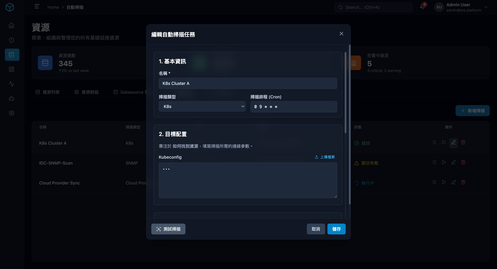
表單長度過長需要大量滾動，建議拆成分步表單或加入側邊導覽。Kubeconfig 區塊缺乏格式說明，易發生貼上錯誤，建議加上簡易範例與驗證提示。

### 29.resources-discovery-task-step3.png
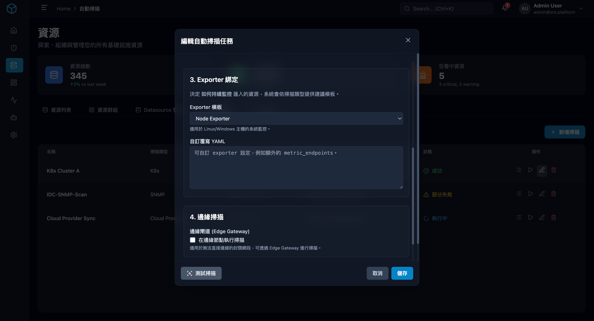
Exporter 模板欄位與自訂 YAML 欄位之間沒有分隔，視覺上容易混淆，建議加入卡片或分隔線。邊緣掃描勾選框的說明僅使用灰色文字，與背景對比不足。

### 30.resources-discovery-task-step5.png
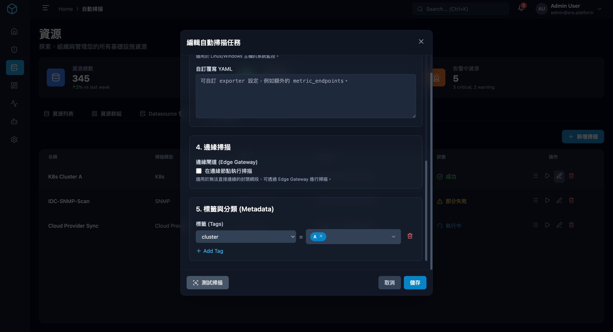
標籤輸入區僅提供 key=value 選項但缺乏提示，建議加入 placeholder 例如「cluster = A」。整體卡片內距不均，上方區塊與下方按鈕距離過近，可增加底部留白。

### 31.resources-topology-view.png
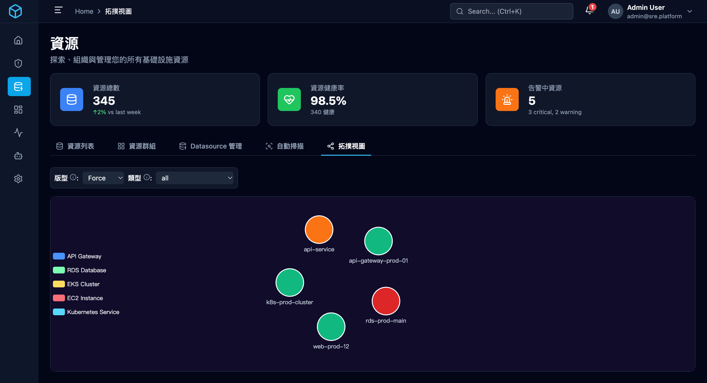
拓撲視圖節點顏色與其他模組狀態顏色不同，建議沿用既有色票。左上角篩選器排列緊貼，缺少標籤或說明，建議加入「視圖模式／類型」文字與一致的下拉選單寬度。

### 32.dashboards-list.png
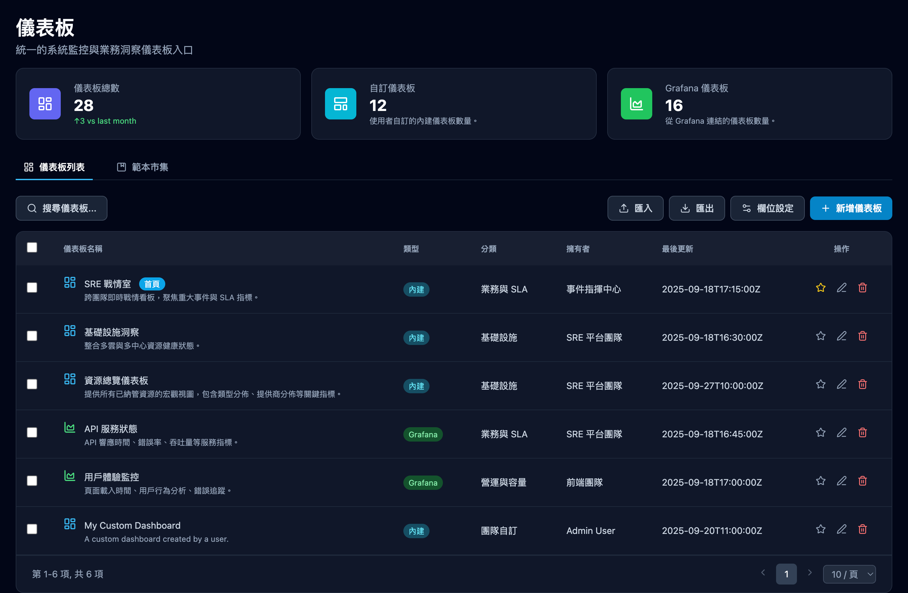
列表中分類標籤（內建、Grafana）使用英文字與中文混搭；建議在標籤內提供統一語言。操作欄的「星號」收藏圖示沒有填滿狀態提示，建議提供 hover 說明並統一圖示顏色。

### 33.dashboards-template-gallery.png
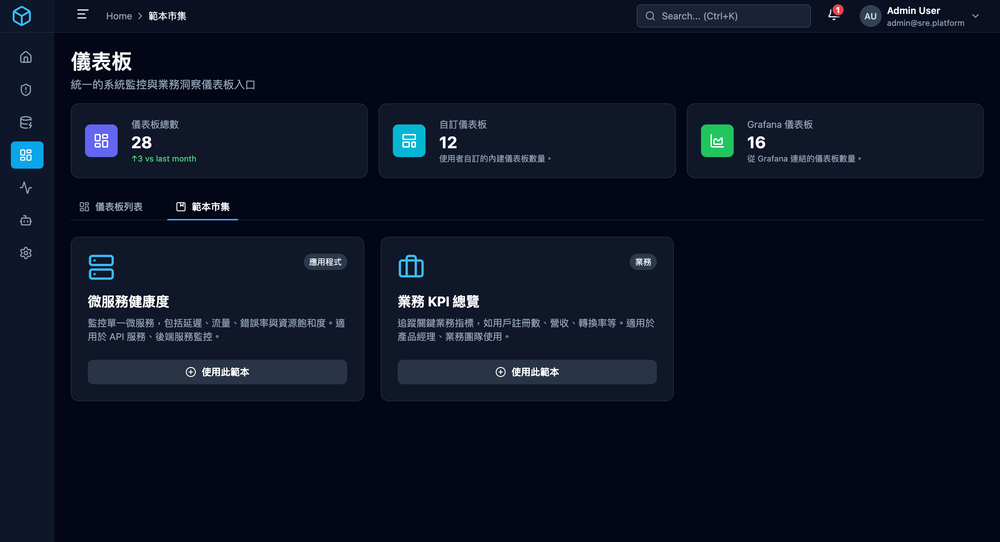
範本卡片高度不一致，造成排列不齊；建議統一卡片高度並確保按鈕置底。卡片內文字全部使用中文但按鈕是「使用此範本」，與其他模組的主要按鈕顏色不同，可改為品牌主色以吸引用戶。

### 34.dashboards-builder-empty.png
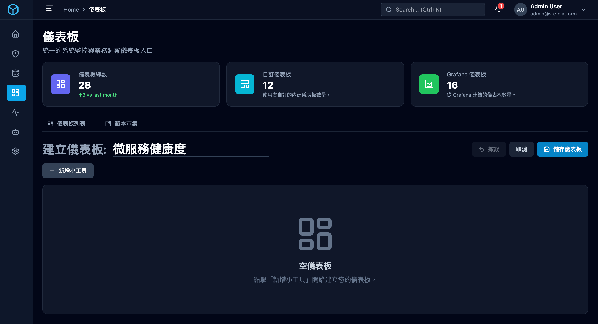
標題「建立儀表板：微服務健康度」與操作按鈕太靠近，缺乏階層；建議插入描述文字或分隔線。空儀表板圖示偏小，可改用更醒目的空狀態插畫並搭配指引文案。

### 35.dashboards-add-widget-modal.png
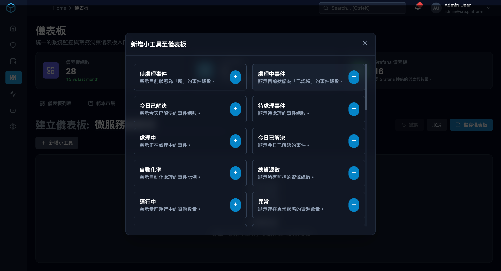
小工具清單有重複項（例如「待處理事件」出現兩次），易造成選擇困難；建議提供分類或搜尋功能。每個項目只以文字說明，缺乏圖示或圖表預覽，可加入縮圖幫助辨識。

### 36.dashboards-builder-with-widgets.png
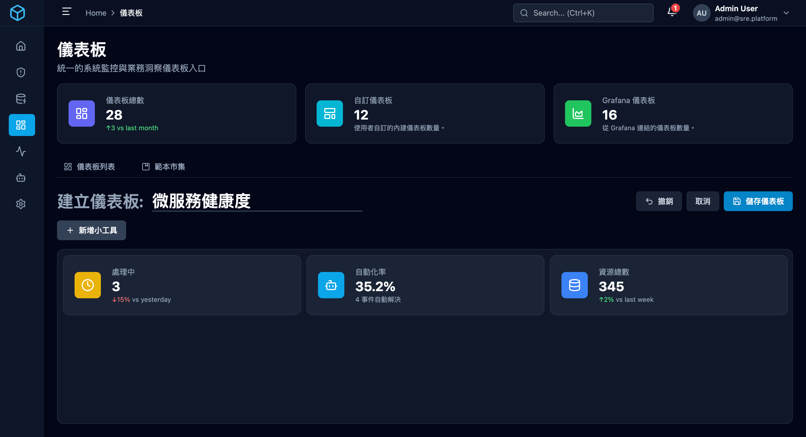
已新增的小工具沒有拖曳手柄或重新排序提示，建議加入拖曳區或提供調整按鈕。卡片之間的縱向間距過大，導致折疊頁面需要大量滾動，可縮小間距或允許雙欄排列。

### 37.insights-overview.png
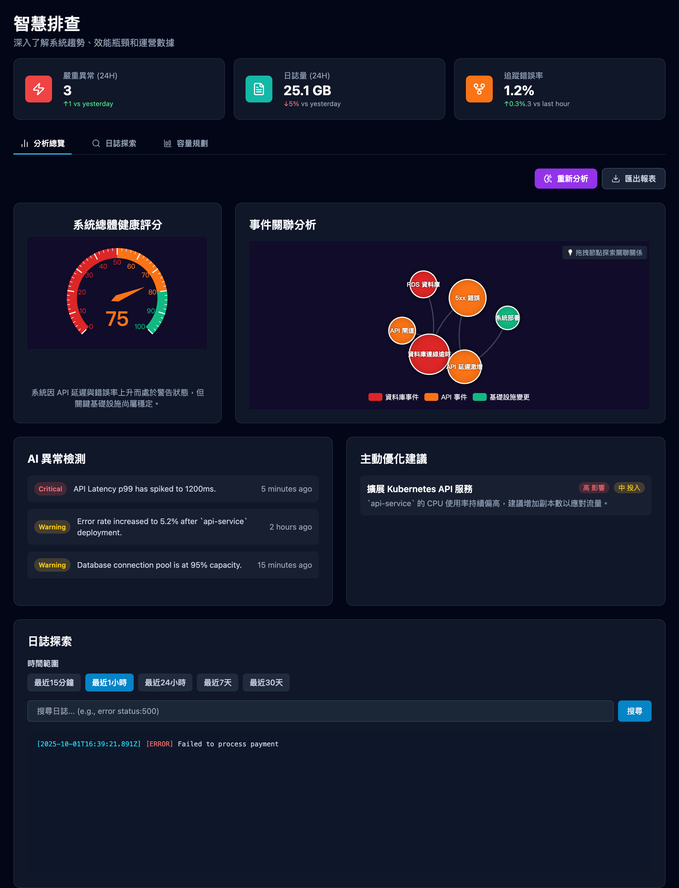
上方統計卡片的單位（GB、%）採英文縮寫，但下方模組標題為中文；建議統一語系。AI 異常偵測與主動化建議卡片缺少更新時間戳，建議在區塊標題旁加入時間資訊。

### 38.automation-scripts-list.png
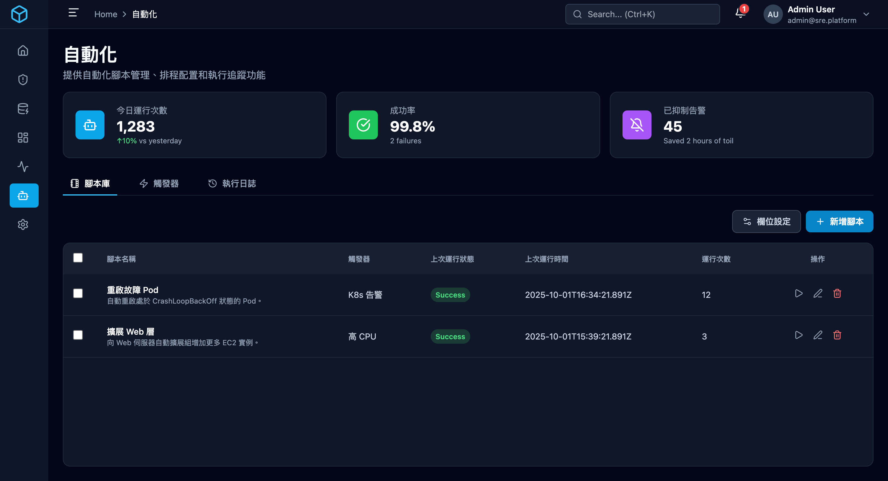
統計卡片顯示英文描述「Saved 2 hours of toil」，建議提供繁體中文翻譯。表格沒有顯示腳本語言或標籤，建議新增欄位以方便快速篩選。

### 39.automation-edit-script-modal.png
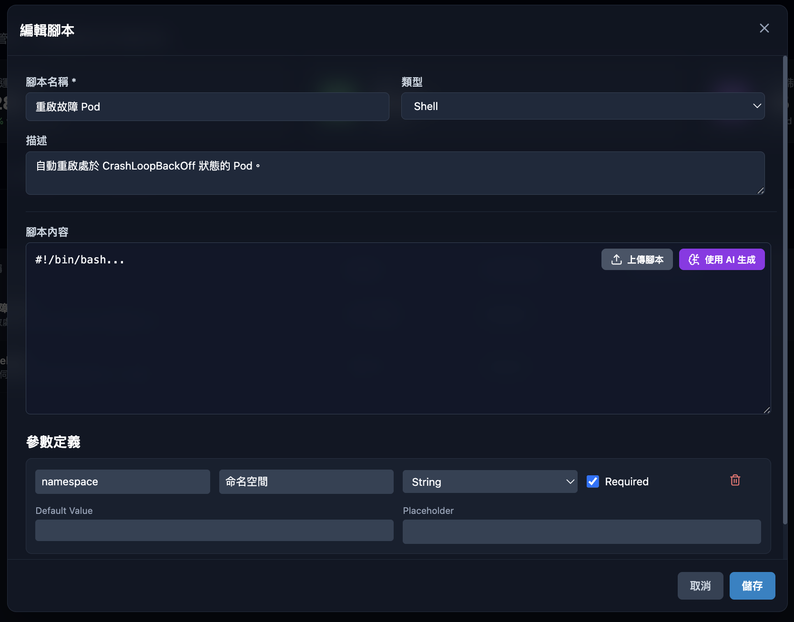
腳本內容編輯區沒有行號與語法高亮，對維護不友善，建議改用程式碼編輯器元件。按鈕「上傳腳本」「使用 AI 生成」放在輸入框內部，與其他模組按鈕位置不同，可移到右上方工具列。

### 40.automation-ai-generate-script-modal.png
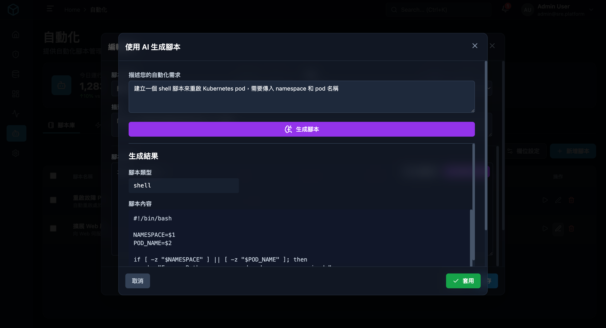
生成結果以大量文字呈現但缺乏捲動條提示，建議限制高度並顯示可捲動區域。腳本類型欄位未預設為與來源需求一致，使用者可能忘記切換，建議自動帶入建議型別。

### 41.automation-triggers-list.png
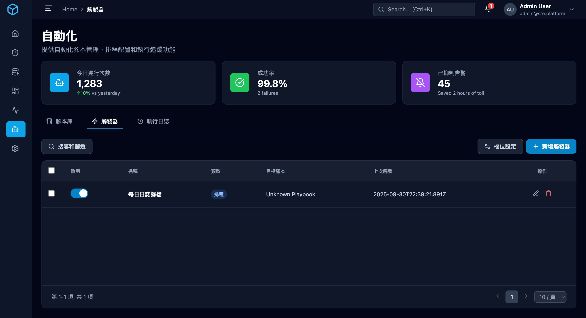
觸發器類型標籤（排程、Webhook）顏色與通知策略不同，建議統一設計系統。表格缺少「上次執行結果」欄位，導致無法快速判斷是否成功，建議新增成功／失敗指標。

### 42.automation-edit-trigger-schedule.png
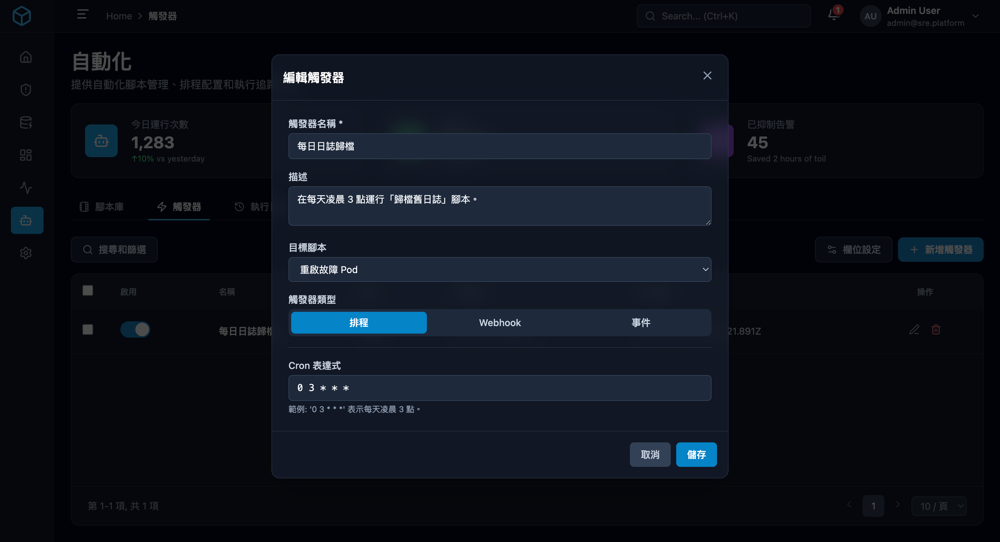
Cron 字串顯示為純文字，缺乏即時預覽，建議加入「下一次執行時間」提示。模態窗寬度過大但內容偏少，可調整為較窄寬度提升集中度。

### 43.automation-edit-trigger-webhook.png
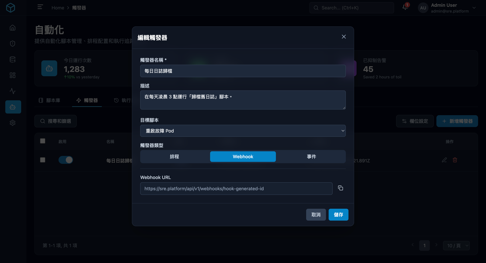
Webhook URL 欄位未提供驗證提示或範例，容易貼入錯誤格式，建議加入 placeholder。頁面使用與排程相同的說明文字，但缺少對 Webhook 特性（認證、Header）的設定欄位，建議補強。

### 44.automation-edit-trigger-event.png
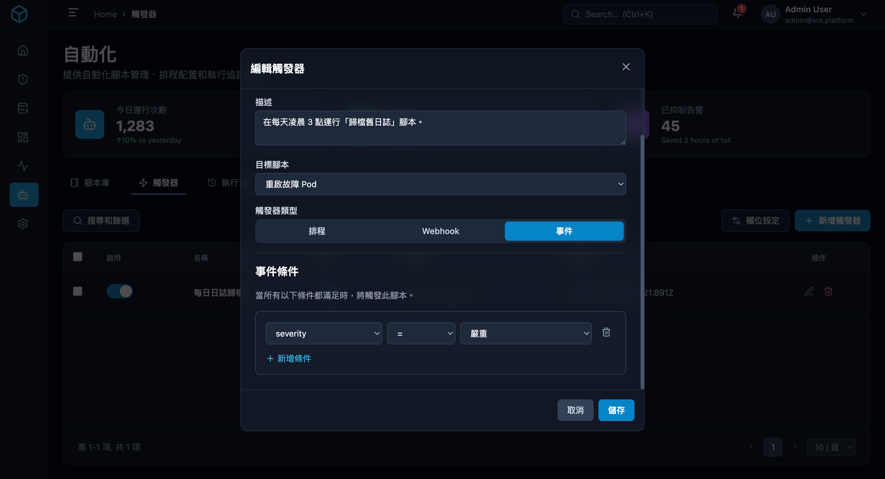
事件條件僅能新增 AND 條件，若需 OR 必須建立多個觸發器，建議提供條件群組設計以維持一致性。條件欄位下拉選單沒有排序或搜尋，建議按照分類或字母排序。

### 45.automation-run-logs-list.png
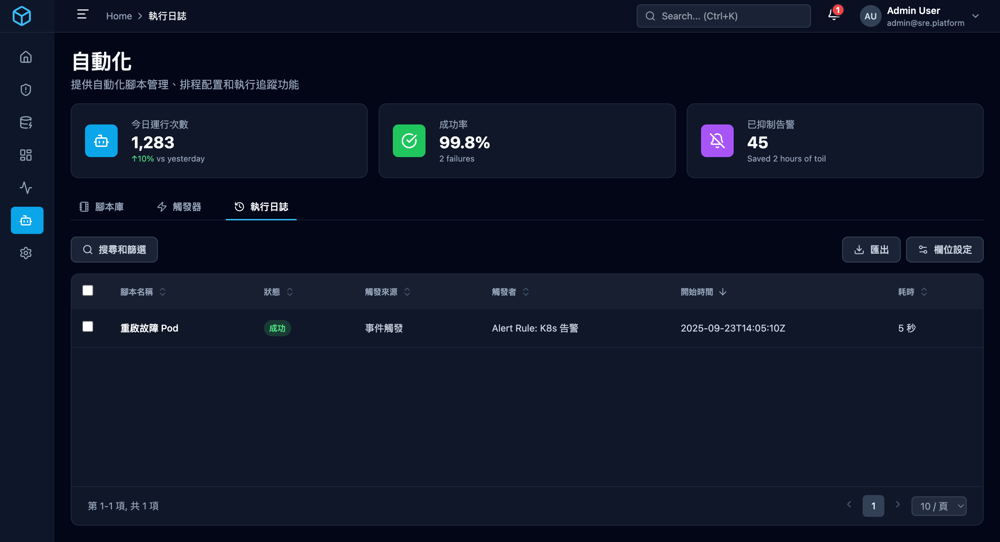
表格沒有提供快速篩選成功／失敗的篩選器，只能靠文字搜尋，建議加入狀態篩選。操作欄缺少「查看輸出」入口，只能點整列，建議加上圖示提示。

### 46.automation-run-log-detail.png
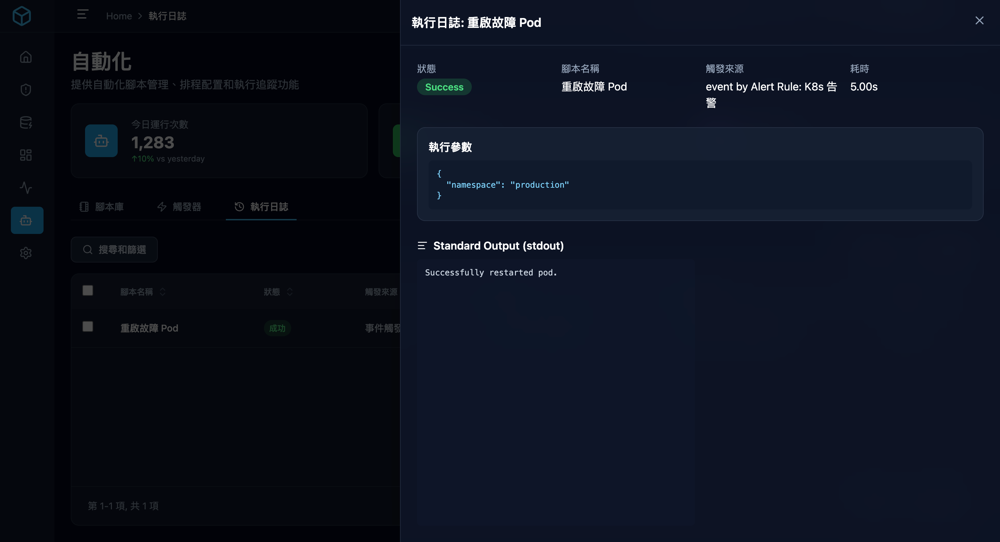
標題僅顯示腳本名稱，缺乏執行編號或時間，容易混淆；建議在標題加入完整識別資訊。stdout 區塊背景顏色與主體相同，建議改為深色區塊凸顯程式輸出。

### 47.identity-users-list.png
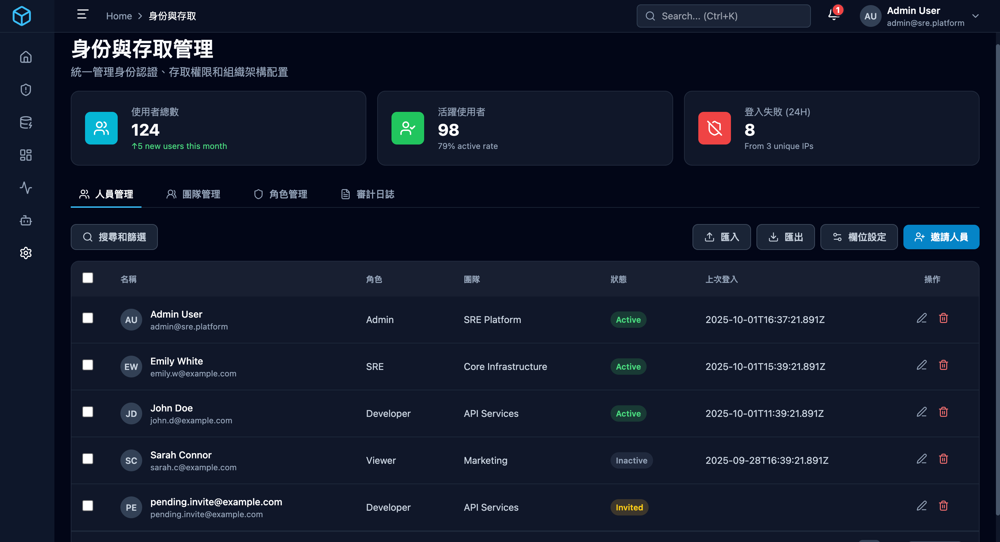
卡片統計中「登入失敗」使用英文說明 From 3 unique IPs，建議改為中文。操作欄圖示與其他模組不同順序，建議統一為「檢視／編輯／刪除」。

### 48.identity-invite-member-modal.png
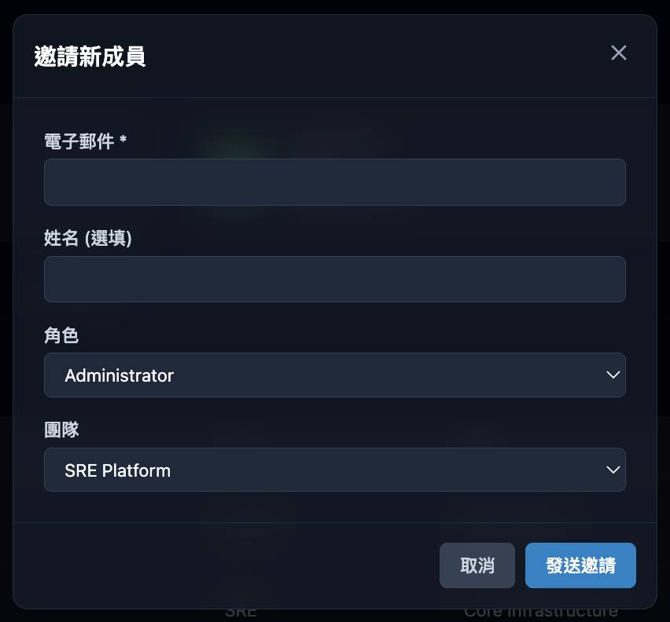
角色與團隊下拉缺少描述，容易選錯權限，建議在選項旁加上權限摘要。送出按鈕顏色與其他模態窗不同（偏藍灰），建議統一使用品牌主色。

### 49.identity-edit-member-modal.png
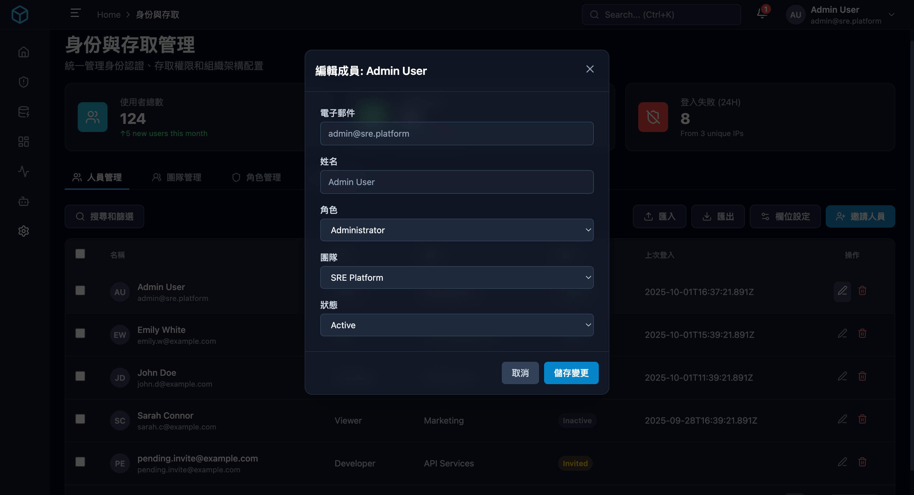
電子郵件欄位不可編輯但樣式與可編輯欄位一致，容易造成誤解，建議使用唯讀樣式。狀態下拉選項只有 Active/Inactive，缺乏顏色標示，建議在列表加入顏色點。

### 50.identity-teams-list.png
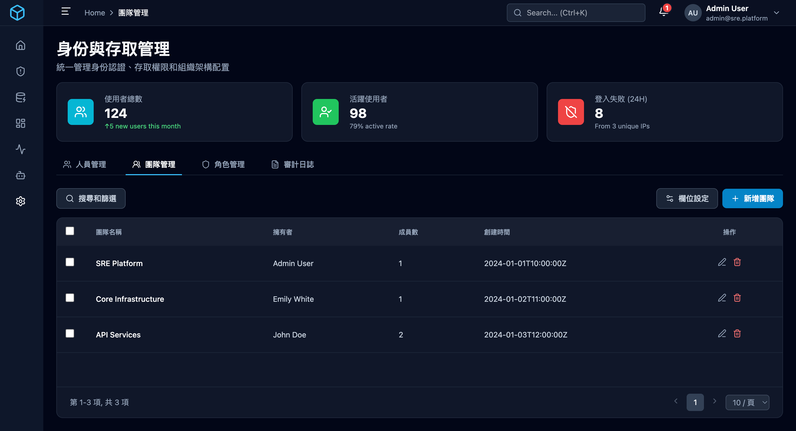
表格未顯示成員數量總和與使用中專案等資訊，建議補充概覽數據。操作欄缺乏快速切換擁有者功能，可加入「設定擁有者」操作提高效率。

### 51.identity-edit-team-modal.png
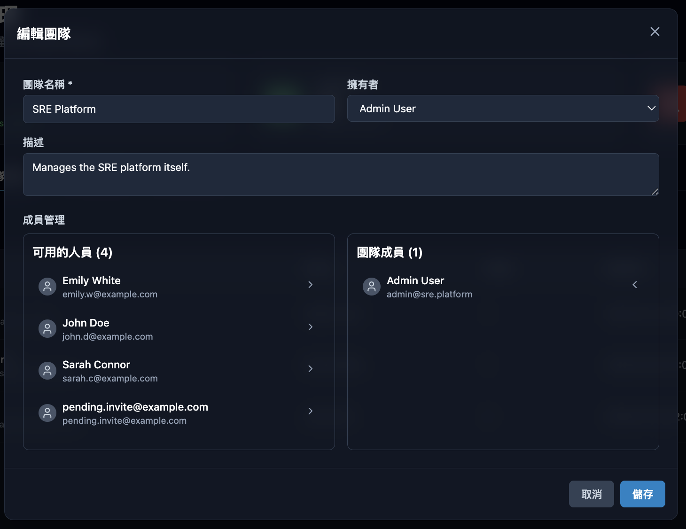
可用成員列表缺乏搜尋或篩選，當成員多時難以尋找，建議加入搜尋框。描述欄位字數限制未提示，建議加入計數器避免超出。

### 52.identity-roles-list.png
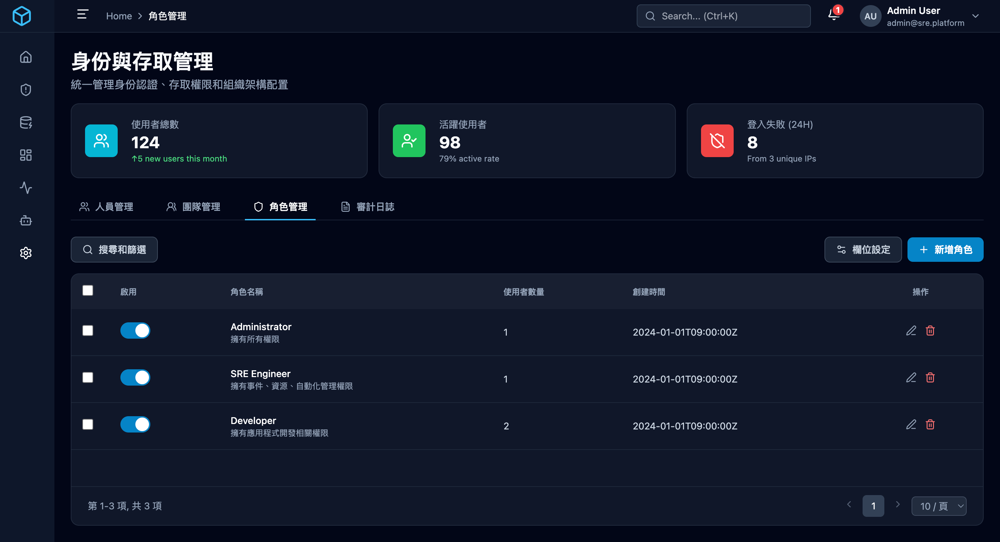
開關按鈕與列表行距不一致，導致排版鬆散，建議固定開關寬度。角色描述全部為英文，建議補上中文說明確保一致。

### 53.identity-edit-role-modal.png
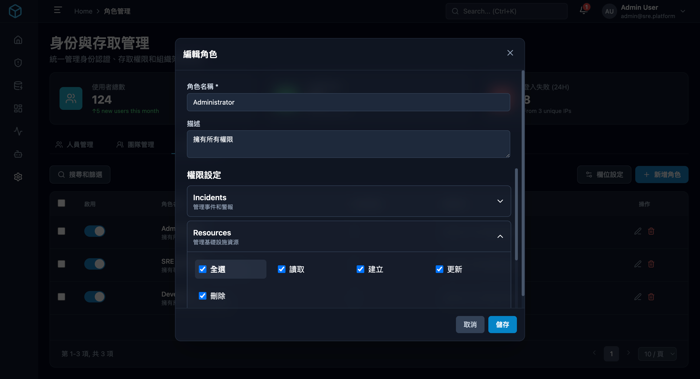
權限設定採用折疊面板但展開指示符號過小，建議加大箭頭尺寸。各模組的權限核取方塊排列不齊，建議改為表格形式列出 CRUD 權限。

### 54.identity-audit-log-list.png
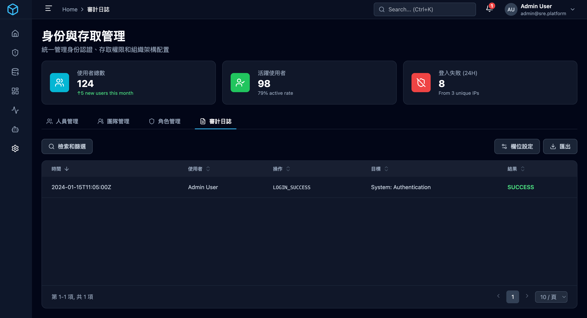
表格僅顯示一筆資料，缺乏空狀態指引；建議在資料少時展示提示文案。操作與目標欄位採英文大寫（LOGIN_SUCCESS），建議提供中文翻譯。

### 55.identity-audit-log-detail.png
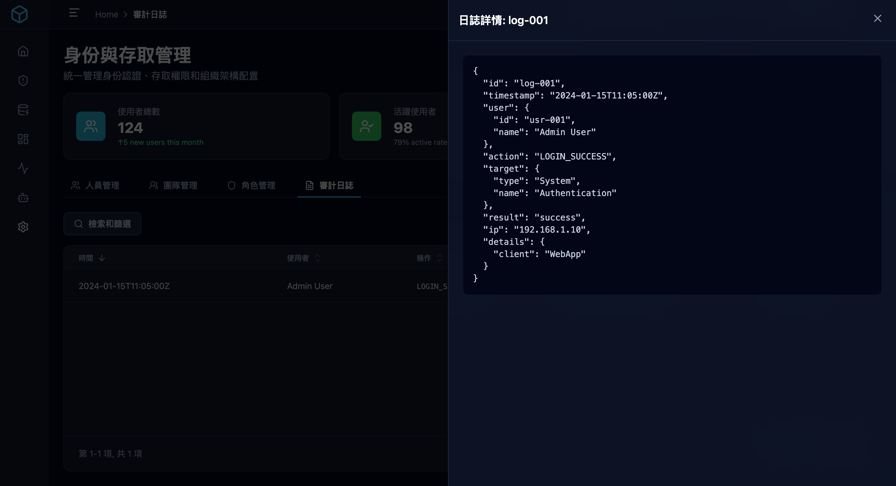
JSON 文字全部置中顯示，閱讀困難；建議改為等寬字體左對齊。缺少複製按鈕，使用者無法快速複製內容，建議加入。

### 56.insights-log-explorer.png
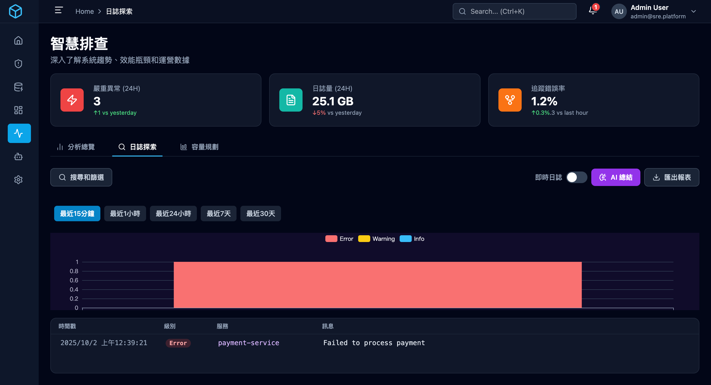
圖表色彩過於鮮豔且缺乏圖例對應，建議在圖表上方加入顏色說明。下方列表使用英文欄位名稱（Category、Message），建議與整體語系同步。

**具體優化建議：**
- 調整圖表色彩飽和度，使用較柔和的調色板 (#38bdf8, #a78bfa, #34d399 替換過度鮮豔的顏色)
- 在圖表上方添加圖例說明區域，明確標示顏色與日誌等級的對應關係
- 將表格欄位名稱翻譯為中文：Category → 類別, Message → 訊息, Timestamp → 時間戳, Level → 等級
- 統一字體樣式，使用系統預設的中文字體確保整體視覺一致性

### 57.insights-capacity-planning.png
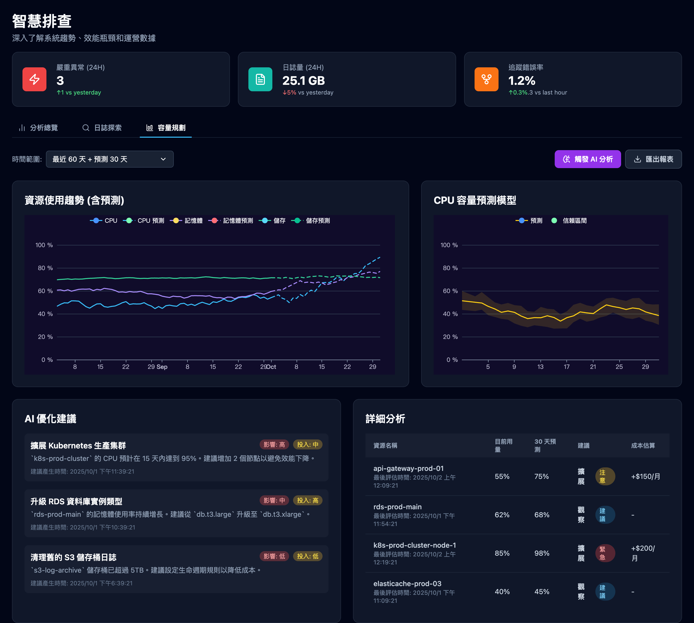
預測線使用虛線但顏色與實際值接近，辨識度不足；建議改用明顯的對比色。AI 優化建議卡片文字過多，建議使用分段或折疊功能提升可讀性。

**具體優化建議：**
- 將預測線改為 #f59e0b (橙色) 或 #ef4444 (紅色)，與實際數據線形成明顯對比
- 為預測線增加圖例說明：「預測趨勢」與實際數據區分標識
- 實作卡片內容折疊功能，超過3行自動顯示「展開詳情」按鈕
- 為長文本內容添加捲軸容器，限制卡片最大高度為200px
- 在卡片右上角添加「展開/收起」控制按鈕，提升使用者體驗

### 58.notifications-strategies-list.png
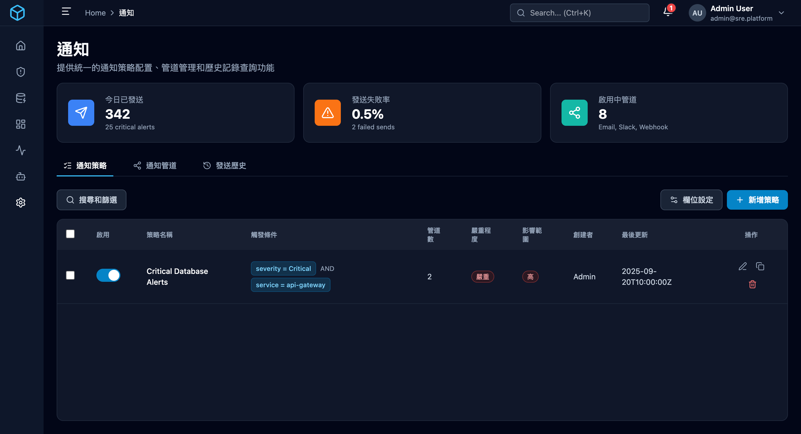
策略條件膠囊使用英文（severity、service），與主標題中文不一致；建議提供中文標籤。欄位未顯示最後觸發時間，建議加入以利追蹤。

**具體優化建議：**
- 將條件膠囊標籤翻譯為中文：severity → 嚴重度, service → 服務, resource → 資源
- 為膠囊按鈕添加工具提示，顯示完整的中英文對應說明
- 在表格中新增「最後觸發」欄位，顯示最近一次策略執行的時間戳
- 為「最後觸發」欄位添加相對時間顯示（如「2小時前」、「昨天」）
- 實作欄位排序功能，讓使用者可以按觸發時間排序查看最新活動

### 59.notifications-strategy-step1.png
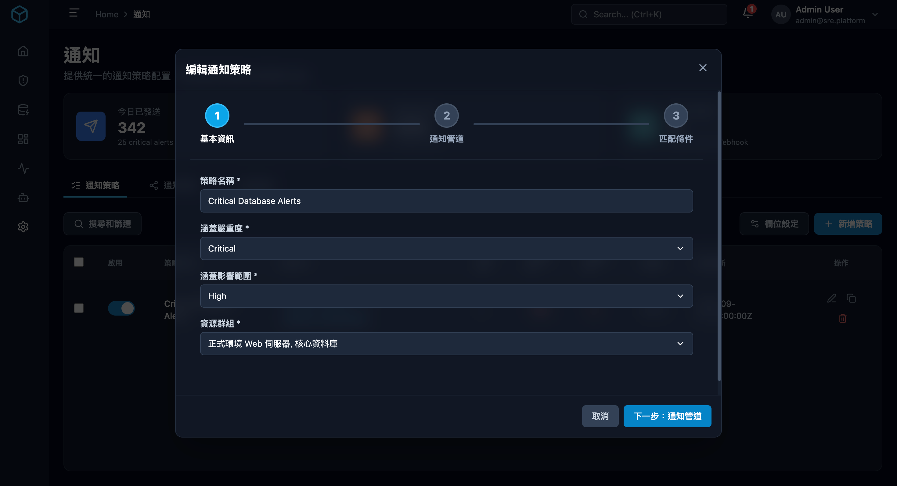
策略名稱與描述欄位未提供輸入限制提醒，使用者可能輸入過長文字，建議加入字數顯示。資源群組多選欄顯示純文字，建議改為可刪除的 Tag 以保持一致。

**具體優化建議：**
- 為策略名稱欄位設置50字元上限，描述欄位設置200字元上限
- 在輸入框右下角顯示即時字數計數（如「23/50」）
- 當接近字數上限時變更計數器顏色為警告色（黃色→橙色→紅色）
- 將資源群組多選改為 Tag 組件，每個選項顯示為可刪除的膠囊按鈕
- 為 Tag 組件添加「全部清除」功能按鈕，方便使用者快速重置選擇

### 60.notifications-strategy-step2.png
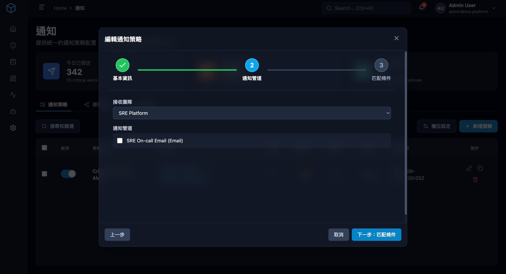
通知管道清單僅以勾選方塊呈現，無法顯示管道狀態；建議加入最近發送成功時間或成功率。標題「通知管道」缺少副標說明，建議補充用途。

**具體優化建議：**
- 在勾選方塊旁添加小徽章顯示「成功率：95%」或「最近發送：2小時前」
- 為不同狀態設置顏色編碼：成功（綠色）、失敗（紅色）、未知（灰色）
- 在標題下方添加副標題：「選擇接收警報的通知管道，系統將依據嚴重程度發送對應訊息」
- 為每個管道選項添加說明文字，顯示支援的通知類型（Email、Slack、Webhook等）
- 實作滑鼠懸停時顯示詳細統計資訊的功能

### 61.notifications-strategy-step3.png
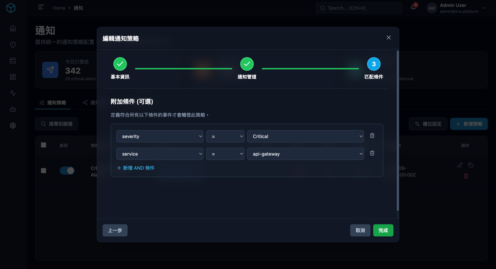
附加條件區塊無分隔線，與上方區域相連，建議加上卡片或背景區隔。條件欄位缺乏預設值，建議提供常用條件快速選擇。

**具體優化建議：**
- 為附加條件區塊添加淺色背景 (`bg-slate-800/30`) 和圓角邊框，形成視覺分隔
- 在區塊頂部添加分隔線 (`border-t border-slate-700`) 與上方內容區分
- 提供常用條件快速選擇按鈕：「嚴重度 >= 高」、「服務 = 關鍵服務」、「時間範圍 = 營業時間」
- 為條件欄位添加智慧預設值，根據歷史策略自動建議常用條件
- 實作條件預覽功能，讓使用者在選擇時即時預覽影響的警報數量

### 62.notifications-channels-list.png
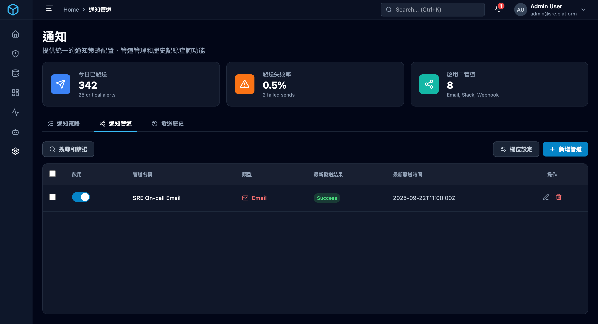
表格僅顯示一個管道，缺乏空狀態說明；建議在列表下方提供新增導引。最新發送結果沒有顏色狀態，建議沿用成功／失敗色彩提示。

**具體優化建議：**
- 設計空狀態頁面，包含說明文字「尚未設定通知管道」和醒目的「新增管道」按鈕
- 為空狀態區域添加圖示插畫，提升視覺吸引力和指引性
- 在「最新發送結果」欄位使用狀態指示器：成功（綠色勾勾）、失敗（紅色叉叉）、進行中（黃色時鐘）
- 為發送結果添加懸停工具提示，顯示詳細的發送時間和錯誤訊息
- 實作自動重新整理功能，每30秒更新發送狀態，保持資訊即時性

### 63.notifications-add-channel-email.png
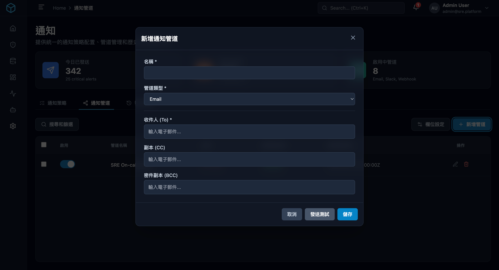
收件人、抄送、密件欄位缺少輸入格式提示，建議加入 placeholder 例子。儲存按鈕與發送測試並列，容易誤觸，建議將「發送測試」改為次要按鈕或移到左側。

**具體優化建議：**
- 為收件人欄位添加 placeholder：「user@example.com, admin@company.com」
- 為抄送欄位添加 placeholder：「cc@example.com」和說明「選用，多個地址請用逗號分隔」
- 為密件欄位添加 placeholder：「bcc@example.com」和說明「收件人不可見」
- 將「發送測試」按鈕改為次要樣式（灰色背景），與主要「儲存」按鈕區分
- 在「發送測試」按鈕旁添加說明文字：「先發送測試郵件確認設定正確」
- 實作郵件地址格式驗證，輸入時即時檢查格式正確性

### 64.notifications-add-channel-webhook.png
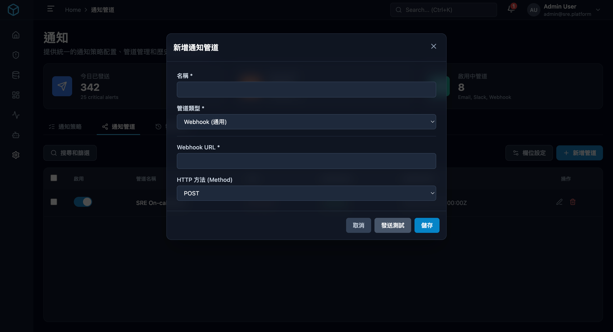
Webhook 表單沒有驗證方式欄位，與其他系統整合需求不符，建議加入認證設定。名稱欄位與類型欄位高度不同，視覺上不一致，可統一表單控件高度。

**具體優化建議：**
- 添加認證方式選擇：None（無）、Bearer Token、API Key、Basic Auth
- 為Bearer Token和API Key添加密碼顯示/隱藏切換按鈕
- 統一所有輸入欄位高度為 `h-10`，確保視覺一致性
- 為Webhook URL欄位添加格式驗證（必須以http://或https://開頭）
- 添加「測試連線」按鈕，點擊後立即驗證Webhook端點可達性
- 在認證設定區域添加摺疊面板，避免過長表單影響使用者體驗

### 65.notifications-add-channel-slack.png
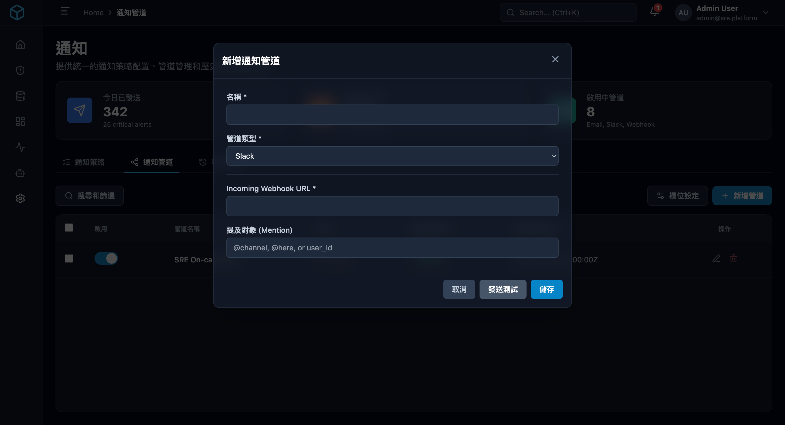
Incoming Webhook URL 的 placeholder 使用英文敘述，可在下方補充中文說明。提及對象欄位缺乏範例格式，建議加入說明以避免輸入錯誤。

**具體優化建議：**
- 將Incoming Webhook URL的placeholder從英文改為中文：「請貼上來自Slack的Webhook URL」
- 在URL欄位下方添加說明：「從Slack App設定頁面複製完整的Webhook URL」
- 為提及對象欄位添加placeholder：「@username, #channel」和說明範例
- 添加「測試訊息」按鈕，發送測試訊息到指定頻道驗證設定
- 實作Webhook URL格式驗證，檢查是否包含正確的Slack網域
- 在提及對象欄位旁添加說明連結，指向Slack提及語法說明文件

### 66.notifications-add-channel-line.png
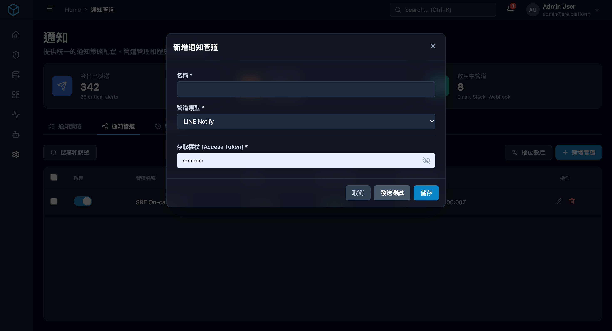
Access Token 欄位缺少顯示／隱藏切換提示，僅有眼睛圖示但無文字，建議加上 Tooltip。整體欄位間距略大，導致視覺焦點分散，可適度縮小。

**具體優化建議：**
- 為Access Token欄位的眼睛圖示添加工具提示：「點擊顯示/隱藏Token內容」
- 將欄位間距從 `gap-6` 調整為 `gap-4`，使表單更緊湊
- 統一所有輸入欄位的高度為 `h-10`，避免視覺差異
- 為Access Token欄位添加placeholder：「請貼上LINE Notify的Access Token」
- 添加「取得Token說明」連結，指向LINE Notify設定教學
- 實作Token格式驗證，檢查是否為正確的LINE Token格式

### 67.notifications-add-channel-sms.png
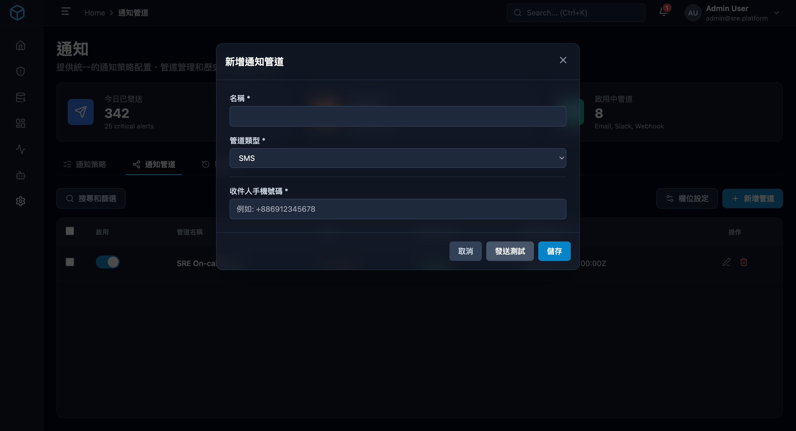
手機號碼欄位示例使用 +886，但未說明是否支援其他國碼，建議補充說明。名稱欄位與類型欄位寬度過大，內容稀疏，建議縮窄或改為雙欄版面。

**具體優化建議：**
- 在手機號碼欄位下方添加說明：「支援國際格式，如：+1 234-567-8900, +886 912-345-678」
- 為手機號碼欄位添加國碼選擇下拉選單，預設為台灣(+886)
- 將表單佈局從單欄改為雙欄，名稱和類型欄位並排顯示
- 為雙欄佈局設置響應式設計，小螢幕時自動堆疊
- 添加手機號碼格式驗證，檢查號碼長度和格式正確性
- 實作「發送測試簡訊」功能，驗證號碼可接收訊息

### 68.notifications-send-history.png
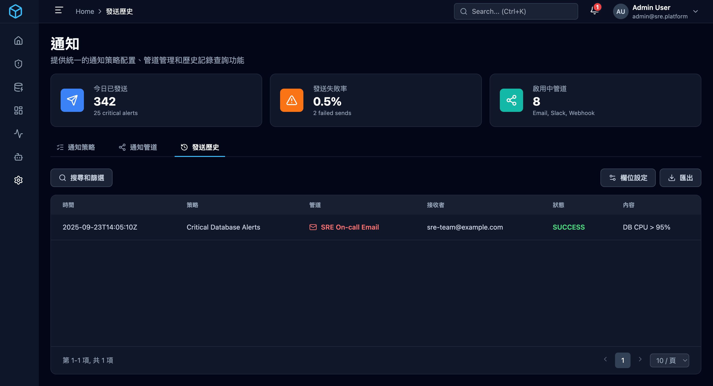
表格缺少快速篩選（依狀態／管道），操作效率低，建議加入篩選器。內容欄位只顯示簡短文字，建議提供展開或查看詳情的行為與工具提示。

**具體優化建議：**
- 在表格上方添加篩選器列，包含狀態篩選（全部、成功、失敗、重試）和管道篩選
- 為篩選器添加「清除篩選」按鈕，一鍵重置所有篩選條件
- 為內容欄位添加展開/收起功能，顯示完整通知內容
- 在內容欄位添加懸停工具提示，預覽完整內容
- 為發送狀態添加圖示指示器：成功（綠勾）、失敗（紅叉）、重試中（黃時鐘）
- 實作自動重新整理功能，每60秒更新發送歷史狀態

### 69.notifications-history-detail.png
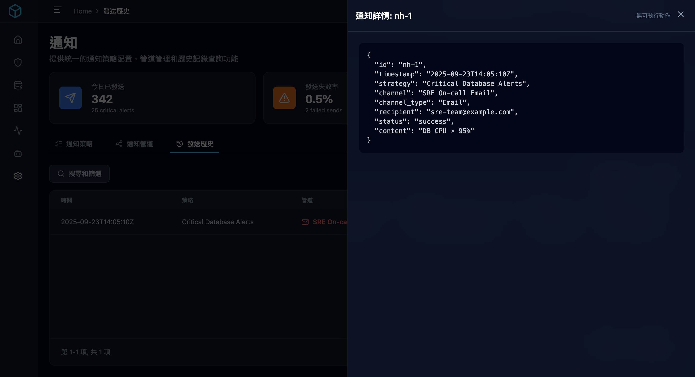
JSON 詳情區同樣缺乏複製功能且行距緊密，建議提供格式化顯示與一鍵複製。右上角提示「無可執行動作」與主要資訊對比過低，建議調整字體或顏色。

**具體優化建議：**
- 將JSON內容改為等寬字體（`font-mono`）並增加行距為 `leading-6`
- 為JSON區域添加語法高亮，按鍵值對顯示不同顏色
- 在JSON區域右上角添加「複製內容」按鈕，一鍵複製格式化後的JSON
- 將「無可執行動作」提示改為較大的字體（`text-base`）和對比色（`text-slate-300`）
- 為提示文字添加背景色塊，提升視覺分離度
- 添加「重新發送」按鈕，讓使用者可以對失敗的通知進行重試

### 70.platform-tags-overview.png
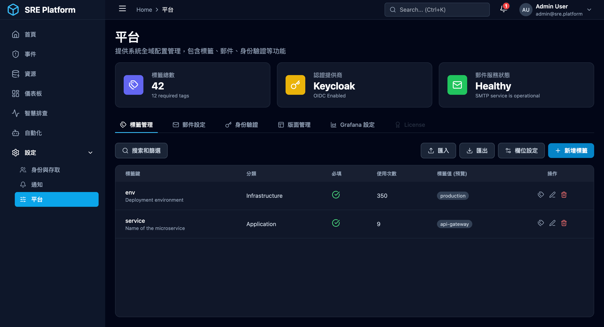
標籤管理區塊的警告條顏色偏橘與系統警告黃不同，建議使用一致的警告色。操作欄僅提供編輯／刪除，缺少批次匯入的入口，建議新增與上方按鈕一致的功能。

**具體優化建議：**
- 將警告條顏色從橘色改為系統標準的黃色 (`bg-yellow-500/10 border-yellow-500`)
- 統一所有警告提示使用相同的顏色方案，維持視覺一致性
- 在操作欄添加「批次匯入」按鈕，與頁面上方的批次操作按鈕保持一致
- 為批次匯入按鈕添加下拉選單，提供「從CSV匯入」和「從JSON匯入」選項
- 實作批次刪除功能，允許多選標籤進行刪除操作
- 在標籤列表中添加搜尋功能，支援按名稱和類型篩選標籤

### 71.platform-email-settings.png
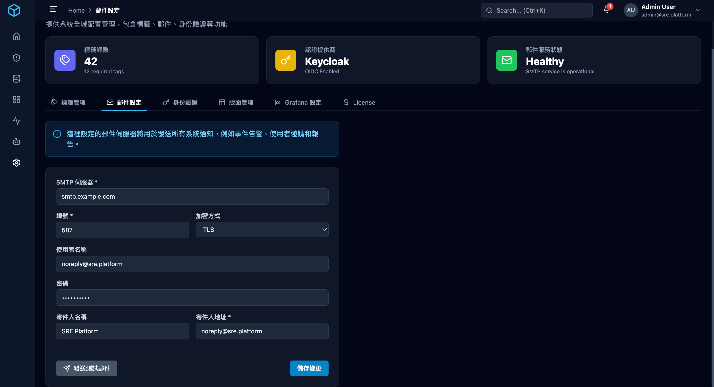
表單欄位無欄位驗證提示，像是「密碼」欄位應提供強度指標。下方「發送測試郵件」按鈕與儲存按鈕同色，建議改為次要按鈕避免誤操作。

**具體優化建議：**
- 為密碼欄位添加密碼強度指示器，顯示弱/中/強三個等級
- 實作即時密碼驗證，包含大寫字母、小寫字母、數字、特殊符號要求
- 將「發送測試郵件」按鈕改為次要樣式（灰色背景），與主要「儲存」按鈕區分
- 為SMTP設定欄位添加連線測試功能，驗證伺服器設定正確性
- 在每個欄位旁添加說明圖示，點擊顯示詳細設定說明

### 72.platform-identity-settings.png
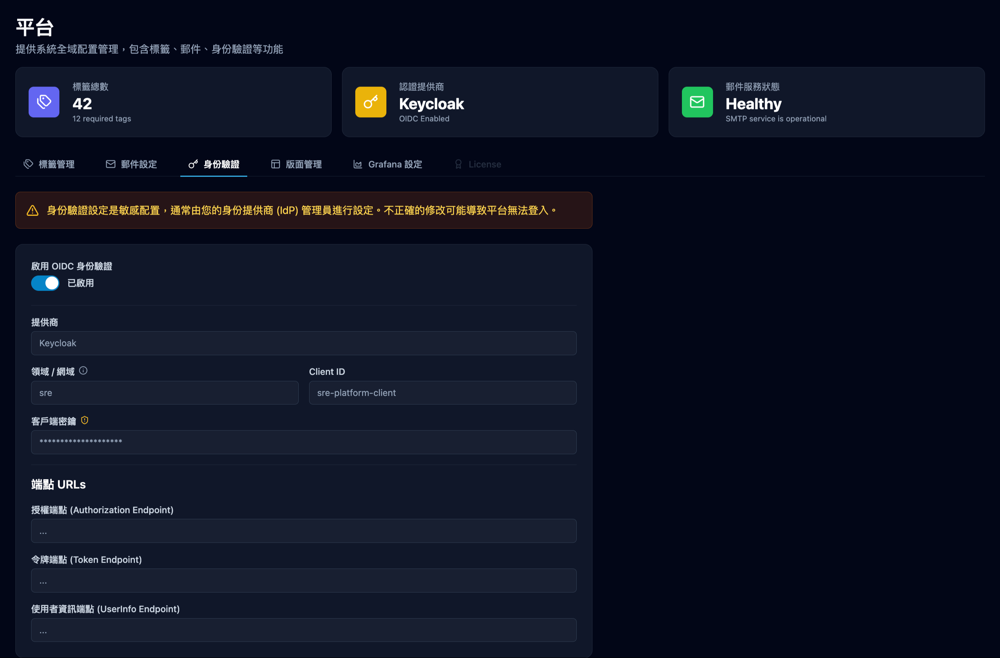
敏感設定警示欄顏色與平台其他警示不同，建議統一樣式。欄位名稱使用英文（Client ID、Client Secret），建議提供中文註解或雙語顯示。

**具體優化建議：**
- 將敏感設定警示欄顏色統一為系統標準的黃色 (`bg-yellow-500/10 border-yellow-500`)
- 為欄位名稱提供雙語顯示：Client ID (客戶端識別碼)、Client Secret (客戶端密鑰)
- 在英文名稱旁添加隱藏式中文提示，滑鼠懸停時顯示
- 為敏感欄位添加額外的安全提示，說明這些資訊的保護重要性
- 實作欄位值的部分遮罩顯示，保護敏感資訊不被意外暴露

### 73.platform-layout-manager.png
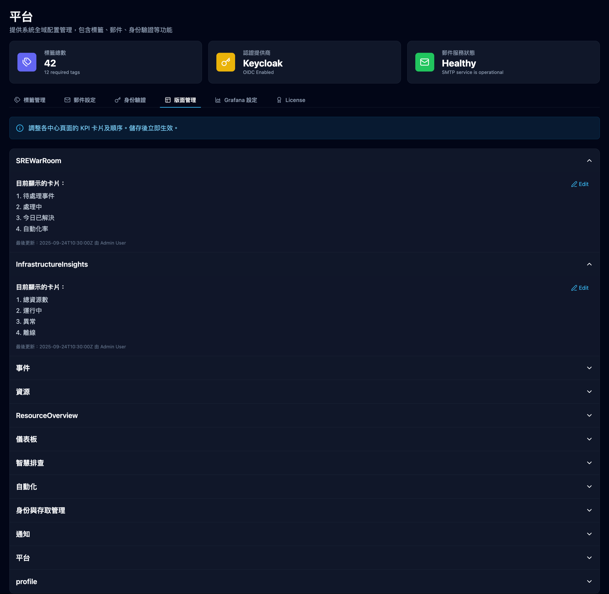
版面管理清單折疊箭頭過於靠右，缺乏區塊分隔，建議為每個模組加上卡片背景。列表未顯示卡片順序或使用頁面數量，建議加入指標協助管理。

**具體優化建議：**
- 為每個模組項目添加卡片背景 (`bg-slate-800/50`) 和圓角邊框，形成視覺分組
- 將折疊箭頭移至項目左側，與內容保持適當間距
- 在每個模組項目中顯示統計資訊：顯示頁面數量、最近更新時間
- 為模組項目添加拖拽手柄圖示，表示支援重新排序功能
- 實作模組項目的上下移動按鈕，方便使用者調整顯示順序
- 添加「預覽版面」按鈕，讓使用者預覽當前版面配置效果

### 74.platform-layout-edit-kpi-modal.png
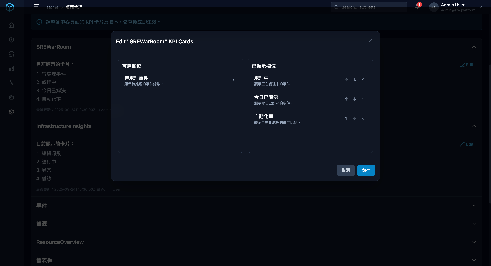
可選欄位與已顯示欄位區塊文字對齊不齊且缺乏拖曳指示，建議加入拖曳 icon。上下排序箭頭間距過窄且沒有 disabled 狀態提示，應提供灰階樣式表示不可用。

**具體優化建議：**
- 為可選欄位和已顯示欄位項目添加拖拽手柄圖示（六點圖示）
- 統一兩個區域的欄位文字對齊方式，使用相同的縮進和字體樣式
- 為上下排序箭頭增加間距，避免誤觸相鄰項目
- 為到達頂部/底部的項目顯示灰階樣式的禁用箭頭
- 添加「自動排序」按鈕，按字母順序或使用頻率自動排列欄位
- 實作拖拽過程中的視覺回饋，顯示允許放置的區域

### 75.platform-grafana-settings.png

Grafana URL 預設為 http://localhost:3000，缺乏說明是否為預設值或實際連線；建議加上提示。API Key 欄位只有眼睛圖示沒有複製按鈕，建議補齊操作。

**具體優化建議：**
- 在 Grafana URL 欄位下方添加說明：「預設為本地開發環境，如連接到遠端Grafana 請修改此 URL」
- 為URL欄位添加格式驗證，檢查是否為有效的 HTTP/HTTPS URL 格式
- 為 API Key 欄位添加「複製內容」按鈕，方便使用者複製金鑰
- 實作連線測試功能，點擊「測試連線」按鈕驗證 Grafana 伺服器可達性
- 為連線測試結果添加狀態指示器：成功（綠色）、失敗（紅色）、測試中（黃色）

### 76.platform-license-page.png
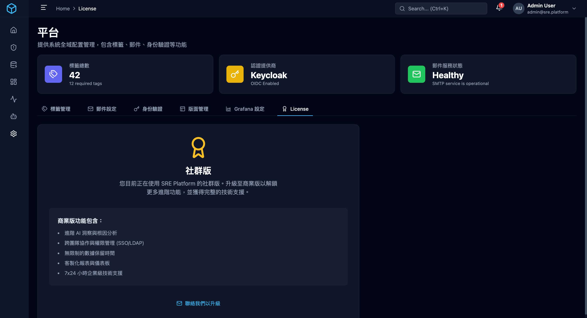
商業版功能清單使用項目符號但無圖示，與整體設計不符；可加入核取或勾勾圖示。聯絡按鈕文字為「聯絡我們以升級」但樣式與主要 CTA 相同，建議使用次要按鈕。

**具體優化建議：**
- 為商業版功能清單中的每個項目添加勾勾圖示 (✓)，表示包含的功能
- 為開源版功能清單添加半透明的禁用勾勾圖示，區分功能可用性
- 將「聯絡我們以升級」按鈕改為次要樣式（灰色背景），避免與主要功能混淆
- 添加功能比較表格，清楚顯示開源版與商業版的差異
- 為升級按鈕添加醒目的價格標籤或「熱門推薦」標籤
- 實作功能試用按鈕，允許使用者體驗部分商業版功能

### 77.profile-personal-info.png
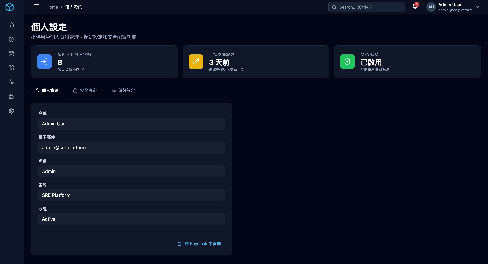
卡片標題與內容之間缺少分隔線，資訊顯得擁擠，建議加入卡片背景或欄位標籤。個人資訊僅可檢視不可編輯，建議提供跳轉至 Keycloak 的明確按鈕而非小連結。

**具體優化建議：**
- 為每個資訊欄位添加明確的欄位標籤（如「姓名」、「電子郵件」、「部門」）
- 在標題與內容之間添加分隔線 (`border-b border-slate-700`)
- 將「編輯個人資訊」改為主要樣式的按鈕，連結至Keycloak進行編輯
- 為唯讀欄位使用灰色文字樣式，與可編輯欄位區分
- 添加「最後更新時間」顯示，告知使用者資訊的新鮮度
- 為重要欄位（如電子郵件、手機號碼）添加驗證狀態指示器

### 78.profile-security-settings.png
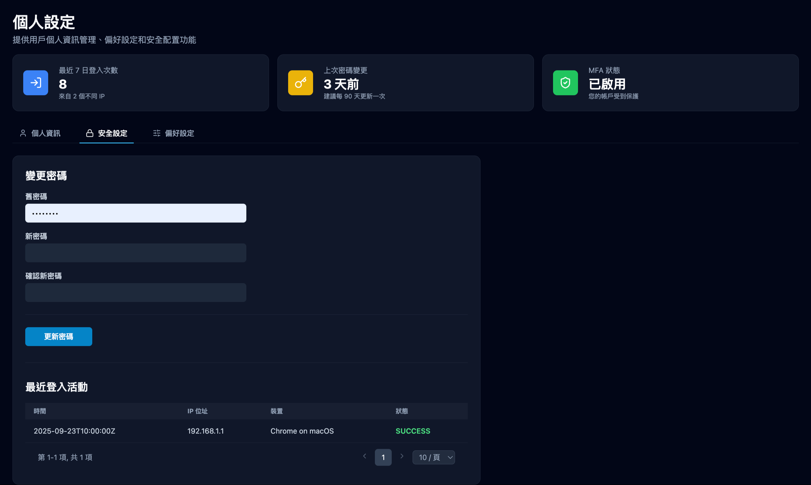
改密碼表單缺乏強度校驗與提示，建議加入強度條與錯誤訊息。最近登入活動表格未提供裝置圖示或地理位置，建議補充資訊增進安全感。

**具體優化建議：**
- 添加密碼強度指示器，顯示弱/中/強三個等級和具體要求
- 實作即時密碼驗證，確認密碼與確認密碼欄位一致
- 為最近登入活動表格添加裝置類型圖示（電腦、手机、平板）
- 在登入活動中顯示地理位置資訊（國家、城市）
- 添加登入活動的風險評估，標記可疑登入行為
- 實作「強制登出其他裝置」功能按鈕，提升帳戶安全性

### 79.profile-preferences.png

偏好設定的下拉選單全部使用相同寬度且無說明，建議在下拉內加入選項提示。儲存設定按鈕位置偏右下，與其他頁面主按鈕位置不同，建議統一放在右下且加上次要按鈕。

**具體優化建議：**
- 為每個下拉選項添加說明文字，例如：「淺色主題 - 適合日間使用，減少眼睛疲勞」
- 根據選項內容調整下拉選單寬度，避免過長選項被截斷
- 將「儲存設定」按鈕移至右下角，與其他頁面保持一致
- 添加「重設預設值」次要按鈕，讓使用者快速恢復系統預設設定
- 為設定變更添加即時預覽功能，選擇主題時立即套用視覺效果
- 實作設定匯出功能，允許使用者備份個人偏好設定
## 平台一致性二次審查補充

### 審查方法與全域原則
- 依照設計系統 `SRE DS v0.8` 的核心原則重新比對每張截圖，著重於語系一致、間距網格（4px 倍數）、元件狀態樣式以及互動層級。
- 建議中若提及 Token，沿用現有命名：顏色（如 `color.intent.warning`）、文字（如 `font.body.sm`）、按鈕尺寸（如 `button.md`）、間距（如 `spacing.16`）。
- 所有彈窗、列表與卡片建議統一使用 `Card/Base` 框架（內距 `spacing.24`、標題字重 `font.heading.sm`、分隔線 `divider.subtle`）。

### 各頁面一致性調整建議
- **dashboard-overview-ai-summary.png**
  - 問題：AI 摘要卡片未沿用指標卡資訊層級，建議與總覽卡同步呈現主指標＋差異值。
  - 調整：採用 `MetricCard` 模板（標題 `font.heading.xs`、副標 `font.body.sm`、差異值 `badge.delta`），並將右側 `建議操作` 按鈕改用 `button.md` 與 `spacing.16` 邊距。
- **incidents-list-overview.png**
  - 問題：狀態卡與表格行距不一致造成閱讀節奏中斷。
  - 調整：卡片改用同一 `StatusSummary` 資料骨架，表格行高統一為 `table.rowHeight.lg` 並讓膠囊使用 `Chip/Status` 樣式。
- **incidents-detail-ai-analysis.png**
  - 問題：語系混用與分隔不足導致語意跳躍。
  - 調整：狀態標籤使用 `Chip/Status` 並套用繁體中文 label，AI 區塊加上 `Card/Subsection` 背景與 `spacing.20` 分隔線。
- **incidents-detail-timeline.png**
  - 問題：AI 建議與時間軸寬度不一、文字語系不一致。
  - 調整：統一卡片寬度採 `layout.column.6`，時間軸文字改用雙語欄位並標示觸發者 `Avatar/with-label`。
- **incidents-assign-modal.png**
  - 問題：按鈕排列與模態窗標題字階與其他模組不同。
  - 調整：套用 `Modal/L` 模板（標題 `font.heading.sm`、主次按鈕右對齊 `button.primary` / `button.tertiary`），指派清單加上 `Tag/Role` 標籤。
- **incidents-silence-modal.png**
  - 問題：靜音時長 pill 與提醒文字色彩未遵循規格。
  - 調整：pill 改用 `SegmentedControl` 元件（高度 40px，間距 `spacing.12`），提醒文字採 `text.secondary` 並附 `Icon/info`。
- **incidents-alert-rules-list.png**
  - 問題：分頁底線與自動化欄位 icon 表達不一致。
  - 調整：分頁採 `Tab/underline` 並使用 `color.intent.primary`，自動化欄位改為 `Chip/Toggle` 搭配 Tooltip。
- **incidents-alert-rules-column-settings.png**
  - 問題：拖曳指示不足且按鈕間距過緊。
  - 調整：可選／已選區域使用 `Card/Subtle` 背景，項目左側加入 `Icon/DragHandle`，上下箭頭採 `button.icon.sm` 與 `spacing.12`。
- **incidents-alert-rule-wizard-step1.png**
  - 問題：步驟顯示狀態不明與卡片行距偏緊。
  - 調整：導覽改用 `Stepper` 元件（完成態顯示勾勾），範本卡採 `Card/Selectable` 並補繁中描述。
- **incidents-alert-rule-wizard-step2-basic.png**
  - 問題：表單缺乏輔助說明與區塊層級。
  - 調整：各欄位加入 `Field/Description`，監控範圍區塊採 `Card/Subsection` 背景與 `spacing.16` 內距。
- **incidents-alert-rule-wizard-step2-scope.png**
  - 問題：說明文字過長與數字缺少視覺重點。
  - 調整：使用 `RichText/list` 拆分段落，匹配資源數改用 `Badge/count` 顯示品牌色。
- **incidents-alert-rule-wizard-step3.png**
  - 問題：OR/AND 敘述混淆與事件等級樣式不符。
  - 調整：標題文案改為「條件群組 #1｜串接方式：OR」，事件等級改用 `Pill/Filter` 與 `button.toggle` 樣式。
- **incidents-alert-rule-wizard-step4.png**
  - 問題：模板變數與 Tag 操作未依設計系統呈現。
  - 調整：變數說明改為 `CodeBlock/inline` 列表，新增 Tag 改用 `Button/icon`（含「＋」圖示）。
- **incidents-alert-rule-wizard-step5.png**
  - 問題：勾選框與腳本欄位內距不齊。
  - 調整：表單使用 `Form/TwoColumn` 模板，勾選框左邊保留 `spacing.24`，腳本參數加上 `Field/HelpText`。
- **incidents-silence-rules-list.png**
  - 問題：欄位間距與操作項目不足。
  - 調整：表格欄距使用 `table.gap.md`，操作欄加入與事件列表一致的 `ActionMenu`（延長靜音、停用）。
- **incidents-silence-rule-wizard-step1.png**
  - 問題：快速套用樣式不符與欄位語系混用。
  - 調整：按鈕套用 `Button/secondary` 並提供 hover，欄位加上繁中標籤與 `Field/Placeholder` 指引。
- **incidents-silence-rule-wizard-step2-once.png**
  - 問題：日期格式未標示時區且分頁選態不明。
  - 調整：時間欄位加入 `Suffix` 顯示 UTC+8，分頁使用 `Tab/Segmented` 並加粗選中狀態。
- **incidents-silence-rule-wizard-step2-recurring.png**
  - 問題：Cron 選項缺少輔助敘述與時間選擇不一致。
  - 調整：新增 `HelperPanel` 提供 Cron 範例，執行時間改用 `TimePicker` 元件。
- **incidents-silence-rule-wizard-step3.png**
  - 問題：條件區塊擁擠與預覽資訊不足。
  - 調整：靜音條件套用 `Card/Subsection` 與 `spacing.20` 內距，預覽改為可展開的 `Disclosure` 列表。
- **resources-inventory-list.png**
  - 問題：語系混搭與操作圖示缺乏說明。
  - 調整：指標/狀態統一繁中標籤並附英文 Tooltip，操作欄使用 `IconButton` 搭配 Tooltip。
- **resources-edit-modal.png**
  - 問題：雙欄間距過大與下拉不可搜尋。
  - 調整：採 `Form/Responsive` 單欄模式（間距 `spacing.24`），下拉改用 `Combobox/searchable`。
- **resources-groups-list.png**
  - 問題：卡片色票與列表狀態不一致、缺少查看入口。
  - 調整：狀態燈號沿用 `StatusLegend` 三色，操作欄加入 `View` 行為與共用圖示排序。
- **resources-edit-group-modal.png**
  - 問題：拖放提示不足與搜尋框缺乏聚焦樣式。
  - 調整：可用/已選區域加入 `IllustrationArrow` 及「拖曳加入」文案，搜尋框使用 `Input/focus` 邊框色。
- **resources-datasources-list.png**
  - 問題：狀態顏色未與資源列表對齊、缺少快捷操作。
  - 調整：狀態 icon 採用共用 `StatusDot` 色票，操作欄新增 `Button/link`「測試連線」。
- **resources-edit-datasource-modal.png**
  - 問題：Tag 與按鈕對齊不佳。
  - 調整：標籤區塊採單列 `TagGroup`，操作區採 `ButtonGroup` 左測試右主次按鈕。
- **resources-auto-discovery-list.png**
  - 問題：Cron 資訊不易理解與狀態缺少圖示。
  - 調整：排程欄位提供 `InfoTooltip` 說明，狀態改用 `StatusChip`。
- **resources-discovery-results-modal.png**
  - 問題：標題資訊與可選行為不匹配，狀態顏色對比不足。
  - 調整：標題顯示「已勾選 X 項 / 全部 Y 項」，狀態使用 `color.intent.info` 提升對比。
- **resources-edit-discovery-task-modal.png**
  - 問題：表單過長與 kubeconfig 缺乏格式提示。
  - 調整：拆為 `Stepper` 子流程或加右側錨點，kubeconfig 欄位附 `CodeEditor` 範例與驗證。
- **resources-discovery-task-step3.png**
  - 問題：模板與 YAML 欄位未分隔、說明色彩過淡。
  - 調整：兩區使用 `Card/Duo` 分欄，邊緣掃描說明採 `text.secondary` 並加 `Icon/info`。
- **resources-discovery-task-step5.png**
  - 問題：標籤輸入缺少提示與底部留白不足。
  - 調整：改用 `TagInput`（placeholder「cluster = A」），底部內距增加至 `spacing.32`。
- **resources-topology-view.png**
  - 問題：節點色票不一致與篩選器缺乏標籤。
  - 調整：拓撲節點沿用 `StatusPalette`，左上篩選採 `FilterGroup` 並加「視圖模式」標籤。
- **dashboards-list.png**
  - 問題：分類標籤語系混用與收藏 icon 沒有狀態提示。
  - 調整：標籤採繁中主語系搭配 Tooltip，收藏圖示使用 `Icon/star-filled` 與 hover 說明。
- **dashboards-template-gallery.png**
  - 問題：卡片高度不齊與主按鈕色彩不一致。
  - 調整：套用 `Card/Template` 固定高度並將主按鈕使用品牌 `button.primary`。
- **dashboards-builder-empty.png**
  - 問題：標題階層不足與空狀態指引不明。
  - 調整：插入 `Description` 副標與 `EmptyState` 插畫（尺寸 200px）。
- **dashboards-add-widget-modal.png**
  - 問題：小工具重複與缺乏辨識輔助。
  - 調整：清單支援 `Search` 與 `Category` 過濾，每項加上 `Thumbnail`。
- **dashboards-builder-with-widgets.png**
  - 問題：已新增小工具無排序提示且間距過大。
  - 調整：每張卡加入 `DragHandle`，縱向間距降至 `spacing.16` 並支援雙欄。
- **insights-overview.png**
  - 問題：語系與時間戳缺失。
  - 調整：統一指標單位語言，AI 模組標題旁加入 `Timestamp/badge`。
- **automation-scripts-list.png**
  - 問題：英文描述與缺乏篩選欄位。
  - 調整：文案提供繁中主體，表格新增 `Script Language` 欄並使用 `Tag` 呈現。
- **automation-edit-script-modal.png**
  - 問題：程式區無行號與操作按鈕位置不一。
  - 調整：嵌入 `CodeEditor`（行號＋高亮），工具按鈕放於右上 `Toolbar`。
- **automation-ai-generate-script-modal.png**
  - 問題：生成結果缺少滾動指示與型別預設。
  - 調整：輸出區高度限制 280px 並顯示 `ScrollShadow`，型別欄位預設來源腳本類型。
- **automation-triggers-list.png**
  - 問題：類型標籤顏色不一致與缺少執行狀態。
  - 調整：標籤採 `Chip/Type` 共用色票，表格新增「上次執行」欄與 `StatusDot`。
- **automation-edit-trigger-schedule.png**
  - 問題：Cron 字串缺少預覽且模態寬度過大。
  - 調整：加上 `NextRunPreview` 元件，模態採 `Modal/M` 寬度。
- **automation-edit-trigger-webhook.png**
  - 問題：缺少 webhook 專屬設定。
  - 調整：提供 `AuthSection`（Bearer/API Key/Basic），欄位統一高度 40px 並加格式驗證。
- **automation-edit-trigger-event.png**
  - 問題：僅支援 AND 條件與下拉排序混亂。
  - 調整：改用 `ConditionBuilder` 支援群組，選單依模組排序並支援搜尋。
- **automation-run-logs-list.png**
  - 問題：缺乏狀態篩選與操作提示。
  - 調整：表頭加入 `FilterBar`（狀態、管道），操作欄新增「查看輸出」icon。
- **automation-run-log-detail.png**
  - 問題：標題資訊不足與 stdout 顏色不夠突出。
  - 調整：標題改為「腳本名稱｜執行編號｜時間」，stdout 使用深色 `CodeBlock`。
- **identity-users-list.png**
  - 問題：統計卡英文文案、操作圖示順序不一。
  - 調整：文案提供繁中主語系並保留英文 Tooltip，操作按鈕依平台順序排列。
- **identity-invite-member-modal.png**
  - 問題：角色/團隊無權限摘要、主按鈕色彩不同。
  - 調整：下拉選項附 `Caption` 描述權限，送出按鈕改用 `button.primary`。
- **identity-edit-member-modal.png**
  - 問題：唯讀欄位樣式與可編輯欄位相同，狀態缺少顏色。
  - 調整：電子郵件改用 `Input/readonly` 樣式，狀態下拉搭配 `StatusDot`。
- **identity-teams-list.png**
  - 問題：缺乏關鍵統計與快速操作。
  - 調整：表格新增成員總數、使用中專案欄位，操作欄加入「設定擁有者」選項。
- **identity-edit-team-modal.png**
  - 問題：可用成員缺搜尋、描述欄位無字數提示。
  - 調整：加入 `SearchInput` 與描述 `CharacterCounter`。
- **identity-roles-list.png**
  - 問題：開關與行距不齊、描述為英文。
  - 調整：使用 `Switch` 標準寬度，描述提供繁中正文並保留英文 Tooltip。
- **identity-edit-role-modal.png**
  - 問題：折疊指示與核取對齊不佳。
  - 調整：展開箭頭放大至 16px 並使用 `Accordion`，權限勾選改為 `Table/PermissionMatrix`。
- **identity-audit-log-list.png**
  - 問題：缺乏空狀態指引與語系一致性。
  - 調整：表格加入 `EmptyState` 指示與繁中欄位標題。
- **identity-audit-log-detail.png**
  - 問題：JSON 置中且無複製功能。
  - 調整：採 `CodeViewer`（等寬字體、左對齊、Copy 按鈕）。
- **insights-log-explorer.png**
  - 問題：圖表缺圖例、表格英文欄位。
  - 調整：使用 `ChartLegend` 標示顏色，欄位名稱翻譯為繁中並統一字體。
- **insights-capacity-planning.png**
  - 問題：預測線辨識度低與 AI 卡片文字過長。
  - 調整：預測線採 `color.intent.warning` 並更新圖例，卡片提供折疊 `ReadMore` 與 200px 高度限制。
- **notifications-strategies-list.png**
  - 問題：條件膠囊英文與缺少最後觸發欄位。
  - 調整：膠囊改為繁中標籤並附 Tooltip，新增「最後觸發」欄位與排序功能。
- **notifications-strategy-step1.png**
  - 問題：欄位缺字數限制提示、Tag 表現不一致。
  - 調整：加入 `CharacterCounter` 與 `TagInput`（含「全部清除」）。
- **notifications-strategy-step2.png**
  - 問題：通知管道缺狀態資訊與說明。
  - 調整：勾選項目顯示成功率徽章，標題下加副標說明與 Hover 詳情。
- **notifications-strategy-step3.png**
  - 問題：附加條件無分隔與預設。
  - 調整：區塊套 `Card/Subtle`，提供常用條件快捷與即時預覽。
- **notifications-channels-list.png**
  - 問題：空狀態與發送結果缺視覺提示。
  - 調整：新增空狀態插畫與 CTA，發送結果使用 `StatusIcon`。
- **notifications-add-channel-email.png**
  - 問題：欄位缺格式提示、測試/儲存按鈕過近。
  - 調整：提供 placeholder 與格式說明，按鈕採主次樣式分離並加入格式驗證。
- **notifications-add-channel-webhook.png**
  - 問題：無認證設定且欄位高度不一。
  - 調整：新增認證區（含顯示/隱藏切換與測試按鈕），所有輸入統一高度 40px。
- **notifications-add-channel-slack.png**
  - 問題：placeholder 為英文且缺測試功能。
  - 調整：改為繁中提示、提供 `測試訊息` 按鈕與 URL 格式驗證。
- **notifications-add-channel-line.png**
  - 問題：Access Token 提示不足、欄距過大。
  - 調整：眼睛圖示加 Tooltip，欄位間距調整為 `spacing.16` 並加取得教學連結。
- **notifications-add-channel-sms.png**
  - 問題：國碼支援不明與佈局鬆散。
  - 調整：加入國碼下拉、雙欄響應式佈局與測試簡訊功能。
- **notifications-send-history.png**
  - 問題：缺篩選與內容預覽。
  - 調整：表頭提供狀態/管道篩選，內容欄加展開/Tooltip。
- **notifications-history-detail.png**
  - 問題：JSON 區缺複製、提示不明顯。
  - 調整：採 `CodeViewer` 與 Copy 按鈕，提示文字使用 `text.emphasis` 背景。
- **platform-tags-overview.png**
  - 問題：警告色票不一致與缺批次功能。
  - 調整：警示沿用 `color.intent.warning`，操作欄加入「批次匯入/刪除」與搜尋。
- **platform-email-settings.png**
  - 問題：欄位缺驗證與按鈕樣式不分。
  - 調整：密碼欄顯示強度條與即時驗證，測試按鈕使用次要樣式。
- **platform-identity-settings.png**
  - 問題：警示色票與欄位語系不一致。
  - 調整：套用標準警示樣式並提供雙語標籤與遮罩顯示。
- **platform-layout-manager.png**
  - 問題：折疊箭頭位置與資訊密度不足。
  - 調整：模組使用 `Card/List` 背景，左側顯示 `DragHandle` 與統計指標。
- **platform-layout-edit-kpi-modal.png**
  - 問題：對齊不齊與排序狀態不明。
  - 調整：項目使用 `ListItem/draggable` 模式，禁用箭頭顯示灰階並加入自動排序。
- **platform-grafana-settings.png**
  - 問題：URL 說明不足與 API Key 缺複製。
  - 調整：新增預設值說明與格式驗證，提供 `Copy` 與「測試連線」按鈕。
- **platform-license-page.png**
  - 問題：功能清單視覺弱與 CTA 分層不明。
  - 調整：使用核取圖示展示功能差異，升級按鈕改為次要樣式並提供比較表。
- **profile-personal-info.png**
  - 問題：卡片缺分隔與編輯入口不明。
  - 調整：欄位加 `Label`、分隔線，提供主要按鈕連結至 Keycloak。
- **profile-security-settings.png**
  - 問題：缺密碼強度與登入活動資訊不足。
  - 調整：新增強度條、即時驗證，登入紀錄加裝置圖示與地理位置。
- **profile-preferences.png**
  - 問題：下拉缺說明與主按鈕位置不一致。
  - 調整：為選項加入描述文字與即時預覽，按鈕改用右下主/次按鈕並提供「重設預設值」。
