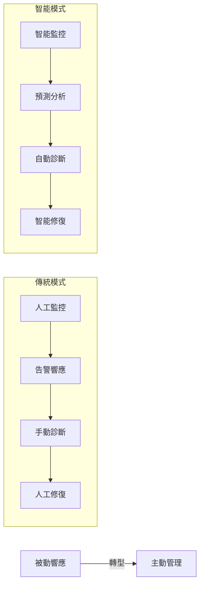
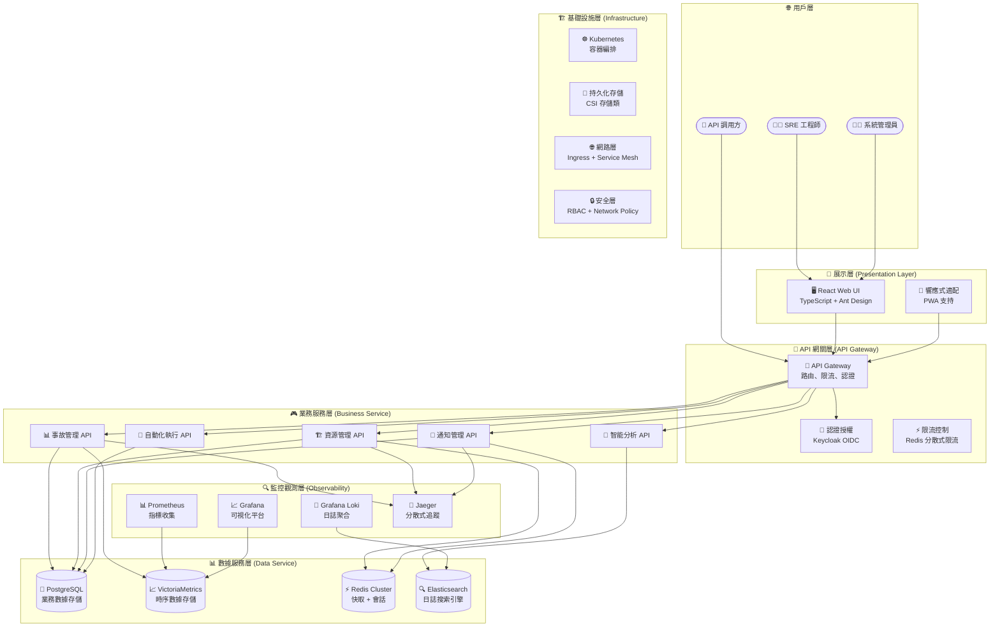
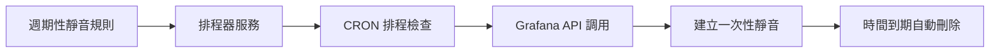
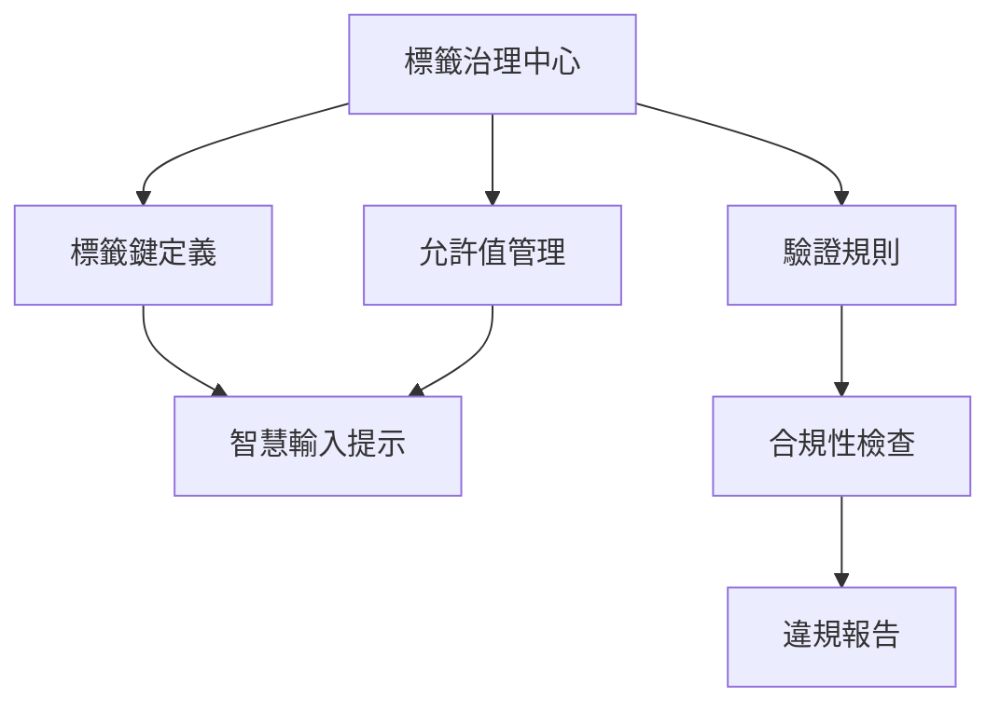
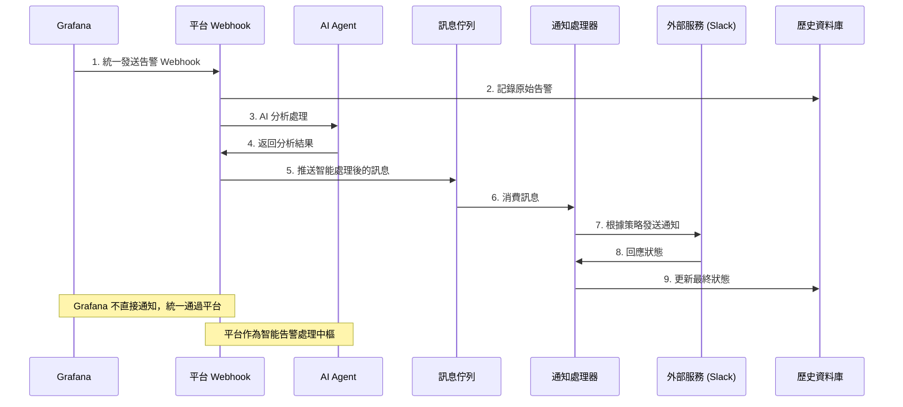
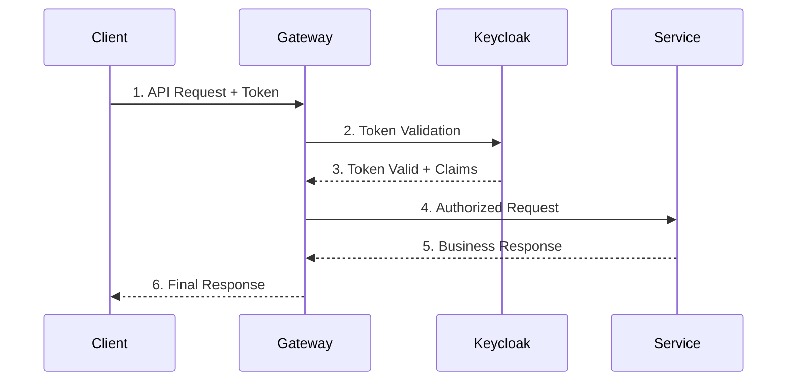
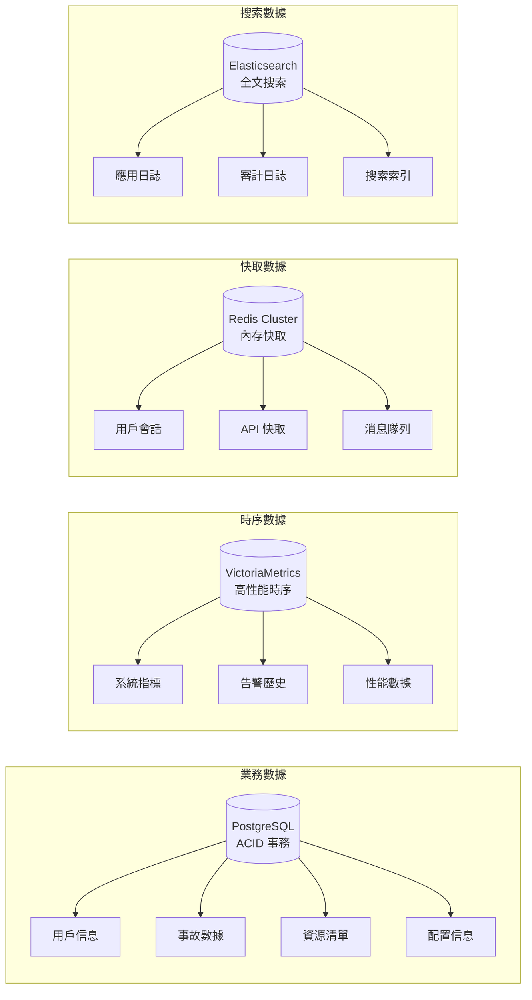

# SRE 平台功能規格 v2.20

本文件旨在記錄 SRE 平台在持續開發過程中的重要功能規格與架構決策，作為開發與測試的依據。

---

## 1. 功能: 頁面版面配置 API 化 (Page Layout Customization API Integration)

-   **模組**: 平台設定 (Platform Settings)
-   **版本**: v2.1
-   **狀態**: ✅ 已完成

### 1.1 使用者故事

**身為** 一名平台管理員，
**我想要** 自訂各個主要頁面上顯示的關鍵效能指標 (KPI) 卡片，
**使得** 這些設定能夠被儲存在伺服器上，以便在不同裝置和瀏覽器間保持一致，提升我的工作效率。

### 1.2 行為變更

-   **數據獲取**: 「版面管理」頁面 (`LayoutSettingsPage.tsx`) 現在會在載入時，向 `/api/v1/settings/layouts` 端點發起 `GET` 請求，以獲取所有頁面的最新版面配置，而非從 `localStorage` 或靜態常數初始化。
-   **數據持久化**: 當使用者儲存對某個頁面版面的修改時，前端會向 `/api/v1/settings/layouts` 端點發起 `PUT` 請求，將**完整的**、更新後的版面配置物件傳送至後端進行儲存。
-   **本地快取與即時更新**: 為了在不刷新頁面的情況下，讓其他頁面（尤其是 `PageKPIs.tsx` 元件）能即時反應版面變更，在成功儲存到後端後，前端會同時更新 `localStorage` 中的版面配置副本，並觸發一個 `storage` 事件。這提供了一種高效能的樂觀更新機制。
-   **使用者體驗**: 頁面新增了載入中 (Loading) 與錯誤 (Error) 狀態的視覺回饋，提升了非同步操作的健壯性。

### 1.3 使用的 API 端點

-   `GET /api/v1/settings/layouts`: 用於讀取當前所有頁面的版面配置。
-   `PUT /api/v1/settings/layouts`: 用於儲存更新後的完整版面配置。

---

## 2. 功能: 資源拓撲圖動態化 (Resource Topology View API Integration)

-   **模組**: 資源管理 (Resource Management)
-   **版本**: v2.1
-   **狀態**: ✅ 已完成

### 2.1 使用者故事

**身為** 一名 SRE 工程師，
**我想要** 查看一個即時、由後端數據驅動的資源依賴拓撲圖，
**使得** 我能快速理解系統的真實架構，並在發生事件時迅速評估潛在的影響範圍。

### 2.2 行為變更

-   **數據獲取**: 「拓撲視圖」頁面 (`ResourceTopologyPage.tsx`) 現在會向新建立的 `GET /api/v1/resources/topology` 端點發起請求，以獲取拓撲圖所需的節點（資源）與連結（依賴關係）數據。
-   **動態視覺化**: 拓撲圖現在完全基於 API 回傳的數據進行動態渲染，確保了其內容的即時性與準確性。
-   **API 契約擴充**: `openapi.yaml` 文件中新增了 `/resources/topology` 端點的定義。
-   **使用者體驗**: 頁面同樣增加了載入中與錯誤狀態的處理，確保在數據獲取過程中提供清晰的視覺回饋。

### 2.3 使用的 API 端點

-   `GET /api/v1/resources/topology`: (新增) 用於一次性獲取所有資源節點及其依賴關係連結。

---

## 3. 功能: 個人設定模組 API 化 (Profile Module API Integration)

-   **模組**: 個人設定 (Profile)
-   **版本**: v2.2
-   **狀態**: ✅ 已完成

### 3.1 使用者故事

**身為** 一名已登入的使用者，
**我想要** 我的個人資訊、安全設定（如登入歷史）以及偏好設定都能從後端 API 動態載入並儲存，
**使得** 我的設定能夠在所有裝置間保持同步，並確保數據的準確性與安全性。

### 3.2 行為變更

-   **個人資訊 (`PersonalInfoPage`)**: 頁面不再讀取靜態模擬數據，而是向 `/api/v1/me` 發起 `GET` 請求，以獲取當前登入使用者的資訊。
-   **安全設定 (`SecuritySettingsPage`)**: 頁面中的「登入歷史」列表，現在透過向 `/api/v1/me/login-history` 發起 `GET` 請求來動態獲取，並支援分頁。
-   **偏好設定 (`PreferenceSettingsPage`)**:
    -   **數據獲取**: 頁面載入時，會向 `/api/v1/me/preferences` 發起 `GET` 請求來獲取使用者的偏好設定，取代了原有的 `localStorage` 讀取邏輯。
    -   **數據持久化**: 當使用者儲存設定時，會向同一個端點發起 `PUT` 請求，將更新後的設定持久化到後端。
-   **使用者體驗**: 所有相關頁面都增加了完整的載入中與錯誤狀態的處理，提升了非同步操作的健壯性。

### 3.3 使用的 API 端點

-   `GET /api/v1/me`: (新增) 取得當前登入者的個人資訊。
-   `GET /api/v1/me/login-history`: (新增) 取得登入者的登入歷史紀錄。
-   `GET /api/v1/me/preferences`: (新增) 取得使用者的偏好設定。
-   `PUT /api/v1/me/preferences`: (新增) 更新使用者的偏好設定。

---

## 4. 功能: 分析中心數據動態化 (Analysis Center API Integration)

-   **模組**: 分析中心 (Analysis Center)
-   **版本**: v2.2
-   **狀態**: ✅ 已完成

### 4.1 使用者故事

**身為** 一名 SRE 或開發人員，
**我想要** 在「日誌探索」和「追蹤分析」頁面中，能夠查詢和瀏覽來自後端的即時數據，
**使得** 我可以對系統的真實運行狀況進行深入分析，快速定位問題。

### 4.2 行為變更

-   **日誌探索 (`LogExplorerPage`)**: 頁面不再使用 `MOCK_LOGS` 靜態數據。現在，它會向 `GET /api/v1/logs` 端點發起請求，獲取日誌數據。API 支援篩選與分頁，讓前端能更有效地處理大量日誌。
-   **追蹤分析 (`TraceAnalysisPage`)**:
    -   **數據獲取**: 「追蹤列表」現在透過向 `GET /api/v1/traces` 端點發起請求來填充。
    -   **動態載入**: 點擊列表中的追蹤項目時，其詳細的 Span 資訊會被動態載入和渲染，取代了原有的靜態數據依賴。
-   **API 契約擴充**: `openapi.yaml` 文件中新增了「分析中心」相關的 `/logs` 和 `/traces` 端點定義。
-   **使用者體驗**: 頁面同樣增加了載入中與錯誤狀態的處理，確保在數據獲取過程中提供清晰的視覺回饋。

### 4.3 使用的 API 端點

-   `GET /api/v1/logs`: (新增) 取得日誌數據，支援篩選與分頁。
-   `GET /api/v1/traces`: (新增) 取得追蹤列表。
-   `GET /api/v1/traces/{trace_id}`: (新增) 取得單一追蹤的詳細資訊，包含所有 Spans。
---

## 5. 功能: 全面 API 化 - 詳情、表單與配置 (Full API Integration)

-   **模組**: 全局
-   **版本**: v2.4
-   **狀態**: ✅ 已完成

### 5.1 使用者故事

**身為** 一名平台使用者，
**我想要** 應用程式中所有的動態內容，包括詳情頁的圖表、編輯表單的下拉選單、以及列表頁的篩選條件，都能從後端 API 動態載入，
**使得** 平台完全擺脫前端的靜態資料依賴，確保我看到的永遠是最新、最準確的資訊，並提升系統的整體可維護性。

### 5.2 行為變更

-   **資源詳情頁 (`ResourceDetailPage`)**:
    -   **動態指標圖表**: 頁面中的 CPU 和記憶體圖表，不再使用前端生成的模擬數據。現在，它們會在載入時向新增的 `GET /resources/{resourceId}/metrics` 端點發起請求，以獲取真實的歷史指標數據並進行渲染。

-   **編輯與新增模態框 (`Edit/Add Modals`)**:
    -   **通用模式**: 所有先前使用 `constants.ts` 中硬編碼陣列來填充下拉選單的模態框，都已被重構為在開啟時向對應的 API 端點發起 `GET` 請求。
    -   **受影響的元件**:
        -   `ResourceEditModal`: 從 `GET /resources/options` 獲取資源類型、提供商、區域和擁有者列表。
        -   `DashboardEditModal`: 從 `GET /dashboards/options` 獲取儀表板類別和擁有者列表。
        -   `InviteUserModal`: 從 `GET /iam/roles` 和 `GET /iam/teams` 分別獲取角色和團隊列表。
        -   `NotificationStrategyEditModal`: 從 `GET /settings/tags` 獲取觸發條件的可用標籤鍵。
        -   `UnifiedSearchModal` (資源篩選): 從 `GET /resources/options` 獲取篩選條件的選項。


-   **列表頁篩選器 (`List Page Filters`)**:
    -   `DashboardListPage`: 頁面頂部的「類別」篩選按鈕，現在基於 `GET /dashboards/options` 的回應動態生成。

### 5.3 新增的 API 端點

-   `GET /resources/options`: (新增) 集中提供資源相關的所有可選項（類型、提供商、區域、擁有者），優化前端請求效率。
-   `GET /dashboards/options`: (新增) 提供儀表板相關的可選項（類別、擁有者）。
-   `GET /resources/{resource_id}/metrics`: (新增) 提供特定資源的歷史指標數據。
-   (重用) `GET /iam/teams`, `GET /iam/roles`, `GET /settings/tags` 等現有端點被更廣泛地用於填充各類表單選項。

---

## 6. 功能: 互動式儀表板與功能測試 (Interactive Dashboards & Functional Testing)

-   **模組**: 儀表板、分析中心、告警規則
-   **版本**: v2.5
-   **狀態**: ✅ 已完成

### 6.1 使用者故事

**身為** 一名 SRE，
**我想要** 看到我核心儀表板（如「SRE 戰情室」、「分析總覽」）上的數據是即時從後端獲取的，並且能夠用一個模擬後端來測試我新建立的告警規則，
**使得** 我可以完全信任平台所呈現的數據來進行日常維運，並在部署告警規則前有信心它能如預期般運作。

### 6.2 行為變更

-   **SRE 戰情室 (`SREWarRoomPage`)**:
    -   **動態圖表**: 頁面中的「服務健康度總覽」和「資源群組狀態」圖表，現在會在載入時分別向 `GET /dashboards/sre-war-room/service-health` 和 `GET /dashboards/sre-war-room/resource-group-status` 端點請求數據，取代了原有的前端靜態資料。
    -   **使用者體驗**: 圖表在數據載入期間會顯示骨架 (Skeleton) 載入動畫，並在 API 請求失敗時顯示清晰的錯誤提示與重試按鈕。

-   **分析總覽 (`AnalysisOverviewPage`)**:
    -   **統一數據源**: 頁面上的所有元件，包括「系統健康評分圖」、「事件關聯分析圖」以及「最近日誌列表」，現在都從一個統一的 `GET /analysis/overview` 端點獲取數據，確保了數據的一致性。
    -   **使用者體驗**: 與戰情室類似，所有元件都增加了載入中和錯誤狀態的處理。

-   **告警規則測試 (`TestRuleModal`)**:
    -   **後端驗證**: 「測試規則」模態框中的「執行測試」按鈕，現在會將使用者輸入的測試 Payload 發送到後端的 `POST /alert-rules/{rule_id}/test` 端點。
    -   **真實回饋**: 後端會模擬規則的評估邏輯，並回傳一個結構化的 JSON 物件，明確指出條件是否匹配，並提供一個基於規則模板生成的事件預覽。這取代了原有的純前端模擬邏輯，提供了更真實的測試體驗。

### 6.3 新增的 API 端點

-   `GET /dashboards/sre-war-room/service-health`: (新增) 提供 SRE 戰情室「服務健康度」熱圖的數據。
-   `GET /dashboards/sre-war-room/resource-group-status`: (新增) 提供 SRE 戰情室「資源群組狀態」長條圖的數據。
-   `GET /analysis/overview`: (新增) 提供分析總覽頁所需的所有聚合數據。
-   `POST /alert-rules/{rule_id}/test`: (新增) 接收一個測試用的 Payload，模擬對特定告警規則的評估，並回傳評估結果。

---

## 7. 功能: 平台連動性與操作流程優化 (Platform Interconnectivity & Workflow Optimization)

-   **模組**: 全局
-   **版本**: v2.6
-   **狀態**: ✅ 已完成

### 7.1 使用者故事

**身為** 一名正在處理事件的 SRE，
**我想要** 在事件詳情頁直接點擊關聯的資源或規則名稱，就能跳轉到對應的管理頁面；同樣地，在資源詳情頁我也能快速連結到與該資源相關的歷史事件，
**使得** 我在進行問題排查時，能夠在不同模組之間無縫穿梭，大幅縮短資訊查找的時間，提升故障排除的效率。

### 7.2 行為變更

-   **事件詳情頁 (`IncidentDetailPage`)**:
    -   「資源」欄位現在是一個可點擊的連結，點擊後會導向至該資源的詳情頁 (`/resources/{resourceId}`)。
    -   「規則」欄位現在也是一個可點擊的連結，點擊後會導向至告警規則列表頁 (`/incidents/rules`)。

-   **資源詳情頁 (`ResourceDetailPage`)**:
    -   「相關事件」列表中的每一個事件，現在都成為一個可點擊的項目，點擊後會開啟該事件的詳情抽屜 (`/incidents/{incidentId}` on the same page)。

-   **API 契約擴充**:
    -   為了支援上述功能，`Incident` 資料模型已擴充，新增 `resourceId` 和 `ruleId` 欄位，以便前端能夠建立正確的連結。

### 7.3 使用的 API 端點

-   `GET /incidents?resource_name={resource_name}`: (增強) `GET /incidents` 端點現在支援依 `resource_name` 進行篩選，以供資源詳情頁查詢關聯事件。

---

## 8. 功能: 後端篩選與核心功能完善 (Backend Filtering & Core Feature Completion)

-   **模組**: 全局
-   **版本**: v2.7
-   **狀態**: ✅ 已完成

### 8.1 使用者故事

**身為** 一名平台使用者，
**我想要** 在所有列表頁面（如告警規則、靜音規則）上進行搜尋和篩選時，操作能直接由後端處理，並希望平台能補全如「規則測試」、「範本套用」、「執行重試」等核心操作，
**使得** 我能高效地處理大規模數據，並享受到一個功能完整、流程順暢的維運體驗。

### 8.2 行為變更

-   **後端篩選與搜尋**:
    -   **受影響頁面**: `AlertRulePage`, `SilenceRulePage`, `ResourceGroupPage`, `AutomationTriggersPage`。
    -   **變更內容**: 這些頁面的搜尋框和篩選器現在會觸發帶有查詢參數的後端 API 請求，取代了原有的前端 JavaScript 篩選邏輯。這顯著提升了處理大量資料時的效能，並確保了數據的一致性。
    -   **使用者體驗**: 在篩選條件變更後，表格會顯示一個載入中狀態，提供明確的數據獲取回饋。

-   **告警規則測試 (`TestRuleModal`)**:
    -   **後端驗證**: 「測試規則」功能現在會將測試 Payload 發送到 `POST /alert-rules/{id}/test` 端點，由後端模擬真實的規則評估邏輯。
    -   **真實回饋**: 模態框會顯示由後端回傳的結構化結果，包含是否匹配以及事件內容預覽。

-   **範本套用功能**:
    -   `AlertRuleEditModal` 和 `SilenceRuleEditModal` 現在會分別從 `GET /alert-rules/templates` 和 `GET /silence-rules/templates` 端點動態獲取可用範本，供使用者快速套用。

-   **自動化執行重試 (`AutomationHistoryPage`)**:
    -   對於失敗的執行紀錄，表格操作列中新增了「重試」按鈕，該按鈕會呼叫 `POST /automation/executions/{id}/retry` 端點來重新觸發一次執行。

-   **通知管道測試 (`NotificationChannelPage`)**:
    -   「測試」按鈕現在會呼叫 `POST /settings/notification-channels/{id}/test` 端點，由後端發起一個非同步的測試任務。

-   **CSV 匯入功能**:
    -   所有支援匯入的頁面 (`PersonnelManagementPage`, `ResourceListPage` 等) 現在都已對接 `POST /.../import` 端點。

### 8.3 新增的 API 端點

-   `GET /alert-rules`, `/silence-rules`, etc. (增強): 新增 `keyword`, `severity`, `enabled` 等後端篩選參數。
-   `GET /alert-rules/templates`: (新增) 取得告警規則範本。
-   `GET /silence-rules/templates`: (新增) 取得靜音規則範本。
-   `POST /alert-rules/{id}/test`: (增強) 完成後端測試邏輯。
-   `POST /automation/executions/{id}/retry`: (新增) 重試自動化執行。
-   `POST /.../import`: (新增) 支援各模組的 CSV 匯入功能。
---

## 9. 功能: CI/CD 與部署工作流程 (CI/CD & Deployment Workflow)

-   **模組**: 開發維運 (DevOps)
-   **版本**: v2.8
-   **狀態**: ✅ 已完成

### 9.1 使用者故事

**身為** 一名開發者，
**我想要** 每當我將最新的程式碼推送到 `main` 分支時，應用程式能夠自動被部署到一個公開的網址，
**使得** 我可以快速地驗證變更、與團隊成員分享進度，並確保線上版本永遠與主分支的程式碼保持同步。

### 9.2 行為變更

-   **建立 GitHub Actions 工作流程**:
    -   在專案中新增了一個 `.github/workflows/deploy.yml` 檔案，定義了一個用於持續部署的 GitHub Actions 工作流程。
    -   **觸發條件**: 此工作流程會在每次有程式碼 `push` 到 `main` 分支時自動執行。同時也支援手動觸發 (`workflow_dispatch`)。
    -   **部署目標**: 工作流程會將專案中的所有靜態檔案部署到 **GitHub Pages**。

-   **工作流程步驟**:
    1.  **Checkout**: 使用 `actions/checkout@v4` 拉取最新的程式碼。
    2.  **Setup Pages**: 使用 `actions/configure-pages@v5` 設定 GitHub Pages 的部署環境。
    3.  **Upload Artifact**: 使用 `actions/upload-pages-artifact@v3` 將整個專案目錄打包成一個部署產物 (artifact)。
    4.  **Deploy**: 使用 `actions/deploy-pages@v4` 將上一步產生的產物部署到 GitHub Pages。

-   **權限設定**:
    -   工作流程被授予了 `pages: write` 和 `id-token: write` 權限，以允許其向 GitHub Pages 寫入內容。

-   **併發控制**:
    -   設定了併發群組 (`concurrency group`)，確保同一時間只有一個部署任務在執行，避免了因快速連續推送而導致的部署衝突。
---

## 10. 功能: 批次操作與資料完整性強化 (Batch Operations & Data Integrity Enhancement)

-   **模組**: 全局
-   **版本**: v2.9
-   **狀態**: ✅ 已完成

### 10.1 使用者故事

**身為** 一名平台管理員，
**我想要** 在所有核心資源的管理頁面（如告警規則、團隊、自動化腳本等）上執行批次操作（例如，批次刪除、啟用/停用），並且確保刪除操作都是軟刪除，
**使得** 我可以更高效地管理大量資源，同時保證了資料的完整性和可恢復性，避免因誤刪除而導致的歷史數據丟失。

### 10.2 行為變更

-   **全面引入批次操作**:
    -   **受影響頁面**: `AlertRulePage`, `SilenceRulePage`, `AutomationPlaybooksPage`, `AutomationTriggersPage`, `TeamManagementPage`, `RoleManagementPage`, `NotificationStrategyPage`, `NotificationChannelPage`。
    -   **變更內容**: 所有上述頁面現在都增加了表格複選框功能。當使用者選擇一個或多個項目時，會出現一個批次操作工具列，提供如「批次刪除」、「批次啟用/停用」等上下文相關的操作。

-   **標準化軟刪除機制**:
    -   **受影響資源**: `Dashboard`, `AlertRule`, `SilenceRule`, `AutomationPlaybook`, `NotificationChannel`, `NotificationStrategy`, `Team`, `Role` 等所有核心資源。
    -   **變更內容**: 平台現在對所有核心資源的刪除操作統一採用軟刪除 (`soft-delete`) 策略。這意味著被刪除的資料僅被標記為已刪除 (`deleted_at` 時間戳)，但仍保留在資料庫中，確保了與這些資源相關的歷史記錄（如審計日誌、事件記錄）的完整性。

-   **API 契約擴充**:
    -   `openapi.yaml` 中為所有相關資源新增了批次操作的 `POST /.../batch-actions` 端點。
    -   `types.ts` 中的多個資料模型已更新，統一增加了 `deleted_at` 可選欄位以支援軟刪除。

### 10.3 使用的 API 端點

-   `POST /*/batch-actions`: (新增) 為多個模組增加了批次操作端點。
-   `DELETE /*/{id}`: (增強) 所有刪除端點現在統一執行軟刪除操作。
---

## 11. 功能: 數據源統一與核心邏輯優化 (Data Source Unification & Core Logic Optimization)

-   **模組**: 全局
-   **版本**: v2.10
-   **狀態**: ✅ 已完成

### 11.1 使用者故事

**身為** 一名平台開發者與管理員，
**我想要** 平台中所有用於篩選、編輯和核心導航的關聯數據（如標籤分類、使用者角色）都從唯一的後端 API 端點獲取，並優化核心的數據請求邏輯，
**使得** 平台完全根除前端的靜態資料依賴，確保了數據源的單一性和一致性，同時提升了應用的啟動效能與可維護性。

### 11.2 行為變更

-   **標籤管理頁面 (`TagManagementPage`)**:
    -   **數據源統一**: 頁面頂部的「分類」篩選按鈕，不再從 `constants.ts` 中讀取硬編碼的陣列。現在，它會在載入時向 `GET /settings/tags/options` 端點發起請求，動態生成篩選選項。這確保了篩選器與「新增/編輯標籤」模態框中的分類選項來源一致。

-   **人員管理 - 編輯模態框 (`UserEditModal`)**:
    -   **動態角色載入**: 「編輯使用者」模態框中的「角色」下拉選單，先前使用硬編碼的角色列表。現已重構為在開啟時向 `GET /iam/roles` 端點請求最新的角色列表，確保了與「邀請人員」流程的數據一致性。

-   **首頁儀表板重新導向 (`App.tsx: DashboardRedirector`)**:
    -   **效能優化**: 平台啟動時決定預設首頁的邏輯被重構。先前，它會獲取**所有**儀表板的列表，然後在前端尋找預設儀表板。現在，它直接使用 `GET /dashboards/{id}` 端點請求單一的預設儀表板，大幅減少了不必要的數據傳輸，提升了首頁的載入速度。
    -   **健壯性提升**: 增加了當預設儀表板不存在（例如已被刪除）時的回退邏輯，自動重置為「SRE 戰情室」並更新本地設定。

### 11.3 使用的 API 端點

-   `GET /settings/tags/options`: (新增) 提供標籤相關的所有可選項（目前為分類列表）。
-   (重用) `GET /iam/roles`: 被 `UserEditModal` 重用，以獲取可用的角色列表。
-   (重用) `GET /dashboards/{id}`: 被 `DashboardRedirector` 用於高效獲取預設儀表板的資訊。
---

## 12. 功能: 數據驅動互動性與元數據增強 (v2.11)

-   **模組**: 全局
-   **版本**: v2.11
-   **狀態**: ✅ 已完成

### 12.1 使用者故事

**身為** 一名平台管理員，
**我想要** 在設定靜音規則時，能夠從一個由後端提供的、預定義的標籤鍵和值列表中進行選擇，並且在管理頁面佈局時，能夠看到每個佈局的最後修改資訊，
**使得** 我可以更準確、更快速地完成配置，同時增強了系統設定的可追溯性和透明度。

### 12.2 行為變更

-   **靜音規則編輯模態框 (`SilenceRuleEditModal`)**:
    -   **動態匹配條件**: 「靜音條件」步驟中的「標籤鍵」欄位，已從一個自由輸入的文字框升級為一個下拉選單。該選單的選項（如 `severity`, `env`, `service`）現在從新增的 `GET /silence-rules/options` API 端點動態獲取。
    -   **智慧型值輸入**: 當使用者選擇一個有預定義值的標籤鍵時（例如 `severity`），對應的「值」欄位會自動轉換為一個包含所有允許值（如 `critical`, `warning`, `info`）的下拉選單，極大地減少了手動輸入錯誤。

-   **版面管理頁面 (`LayoutSettingsPage`)**:
    -   **元數據增強**: 頁面中的每一個可折疊的佈局項目，現在都會顯示「最後更新時間」和「修改者」的資訊。
    -   **API 結構更新**: `GET /settings/layouts` API 的回應結構已從 `Record<string, string[]>` 升級為 `Record<string, { widgetIds: string[]; updatedAt: string; updatedBy: string; }>`，以承載新增的元數據。
    -   **關聯元件更新**: `PageKPIs.tsx` 元件也已同步更新，以兼容新的 `layouts` 資料結構，確保全平台的 KPI 顯示不受影響。

### 12.3 新增的 API 端點

-   `GET /silence-rules/options`: (新增) 提供建立靜音規則時可用的匹配條件鍵值對選項。
-   `GET /settings/layouts`: (增強) 回應結構中增加了 `updatedAt` 和 `updatedBy` 欄位。
---

## 13. 功能: 工作流程優化與使用者回饋強化 (v2.12)

-   **模組**: 全局
-   **版本**: v2.12
-   **狀態**: ✅ 已完成

### 13.1 使用者故事

**身為** 一名平台使用者，
**我想要** 在介面的各個角落都能獲得即時、有用的操作回饋，例如複製 Webhook URL 時有成功提示，點擊尚未實作的功能時也能收到明確的通知，
**使得** 我能更順暢地完成我的工作流程，並清楚了解目前平台的功能邊界，提升整體使用體驗。

### 13.2 行為變更

-   **自動化觸發器編輯模態框 (`AutomationTriggerEditModal`)**:
    -   **一鍵複製 Webhook URL**: 在 Webhook 類型的觸發器設定中，新增了「複製」按鈕的實際功能。使用者點擊後，會將生成的 Webhook URL 複製到剪貼簿，並顯示一個成功的 Toast 通知，簡化了與外部系統（如 CI/CD 工具）的整合流程。

-   **Grafana 儀表板檢視器 (`DashboardViewer`)**:
    -   **功能預告與回饋**: 對於儀表板檢視器中尚未完全實作的輔助功能，如「放大」(Zoom In) 和「分享」(Share)，現在點擊後會彈出一個標準化的「功能開發中」提示模態框。
    -   **使用者體驗**: 這種做法取代了無反應的按鈕，為使用者提供了明確的回饋，告知他們該功能已被規劃但尚在開發中，從而管理了使用者期望並提升了互動的清晰度。

-   **核心技術**:
    -   **前端互動**: 利用 `navigator.clipboard.writeText` API 實現安全的剪貼簿操作。
    -   **元件重用**: 廣泛利用 `PlaceholderModal` 元件來統一處理所有未實作功能的點擊回饋，確保了 UI 的一致性。
---

## 14. 功能: 動態化 UI 配置與表單選項 (v2.13)

-   **模組**: 全局
-   **版本**: v2.13
-   **狀態**: ✅ 已完成

### 14.1 使用者故事

**身為** 一名平台管理員，
**我想要** 平台的核心導航選單，以及所有表單中的選擇項（例如，靜音時長、使用者狀態、通知條件等），都能從後端 API 動態載入，
**使得** 平台的 UI 結構和業務選項可以被後端統一配置，無需修改前端程式碼，從而確保了數據的一致性、提升了系統的靈活性與可維護性。

### 14.2 行為變更

-   **動態導航選單 (`AppLayout.tsx`)**:
    -   應用的主側邊欄導航選單不再由 `constants.ts` 中的 `NAV_ITEMS` 硬編碼。現在，它會在應用程式啟動時，向新增的 `GET /navigation` API 端點發起請求，動態獲取選單結構。
    -   此變更為未來實現基於角色的選單可見性控制奠定了基礎，並允許在不重新部署前端的情況下調整導航。

-   **API 驅動的表單選項**:
    -   **快速靜音模態框 (`QuickSilenceModal.tsx`)**: 快速靜音的持續時間選項（例如，「1 小時」、「4 小時」）不再是靜態陣列，而是從 `GET /incidents/options` API 動態獲取。
    -   **通知策略編輯器 (`NotificationStrategyEditModal.tsx`)**: 建立觸發條件時，所有可用的「標籤鍵」（如 `severity`, `resource_type` 及自訂標籤）和對應的「允許值」都從 `GET /settings/notification-strategies/options` API 統一載入。
    -   **使用者編輯模態框 (`UserEditModal.tsx`)**: 「編輯使用者」時可選擇的「狀態」（如 `active`, `inactive`）列表，現在從 `GET /iam/users/options` API 獲取。

-   **程式碼清理 (`constants.ts`)**:
    -   徹底移除了 `NAV_ITEMS` 和先前已未被使用的 `TAG_CATEGORIES` 靜態常數，完成了根除前端靜態資料依賴的重構目標。

### 14.3 新增的 API 端點

-   `GET /navigation`: (新增) 提供主導航選單的結構。
-   `GET /incidents/options`: (新增) 提供事件管理相關的選項，如快速靜音時長。
-   `GET /settings/notification-strategies/options`: (新增) 提供建立通知策略時所需的所有選項。
-   `GET /iam/users/options`: (新增) 提供使用者管理相關的選項，如可用的狀態列表。
---

## 15. 功能: 使用者介面配置動態化 (v2.14)

-   **模組**: 全局 (UI)
-   **版本**: v2.14
-   **狀態**: ✅ 已完成

### 15.1 使用者故事

**身為** 一名平台開發者，
**我想要** 平台中所有與 UI 顯示相關的靜態配置，如圖示對應表和圖表顏色主題，都能從後端 API 動態載入，
**使得** 平台的前端程式碼與視覺呈現完全解耦，未來若需更換圖示庫或調整品牌顏色時，僅需修改後端配置即可，無需重新部署前端應用，大幅提升了系統的可維護性和客製化彈性。

### 15.2 行為變更

-   **圖示對應表 API 化 (`Icon.tsx`)**:
    -   `Icon` 元件內部硬編碼的 `iconNameMap` 已被移除。現在，該元件會在應用程式首次載入時，向 `GET /ui/icons` 端點請求圖示對應表，並將其快取在記憶體中供後續所有 `Icon` 元件實例使用。
    -   這種一次性載入與快取機制，確保了在不犧牲效能的前提下實現了圖示的動態配置。

-   **圖表顏色配置動態化 (`TraceTimelineChart.tsx`)**:
    -   「追蹤分析」頁面中的時間軸圖表，其渲染 Span 所用的顏色陣列不再是靜態的。現在，它會在元件載入時向 `GET /ui/themes/charts` API 請求顏色配置。
    -   增加了錯誤處理機制，若 API 請求失敗，會自動回退至一組預設的顏色，確保圖表的可用性。

### 15.3 新增的 API 端點

-   `GET /ui/icons`: (新增) 提供 Ant Design 圖示名稱到 Lucide 圖示名稱的對應關係。
-   `GET /ui/themes/charts`: (新增) 提供圖表預設的顏色主題陣列。
---

## 16. 功能: 頁面配置 API 化 (v2.15)

-   **模組**: 全局 (Core)
-   **版本**: v2.15
-   **狀態**: ✅ 已完成

### 16.1 使用者故事

**身為** 一名平台開發者，
**我想要** 平台中所有頁面級的配置，特別是用於儲存使用者偏好的識別符（如表格欄位配置的鍵），都能從後端 API 統一管理和獲取，
**使得** 前端元件與具體的 API 端點識別符完全解耦，未來若需調整後端儲存結構時，無需修改多個前端元件，從而極大地提升了系統的可維護性和擴展性。

### 16.2 行為變更

-   **引入頁面元數據 API (`/pages/metadata`)**:
    -   新增了一個全局性的 `GET /pages/metadata` 端點。此端點會在應用程式啟動時，一次性地返回所有需要特殊配置的頁面的元數據，例如 `columnConfigKey`。
    -   這取代了在各個列表頁面中硬編碼 `PAGE_KEY` 常數的做法。

-   **建立全局配置上下文 (`PageMetadataContext`)**:
    -   為了在整個應用程式中高效地共享從 `/pages/metadata` 獲取的配置，建立了一個新的 React Context (`PageMetadataContext`)。
    -   `App.tsx` 的根元件被 `PageMetadataProvider` 包裹，確保所有頁面都能在載入時存取到這份全局配置。

-   **重構所有列表頁面**:
    -   **受影響頁面**: `DashboardListPage`, `IncidentListPage`, `ResourceListPage`, `PersonnelManagementPage`, `AlertRulePage`, `SilenceRulePage`。
    -   **變更內容**: 這些頁面不再定義本地的 `PAGE_KEY` 常數。取而代之的是，它們會使用 `usePageMetadata` 鉤子從上下文中讀取其對應的 `columnConfigKey`。
    -   **健壯性提升**: 頁面的數據獲取邏輯（`fetchData`）現在會依賴於元數據的載入狀態，確保只有在獲取到配置鍵後，才會發起對欄位配置的請求，避免了競爭條件和錯誤。

### 16.3 新增的 API 端點

-   `GET /pages/metadata`: (新增) 提供一個包含所有頁面配置元數據的映射表，將前端頁面標識符與後端配置鍵關聯起來。
---

## 17. 功能: 前端靜態資料依賴審核與 API 化 (v2.17)

-   **模組**: 全局
-   **版本**: v2.17
-   **狀態**: ✅ 已完成

### 17.1 使用者故事

**身為** 一名平台開發者與管理員，
**我想要** 平台徹底根除所有前端的靜態資料依賴，所有用於 UI 呈現的配置、選項與樣式對應，都由後端 API 統一驅動，
**使得** 平台成為一個真正單一資料來源 (SSOT) 的應用程式，未來若需調整業務邏輯 (如新增狀態) 或視覺主題時，僅需修改後端配置即可，無需重新部署前端，大幅提升其可維護性、一致性與未來的擴展彈性。

### 17.2 行為變更

-   **全面引入 UI 元數據 API**:
    -   為平台中幾乎所有核心模組建立了對應的 `GET /.../options` API 端點。這些端點現在負責提供所有先前硬編碼在前端的 UI 相關資料。
    -   **受影響的資料類型**:
        -   **篩選器選項**: 如日誌時間範圍、審計日誌的操作類型等。
        -   **狀態與樣式**: 如事件狀態、資源健康度、腳本執行結果等對應的顏色、標籤與 CSS class。
        -   **表單選項**: 如自動化觸發器類型、靜音規則的星期選項等。

-   **前端元件重構**:
    -   **受影響的元件**: 根據「前端靜態資料依賴審視報告」中的列表，重構了超過 15 個核心元件與頁面。
    -   **變更內容**: 所有元件現在都會在載入時向其對應的 `/.../options` 端點發起請求，並根據回傳的資料動態渲染 UI。
    -   **移除硬編碼邏輯**: 徹底移除了所有用於判斷狀態並返回對應 CSS class 的 `switch` 語句和硬編碼的物件。
    -   **健壯性提升**: 所有依賴這些動態選項的元件都增加了載入中 (Loading) 和錯誤 (Error) 狀態的處理，取代了原先在 API 失敗時回退到靜態資料的邏輯，確保了 UI 顯示與後端資料源的嚴格一致。

### 17.3 新增的 API 端點

-   `GET /logs/options`: 提供日誌探索頁面的時間範圍選項。
-   `GET /incidents/options`: (增強) 提供事件狀態、嚴重性等樣式描述符。
-   `GET /automation/triggers/options`: 提供觸發器類型、條件鍵等選項。
-   `GET /silence-rules/options`: (增強) 提供本地化的星期選項。
-   `GET /iam/audit-logs/options`: 提供審計日誌的操作類型選項。
-   `GET /notifications/options`: 提供通知嚴重性對應的樣式描述符。
-   `GET /resources/options`: 提供資源狀態的樣式描述符與拓撲圖顏色。
-   `GET /automation/executions/options`: 提供執行狀態的樣式描述符。
-   `GET /automation/scripts/options`: 提供腳本運行狀態的樣式描述符。
-   `GET /ai/insights/options`: 提供 AI 洞察嚴重性與影響等級的樣式。
-   `GET /dashboards/infrastructure-insights/options`: 提供風險等級的顏色配置。
-   `GET /iam/users/options`: (增強) 提供人員狀態的樣式描述符。

---

## 18. 功能: 全局動態化與工作流程強化 (v2.16)

-   **模組**: 全局
-   **版本**: v2.16
-   **狀態**: ✅ 已完成

### 18.1 使用者故事

**身為** 一名平台開發者與管理員，
**我想要** 平台徹底根除前端的靜態資料依賴，所有配置、選項與使用者內容都由後端 API 驅動，並廢棄所有包含過時資訊的遺留元件，
**使得** 平台成為一個真正單一資料來源 (SSOT) 的應用程式，大幅提升其可維護性、一致性與未來的擴展彈性。

### 18.2 行為變更

-   **廢棄遺留版面殼層**:
    -   **問題**: 多個頁面元件 (如 `IncidentsPage.tsx`, `ResourceManagementPage.tsx`) 内含硬編碼的分頁籤定義，與 `UIConfigContext` 提供的動態配置衝突，構成潛在的維護風險。
    -   **解決方案**: 由於這些元件在目前的路由 (`App.tsx`) 中已不再使用，它們已被清空並轉換為佔位符元件。此舉在無法刪除檔案的限制下，有效地移除了過時的靜態程式碼。

-   **引入全局使用者上下文 (`UserContext`)**:
    -   **問題**: 多個模態框 (如 `AlertRuleEditModal`, `AddDashboardModal`) 中硬編碼了 `'Admin User'` 作為建立者或擁有者，導致資料歸屬不正確。
    -   **解決方案**: 建立了一個新的 `UserContext`，在應用程式啟動時向 `/me` 端點請求目前登入者的資訊。現在，所有需要使用者資訊的元件都從此 Context 中獲取，確保了操作歸屬的準確性。

-   **表單與篩選器選項 API 化**:
    -   **問題**: 多個元件的下拉選單和篩選器選項 (如時間範圍、優先級) 是在前端硬編碼的。
    -   **解決方案**:
        -   `DashboardViewer.tsx`: 時間範圍、刷新頻率等控制選項，現在從新增的 `GET /settings/grafana/options` 端點動態載入。
        -   `NotificationStrategyEditModal.tsx`: 預設觸發條件與優先級選項，現在從 `GET /settings/notification-strategies/options` 端點獲取。
        -   `TagDefinitionEditModal.tsx`: 新增標籤時的預設分類，現在基於 `GET /settings/tags/options` 的回應。

-   **強化錯誤處理與即時數據**:
    -   **`InfrastructureInsightsPage.tsx`**: 修復了在 API 請求失敗時注入假資料的問題。現在，頁面會顯示一個清晰的錯誤狀態和重試按鈕。
    -   **`LogExplorerPage.tsx`**: 移除了前端生成的模擬「即時日誌」。現在，「即時」模式會透過真實的輪詢機制，定期從後端 API 獲取最新的日誌數據。

### 18.3 新增的 API 端點

-   `GET /settings/grafana/options`: (新增) 提供 Grafana 儀表板檢視器的控制選項。
-   `GET /settings/notification-strategies/options`: (增強) 新增了預設觸發條件和優先級列表。
-   `GET /logs/options`: (新增) 提供日誌探索頁面的時間範圍等選項 (未來規劃)。
-   (重用) `/me`: 現在由 `UserContext` 統一呼叫，為全平台提供使用者資訊。
-   (重用) `/dashboards/options`, `/settings/tags/options`: 被更多元件用於獲--- START OF FILE architecture.md ---

# SRE 平台系統架構設計書

## 📋 文檔概覽

**文檔版本**: 1.0
**更新日期**: 2025-09-25

## 📋 核心契約文件參考 (SSOT)
本架構設計基於以下唯一真實來源：
- **[openapi.yaml](openapi.yaml)** - API 規格契約
- **[db_schema.sql](db_schema.sql)** - 數據庫架構契約
- **[specs.md](specs.md)** - 功能規格和 UI 原型分析

## 🎯 系統概覽與核心架構哲學

SRE 平台是一個現代化的企業級維運平台，採用前後端分離架構，專為 SRE 團隊設計。平台作為「統一管理平面」(Unified Management Plane)，整合多個開源工具，實現從被動故障響應到主動系統管理的轉型。

### 統一管理層 + 開源執行引擎架構
- **平台定位**：作為「統一管理平面」(Unified Management Plane)
- **整合方式**：通過API調用Grafana Alerting和Grafana OnCall
- **核心價值**：提供最佳人員體驗，而非重建底層引擎

### 核心設計理念



### 智慧告警處理中樞
- **Webhook作為AI整合點**：Grafana 統一發送告警到平台，不直接通知用戶
- **平台作為智能處理中樞**：所有告警先經過平台 AI 分析再智能分發
- **AI Agent四大核心角色**：
  1. 智慧關聯與根因分析
  2. 動態產生處理預案
  3. 自動化修復
  4. 告警風暴總結

### 關鍵技術決策

1. **統一管理層策略**: 告警管理委託給 Grafana，人員**認證**狀態管理委託給 Keycloak，平台僅保留**業務**活動狀態。
2. **混合架構模式**: Go 後端處理高併發業務邏輯，React 前端提供現代化用戶體驗
3. **雲原生設計**: 完全容器化，支持 Kubernetes 部署
4. **可觀測性優先**: 內建分散式追蹤、指標收集、結構化日誌

## 📊 資訊架構原則

### 操作視圖 vs 管理配置雙軌制
| 分類 | 職責 | 使用頻率 | 範例功能 |
|------|------|----------|----------|
| **操作視圖** | 日常監控巡檢 | 高頻使用 | 儀表板、資源、事件 |
| **管理配置** | 平台設定調整 | 低頻使用 | 管理選單各項功能 |

## 🔧 核心設計邏輯

### 權責分離原則體系
1. **權限群組**：專注RBAC權限管理
2. **通知團隊**：專注通知設定與聯絡點
3. **資源群組**：擁有唯一負責團隊，確保責任歸屬

### 引導式配置策略
- 從範圍開始 → 系統自動建議 → 提供透明反饋 → 保留手動覆寫
- 降低人員操作門檿，提升配置準確性

## 🔐 身份認證整合

### Keycloak整合方案核心
- **委託專業IAM**：將帳號狀態管理交給Keycloak
- **平台專注點**：內部角色與權限映射
- **簡化管理頁面**：專注於權限群組分配

## ⚡ 自動化引擎設計

### 四大觸發機制
1. **事件驅動**：自動化修復 (設定於告警規則)
2. **排程觸發**：例行任務 (排程管理頁面)
3. **手動觸發**：日常操作 (腳本庫執行按鈕)
4. **Webhook觸發**：系統整合 (腳本詳情頁)

> 💡 **設計依據**: 參考 [Google SRE Book](google-sre-book/Chapter-07-The-Evolution-of-Automation-at-Google.md) 的自動化觸發機制設計理念

## 📈 監控策略體系

### DataOps實踐框架三支柱
1. **數據來源與資產目錄**：建立數據資產註冊表
2. **數據可觀測性**：監控數據管道健康狀態
3. **數據血緣分析**：追溯AI決策完整鏈路

### 飽和度監控指標體系
- **CPU**：平均負載 vs 核心數比率
- **記憶體**：交換空間使用情況
- **磁碟I/O**：等待時間佔比
- **網路**：頻寬使用率與封包丟失
- **應用層**：資源池使用率(連線池、線程池)

## 🏗️ 整體架構

### 系統分層架構



### 核心組件說明

#### 🎯 前端平台 (React + TypeScript)
- **技術棧**: React 18 + TypeScript 5 + Ant Design 5 + Vite
- **主要職責**:
  - 統一的管理界面和用戶體驗
  - 資源生命週期可視化管理
  - 任務編排和調度界面
  - 實時監控數據展示
  - 響應式設計支持多設備

#### 🔧 後端服務 (Go)
- **技術棧**: Go 1.21+ + Gin + GORM + Redis + PostgreSQL
- **主要職責**:
  - RESTful API 服務提供
  - 複雜業務邏輯處理
  - 數據持久化管理
  - 外部系統集成
  - AI Agent 驅動的智能分析
  - 自動化工作流執行

## ⭐ 平台核心功能架構

平台確立了以下三大核心附加價值功能，這些功能超越了原生 Grafana 的能力：

### 🔄 週期性靜音規則 (Recurring Silence Rules)
**問題解決**: Grafana 只支援一次性靜音，無法滿足例行維護需求。

**平台解決方案**:
- **自訂排程器服務**: 基於 CRON 表達式的週期性靜音規則
- **智慧型代理**: 動態呼叫 Grafana API 建立/刪除標準靜音
- **視覺化管理**: 提供比原生 Grafana 更友善的管理介面



### 🏷️ 標籤治理 (Tag Governance)
**問題解決**: 缺乏統一的元數據標準，導致標籤混亂。

**平台解決方案**:
- **標籤綱要管理**: 定義標籤鍵、允許值、驗證規則
- **合規性檢查**: 自動檢測不符合規範的資源標籤
- **智慧輸入**: 提供預設值下拉選單，防止標籤錯誤



### 📨 智能告警處理與通知歷史追蹤 (Intelligent Alert Processing & Notification History)
**問題解決**: Grafana 通知是無狀態的，且缺乏 AI 分析能力。

**平台解決方案**:
- **統一 Webhook 入口**: 平台作為 Grafana 告警的唯一接收點
- **AI 智能分析**: 對每個告警進行根因分析和關聯分析
- **智能通知分發**: 根據分析結果和業務策略智能決定通知方式
- **持久化記錄**: 儲存告警處理的完整生命週期
- **可審計性**: 提供完整的告警處理歷史和狀態追蹤



## 📐 詳細架構設計

### 1. API 設計架構

#### RESTful API 設計原則
```yaml
# 基於 OpenAPI 3.1.0 規範
基礎路徑: /api/v1
認證方式: Bearer Token (OIDC)
內容類型: application/json
響應格式: 統一的 ResponseWrapper<T>

# 核心 API 模組
/auth/*          # 認證授權
/incidents/*     # 事故管理
/resources/*     # 資源管理
/notifications/* # 通知管理
/analytics/*     # 分析報告
/automation/*    # 自動化執行
```

#### API 安全設計


### 2. 數據架構設計

#### 數據存儲策略


#### 數據模型設計要點
1. **用戶系統**: 委託 Keycloak 管理，本地僅存儲業務關聯數據
2. **事故模型**: 支持層級關聯、狀態流轉、AI 分析結果存儲
3. **資源模型**: 多維度標籤、動態屬性、批量操作支持
4. **通知模型**: 多渠道、模板化、條件觸發機制

## 🛠️ 技術實作細節

### 監控採集策略矩陣
| 資源類型 | 可安裝Agent | 推薦方案 | 理由 |
|----------|-------------|----------|------|
| Linux/Windows伺服器 | ✅ 是 | node_exporter | 黃金標準，指標最全面 |
| 網路設備 | ❌ 否 | snmp_exporter | 業界標準，專為網路設備設計 |
| 應用程式 | ✅ 是 | 專屬Exporter | 獲取應用內部性能指標 |
| 自訂應用 | ✅ 是 | Prometheus Client Library | 從源頭暴露指標 |

### 資源分類管理體系
| 資源類型 | 標籤 | 說明 |
|----------|------|------|
| Host | 基礎設施資源 | 物理/虛擬主機 |
| Service | 應用服務資源 | 微服務單元 |
| Database | 資料庫資源 | 託管資料庫實例 |
| Container | 容器資源 | Kubernetes容器實例 |
| Cloud Resource | 雲端資源 | AWS/GCP雲服務 |

## 🧰 技術棧

根據藍圖設計文件，SRE平台涉及以下技術棧：

### 前端技術
- **React 18**：用於構建互動原型
- **TypeScript**：提供類型安全
- **Ant Design 5**：UI組件庫
- **ECharts 5**：數據可視化工具

### 前端觀測性
- **Sentry**：前端錯誤追蹤和性能監控
- **OpenTelemetry JavaScript**：前端人員行為追蹤
- **Web Vitals**：核心 Web 性能指標監控
- **Real User Monitoring (RUM)**：真實人員監控

### 後端與監控技術
- **Go 1.21+**：高性能後端語言
- **Gin**：HTTP Web 框架
- **GORM**：ORM 數據庫操作
- **Zap**：高性能結構化日誌記錄
- **OpenTelemetry**：分散式追蹤、指標和日誌收集
- **Grafana Alloy**：統一觀測性數據收集器
- **Grafana Alerting**：告警規則與路由引擎
- **VictoriaMetrics**：時序數據庫存儲
- **Prometheus node_exporter**：系統指標收集
- **snmp_exporter**：網路設備指標收集
- **Grafana OpenAPI SDK**：已有社群產生的 OpenAPI Go client：`github.com/grafana/grafana-openapi-client-go`，由 Swagger/OpenAPI 規範自動生成，支援全 API 覆蓋。
- **Keycloak OpenAPI**：
https://www.keycloak.org/docs-api/latest/rest-api/openapi.yaml
- **Grafana OpenAPI**：
https://github.com/grafana/grafana/blob/main/public/api-merged.json


### 觀測性架構 (Observability)
- **OpenTelemetry 統一匯出**：Logs/Traces/Metrics 三合一觀測性數據
- **Grafana Alloy 作為收集器**：統一接收和轉發觀測性數據
- **多目標匯出**：支援本地 Grafana 或 Grafana Cloud
- **結構化日誌**：使用 Zap (後端) 提供高性能結構化日誌記錄
- **分散式追蹤**：端到端請求追蹤和性能監控
- **業務指標**：自定義業務指標收集和分析
- **前端監控**：Sentry + Web Vitals + RUM 真實人員監控
- **性能測試**：K6 負載測試和性能監控

### 數據流架構
```
前端 (React) → OpenTelemetry JS → Grafana Alloy → Grafana/Loki
    ↓
後端 (Go) → OpenTelemetry Go → Grafana Alloy → VictoriaMetrics
    ↓
測試 (K6) → 性能指標 → Grafana Alloy → Grafana Dashboards
```

### 身份認證
- **Keycloak**：專業IAM系統，處理人員身份與權限

## ⚖️ 重要技術決策

### 1. 架構決策：統一管理層 + 開源執行引擎
**決策內容**：
- 平台作為「統一管理層」，專注於人員體驗
- 底層依賴Grafana等開源工具作為「執行引擎」
- 通過API調用整合Grafana功能

** rationale**：
- 避免重複造輪子
- 利用成熟開源工具的能力
- 專注於提供增值的人員體驗

### 2. 數據收集策略決策
**決策內容**：
- 優先使用`node_exporter`進行深度監控（侵入式）
- 無法安裝agent時使用`snmp_exporter`（非侵入式）

** rationale**：
- `node_exporter`提供更豐富的系統指標
- `snmp_exporter`適用於網路設備等無法安裝agent的場景
- 平衡監控深度與部署複雜度

### 3. 身份認證決策
**決策內容**：
- 整合Keycloak進行身份認證
- 平台不再自行管理帳號狀態

** rationale**：
- 專業事項委託專業系統處理
- 簡化平台複雜度
- 提高安全性

### 4. AI整合決策
**決策內容**：
- 所有告警先經平台Webhook服務再分發
- AI Agent在Webhook服務中進行分析處理

** rationale**：
- 實現AI分析的統一入口
- 提供上下文豐富的分析能力
- 支持自動化修復等功能

### 5. 功能分階段實施決策
**決策內容**：
- Phase 1：聚焦監控與洞察核心功能
- Phase 2：實現響應與協作整合功能

** rationale**：
- 確保核心監控能力穩定
- 降低外部系統依賴風險
- 通過人員反饋優化後續功能

### 6. 資源分類決策
**決策內容**：
- 將資源分為多個類型：Host、Service、Database、Container、Cloud Resource
- 在資源列表中明確標示資源類型

** rationale**：
- 統一管理不同層次的資源
- 提供清晰的資源視圖
- 支持針對性的監控策略

### 7. 飽和度監控決策
**決策內容**：
- 監控資源飽和度而非僅使用率
- 針對不同資源類型定義專門的飽和度指標

** rationale**：
- 更準確反映系統壓力狀況
- 提供預警性監控能力
- 支持更精細的容量規劃

### 8. **告警執行委託給 Grafana，處理交由平台智能中樞**
**決策內容**：
- Grafana 負責告警規則評估和觸發，平台負責智能處理和分發
- 平台提供友善的規則配置界面，同步到 Grafana 執行
- Grafana 統一發送 Webhook 到平台，不直接通知用戶
- 平台作為智能告警處理中樞，提供 AI 分析和複雜通知策略

** rationale**：
- 專注於人員體驗而非重複造輪子
- 利用 Grafana 成熟的告警執行引擎
- 通過統一 Webhook 實現 AI 智能分析
- 提供比原生 Grafana 更強大的處理能力

### 9. **內部人員狀態管理 (Internal User Status)**
**決策內容**：
- 在 `users` 表中保留一個 `is_active` 欄位
- 此欄位用於控制平台內部的業務邏輯，如任務指派、通知等

** rationale**：
- 避免因 SSO 系統中的人員狀態變更，導致平台內部數據關聯中斷
- 提供平台管理員一個獨立的人員啟用/停用控制開關
- 實現平台內部業務邏輯與外部認證系統的解耦

### 10. **軟刪除策略 (Soft Delete Strategy)**
**決策內容**：
- 核心資源表（如 `users`, `teams`, `resources`）採用軟刪除機制
- 透過 `deleted_at` 時間戳欄位來標記刪除狀態

** rationale**：
- **數據完整性**: 確保與已刪除資源相關的歷史記錄（如審計日誌、事件記錄）不會因級聯刪除而丟失，這對於一個需要嚴格審計的 SRE 平台至關重要。
- **可恢復性**: 提供一個快速恢復被誤刪除數據的機制，增加系統的容錯能力。
- **歷史追溯**: 即使資源被刪除，其歷史操作和關聯依然可以被追溯，滿足合規性與故障分析的需求。

### 11. **數據庫架構一致性原則 (Database Architecture Consistency)**
**決策內容**：
- 數據庫表設計必須嚴格符合「統一管理層」架構理念
- 禁止創建與外部系統功能重複的表格
- 所有新增表格必須支持平台核心增值功能

** rationale**：
- **避免功能重複**: 防止與 Grafana、Keycloak 等外部系統產生功能衝突
- **維護一致性**: 確保數據架構與系統架構決策保持同步
- **降低複雜度**: 減少不必要的數據同步和維護負擔

### 12. **數據模型設計規範 (Data Model Design Standards)**
**決策內容**：
- 所有表格必須包含完整的約束檢查（CHECK constraints）
- 時序數據表必須有合理的索引策略
- 大數據量表必須考慮分區策略

** rationale**：
- **數據品質**: 通過約束確保數據一致性和完整性
- **查詢性能**: 通過合理索引提升查詢效率
- **擴展性**: 通過分區策略支持大規模數據存儲

**設計模板**：
```sql
-- 標準表格設計模板
CREATE TABLE example_table (
    id UUID PRIMARY KEY DEFAULT gen_random_uuid(),
    name VARCHAR(128) NOT NULL,
    status VARCHAR(32) NOT NULL DEFAULT 'active',
    created_at TIMESTAMPTZ NOT NULL DEFAULT NOW(),
    updated_at TIMESTAMPTZ NOT NULL DEFAULT NOW(),
    deleted_at TIMESTAMPTZ, -- 軟刪除支持
    CONSTRAINT chk_example_status CHECK (status IN ('active','inactive'))
);

-- 必要索引
CREATE INDEX idx_example_status ON example_table (status);
CREATE INDEX idx_example_created_at ON example_table (created_at DESC);
```

---

### 13. **審計日誌保留策略 (Audit Log Retention)**
**決策內容**：
- 透過資料庫函式 `cleanup_old_audit_logs(retention_interval INTERVAL)` 週期性清理超過保留期間的審計資料，預設保留兩年。

** rationale**：
- **合規與成本平衡**：確保審計資料滿足稽核需求的同時控制儲存成本，避免日誌無限制成長。
- **自動化治理**：搭配排程服務即可週期觸發清理函式，減少人工維運成本。
- **彈性保留**：函式保留參數化的保留期間，未來可依合規需求調整。

## 📊 數據架構邊界說明 (Data Model Boundary Overview)

### 事件與告警分工 (Event Processing vs Alerting)
- **Grafana 告警規則**：負責告警條件評估、觸發判斷與基礎通知派送。
- **SRE 平台事件**：聚焦於 AI 根因分析、跨事件關聯、值班處理追蹤與歷史報表。
- **資料模型落實**：`incidents` 表新增 `source` 枚舉欄位與註解，強調僅承載增值處理，所有告警規則仍交由 Grafana 管理。
- **快取支援**：新增 `alert_rule_snapshots` 表記錄 Grafana 規則快取與同步狀態，提供精靈編輯時的離線回填資料，同時維持 Grafana 作為唯一真實來源。

### 通知策略範圍 (Notification Strategy Scope)
- **Grafana 通知**：專注於告警觸發後的標準聯絡點與 On-Call 流程。
- **平台通知策略**：透過 `notification_strategies` 與 `notification_channels` 管理複雜業務規則、跨系統事件與多渠道路由。
- **整體體驗**：統一管理層負責彙整狀態、追蹤歷史與提供精細化的接收條件，補足 Grafana 在商業流程上的不足。

## 📋 架構總結

SRE 平台的核心價值，在於提供了一個**統一、易用的管理介面 (Unified Management Plane)**，將 Grafana Alerting、Grafana OnCall 這些強大但可能分散的工具整合在一起。

專注於打造最好的上層體驗，而不是重建底層已經非常成熟的引擎。

**最終的架構如下：**

### 🎯 核心架構組件

1. **SRE 平台 (UI + Backend)**：作為**「統一管理層」**
   - 提供統一的用戶界面和業務邏輯
   - 實現三大核心增值功能
   - 管理平台特有的數據和流程

2. **外部系統整合**：通過 API 調用管理外部資源
   - **Grafana**: 告警規則、通知策略、儀表板渲染
   - **Keycloak**: 用戶認證、會話管理、身份提供商整合
   - 其他監控工具: Prometheus、VictoriaMetrics 等

3. **明確的系統邊界**：避免功能重複和架構衝突

### ⚖️ 系統邊界原則總結

#### Grafana 邊界 🚨
```
平台職責: 週期性靜音、通知歷史、告警關聯分析、自動化響應
Grafana 職責: 告警規則引擎、告警評估、通知路由、儀表板渲染
```

#### Keycloak 邊界 🔐
```
平台職責: 用戶偏好、團隊管理、業務權限、平台通知
Keycloak 職責: 用戶認證、密碼管理、SSO整合、身份協議
```

### 🎖️ 架構優勢

這個架構設計實現了：
- **避免重複造輪子**: 專注於平台增值功能
- **清晰的職責分離**: 每個系統負責自己的專業領域
- **統一的管理體驗**: 用戶通過單一界面管理所有資源
- **高度可擴展性**: 通過 API 整合更多外部系統
- **架構一致性**: 數據庫設計與系統架構決策保持同步

**最終效果**: 在享受 Grafana、Keycloak 強大能力的同時，提供給使用者一個完全客製化、無縫整合的平台體驗，並通過三大增值功能提供超越原生工具的價值。
